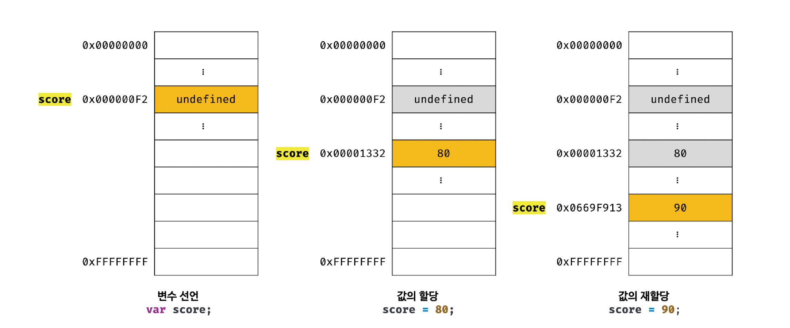

[TOC]


# 0. 개요

* 웹 브라우저에서 동작하는 유일한 프로그래밍 언어
* 별도의 컴파일 작업 없이 JS Engine만 있으면 실행 가능한 interpreter Language
* 명령형(imperative), 함수형(functional), 프로토타입 기반(prototype-based) 객체지향 프로그래밍을 지원하는 **멀티 패러다임 프로그래밍 언어**
* 강력한 OOP 능력을 지님
  * 클래스 기반 OO 보다 효율적이며 강력한 Prototype based OOP


## 0-1. ECMA 

* ECMA
  * Ecma 인터내셔널을 지칭
  * 정보와 통신 시스템을 위한 국제적 표준화 기구
  * ECMA-262, C#, C++, Drat, JSON 등 여러 시스템을 위한 표준을 담당
* ECMA-262 : 자바스크립트를 개발한 Netscape가 제시한 개선된 기술규격을 바탕으로 ECMA가 새롭게 제정한 표준
* ECMAScript
  * ECMA-262 기술 규격에 따라 정의하고 있는 표준화된 스크립트 프로그래밍 언어
  * Javascript를 표준화 하기 위해 만들어 짐
  * Javascript는 ECMAScript와의 호환을 목표로 함
* ES6 : ECMAScript(=ES) 의 6번째 개정안
* Javascript : ECMAScript의 표준 사양을 가장 잘 구현한 프로그래밍 언어


# 1. 변수

## 1-1. 변수 선언

* var, let, const 키워드 사용

```javascript
var score;
```


**식별자**(Identifier)

* 변수, 함수, 클래스 등을 구별해서 식별할 수 있는 고유한 이름
* **값이 아니라 메모리 주소를 기억함**
* 즉, 식별자란 메모리상에 존재하는 어떤 값을 식별할 수 있는 이름을 지칭


## 1-2. 실행 컨텍스트(execution context)

* 변수이름을 비롯한 모든 식별자가 저장되는 공간
* JS engine이 여러가지 작업을 진행하는 공간
  * 실행환경 제공
  * 소스코드 평가
  * 실행결과 관리
  * 식블져와 스코프 관리


## 1-3. 호이스팅(hoisting)

* var, let, const, function, function*, class 등의 키워드를 사용해서 선언하는 모든 식별자는 JS Engine에 의한 사전 평가에 의해 선언문이 선두로 끌어올려진것처럼 동작하는 JS 고유의 특징을 **hoisting**이라 한다.
  * JS engine은 소스코드를 실행하기 전, 소스코드 평가과정을 거친 후 실행을 위한 준비를 함
    * 평가과정내에서 변수선언 및 함수정의 등 모든 선언문을 소스코드에서 찾아내 먼저 실행
  * 평가과정이 끝나면 선언문을 제외한 소스코드를 한 줄씩 순차적으로 실행

> 변수 선언은 runtime이 아닌 그 이전단계에서 실행됨


자바스크립트의 고유 특징인 호이스팅 덕분에 아래 코드는 이상 없이 사용 가능하다

```javascript
console.log(score);
var score;
```


하지만 **초기화**는 runtime 시점에서 이루어진다

```javascript
console.log(x);	// undefined
var x = 'hello';
console.log(x);	// hello
```


**요약**

변수 선언 : 평가 과정

변수 초기화 : runtime


## 1-4. 값의 할당

- 변수에 값을 할당할 때는 새로운 메모리 공간을 확보하고 그곳에 할당값을 저장한다.
- 즉, 이전에 할당되었던 값은 유지된다.


가령 아래 코드를 보면

```javascript
console.log(score);	// undefined
var score = 80;
console.log(score);	// 80
score = 90;
console.log(score);	// 90
```


값을 매번 재할당 할 때마다 변수는 새로운 메모리 영역을 가리킨다.

(원시 값의 불변성과 연관됨)

불필요한 값들은 **가비지 콜렉터**에 의해 자동 해제된다.


# 2. 표현식과 문

**용어**

* 값(value) : 식(표현식; expression)이 평가(evaluate)되어 생성된 결과를 지칭
* 평가 : 식을 **해석**해서 값을 **생성**하거나 **참조**하는 것

```javascript
// 10 + 20 은 평가되어 숫자 값 30을 생성한다. 그리고 변수에 할당한다.
var sum = 10 + 20;	// 30
```

* 리터럴(literal)
  * 사람이 이해할 수 있는 문자(아라비아 숫자, 알파벳, 한글...) 또는 약속된 기호를 사용해 값을 생성하는 표기법(notation)

```javascript
// 숫자 리터럴 3
3
```

위 코드에서 3은 단순한 아라비아 숫자가 아니라 숫자 리터럴이다.

사람이 이해할 수 있는 아라비아 숫자를 사용해 숫자 리터럴 3을 코드에 기술하면 자바스크립트 엔진은 이를 평가해 숫자 값 3을 생성한다.

> 리터럴은 JS Engine에 의해 평가되어 값을 생성한다

리터럴로 생성 가능한 값의 종류( data type)은 아래와 같음

| 리터럴             | 예시                              | 비고                    |
| ------------------ | --------------------------------- | ----------------------- |
| 정수 리터럴        | 100                               |                         |
| 부동소수점 리터럴  | 10.5                              |                         |
| 2진수 리터럴       | 0b01000001                        | 0b로 시작               |
| 8진수 리터럴       | 0o101                             | ES6에서 도입. 0o로 시작 |
| 16진수 리터럴      | 0x41                              | ES6에서 도입. 0x로 시작 |
| 문자열 리터럴      | 'Hello' "Hello"                   |                         |
| 불리언 리터럴      | true false                        |                         |
| null 리터럴        | null                              |                         |
| undefined 리터럴   | undefined                         |                         |
| 객체 리터럴        | { name: 'Lee', address: 'Seoul' } |                         |
| 배열 리터럴        | [ 1, 2, 3 ]                       |                         |
| 함수 리터럴        | function() {}                     |                         |
| 정규 표현식 리터럴 | /[A-Z]+/g                         |                         |


## 2-1. 표현식(expression)

* 값(value)으로 평가될 수 있는 문(statement)
* 표현식이 평가되면 새로운 값을 생성하거나 기존 값을 참조 함
* 리터럴도 표현식에 포함 됨

```javascript
// 100은 리터럴임
// 리터럴 100은 JS engine에 의해 평가되어 값을 생성하므로 그 자체로 표현식임
var score = 100;
```


```javascript
// 50 + 50 은 리터럴과 연산자로 이뤄짐
// 50 + 50 은 평가되어 숫자 값 100을 생성하므로 표현식임
var score = 50 + 50;
```


```javascript
// 변수 식별자를 참조하면 변수 값으로 평가 됨
// 식별자 참조는 값을 생성하지는 않지만 값으로 평가되므로 표현식임
score;
```


> 표현식은 리터럴, 식별자(변수, 함수 이름 등), 연산자, 함수 호출 등의 조합으로 이뤄질 수 있음
>
> 표현식 : 값으로 평가 될 수 있음, 변수에 의해 주솟값이 참조 될 수 있음


```javascript
//리터럴 표현식
10
'Hello'

//식별자 표현식(선언이 이미 존재한다고 가정)
sum
person.name
arr[1]

//연산자 표현식
10 + 20
sum = 10
sum !== 10

//함수/메서드 호출 표현식(선언이 이미 존재한다고 가정)
square()
person.getName()
```


## 2-2. 문(statement)

- 프로그램을 구성하는 기본단위이자 최소 실행 단위
  - 프로그램 : 문의 집합으로 이루어진 것
  - 프로그래밍 : 문을 작성하고 순서에 맞게 나열하는 것
- 문은 여러 토큰(token)으로 구성 됨
  - 토큰 : 문법적 의미를 가지며, 문법저긍로 더이상 나눌 수 없는 코드의 기본 요소


* 명령문 이라고도 불린다.
  * 즉, 컴퓨터에 내리는 명령 단위
* 선언문, 할당문, 반복문 등이 존재

```javascript
//변수 선언문
var x;

//할당문
x = 5;

//함수 선언문
function foo() {}

//조건문
if (x > 1) { console.log(x); }

//반복문
for (var i = 0 ; i < 2; i++) { console.log(i); }
```


**세미콜론**

- 문의 종료를 나타냄
- 중괄호로 묶인 코드블록 {...} 뒤에는 세미콜론 안붙임
  - if, for 문 등
  - 이런 코드 블록은 자체 종결성(self closing)을 지님


**표현식인 문과 표현식이 아닌 문**

- 표현식인 문 : 값으로 평가되어 변수에 할당 가능
- 표현식이 아닌 문 : 값으로 평가될 수 없으므로 변수에 할당하면 에러 발생

```javascript
//변수 선언문은 표현식이 아닌 문이다.
var x;

//할당문은 그 자체가 표현식이지만 완전한 문이기도 하다. 즉, 할당문은 표현식인 문이다.
x = 100;

//표현식이 아닌 문은 값처럼 사용할 수 없다.
var foo = var x;	//SyntaxError : Unexpected token var

//표현식인 문은 값처럼 사용할 수 있다.
var foo = x = 100;
console.log(foo);	//100
```


# 3. 데이터 타입(Data Type)

- 값의 종류를 지칭
- JS의 모든 값은 데이터타입을 가짐
- JS(ES6)는 7개 타입을 제공
  - 원시타입(primitive type)과 객체 타입(object/reference type) 으로 분류


**구분**

- 원시 타입
  - 숫자 타입
  - 문자열 타입
  - 불리언 타입
  - undefined 타입 : var 키워드로 선언된 변수에 암묵적으로 할당되는 값
  - null 타입 : 값이 없다는 것을 의도적으로 명시할 때 사용하는 값
  - symbol 타입 : ES6에서 추가된 7번째 타입
- 객체 타입 : 객체, 함수, 배열 등


**숫자 타입**

- C나 자바와 달리 정수와 실수의 구분이 없음
- 64비트 부동소수점 형식을 따름

```javascript
var binary = 0b01000001;
var octal = 0o101;
var hex = 0x41;

console.log(binary); 	//65
console.log(octal);		//65
console.log(hex);		//65
console.log(binary === octal);	//true
console.log(octal === hex);		//true

//숫자 타입은 모두 실수로 취급한다.
console.log(1 === 1.0);	// true
console.log(4 / 2);		// 2
console.log(3 / 2);		// 1.5

//세가지 특별한 값
console.log(10 / 0);	// Infinity
console.log(10 / -0);	// -Infinity
console.log(1 * 'String');	//NaN (not-a-number; 산술 연산 불가)
```


**문자열 타입**

```javascript
var string;
string = '문자열';
string = "문자열";
string = `문자열`;

string = '작은따옴표로 감싼 문자열 내의 "큰따옴표"는   문자열로 인식된다.';
string = "큰따옴표로   감싼 문자열 내의 '작은따옴표'는 문자열로 인식된다.";
```

* JS의 문자열은 원시타입이며 변경 불가능한 값(immutable value) 임
  * 즉, 생성된 이후 수정 불가
* **문자열과 불변성**에서 자세히 다룰 예정


### 템플릿 리터럴

- 멀티라인 문자열(multi-line string), 표현식 삽입(expression interpolation), 태그드 템플릿(tagged template) 등 편리한 문자열 처리기법을 제공한다.

- 런타임에 일반 문자열로 변환되어 처리됨
- 백틱(`)을 사용해 표현

```javascript
var template = `Template literal`;
console.log(template);
```


```javascript
// 1. 멀티라인 문자열
var str = 
`Hello
World`;

console.log(str);

var template = 
`
<ul>
    <li><a href="#">Home</a></li>
</ul>
`


// 2. 표현식 삽입
var first = 'Ung-mo';
var last = 'Lee';

// ES5 : 문자열 연결
console.log(`My name is ${first} ${last}.`);	// My name is Ung-mo Lee.
console.log(`1 + 2 = ${1+2}`);	//1 + 2 = 3
${}로 표현식을 감싸서 문자열 내에 삽입할 수 있다.
표현식의 평가 결과가 문자열이 아니더라도 문자열로 타입이 강제로 변환되어 삽입된다.
console.log('1 + 2 = ${1 + 2}');	// 1 + 2 = ${1 + 2}
```


**undefined 타입**

- undefined 타입의 값은 undefined가 유일
- var 키워드로 선언한 변수는 암묵적으로 undefined로 초기화 됨
- 할당후 초기화 되지 않은 변수를 참조하면 undefined가 반환 됨

```javascript
var joo;
console.log(foo);	// undefined
```


**null 타입**

- 변수에 값이 없음을 의도적으로 명시할때 사용한다.
  - 개발자가 의도적으로 값을 할당하지 않았음을 명시하고 싶다면 undefined가 아닌 null을 할당해야한다.
- null을 할당한다는것은 이전에 있던 값에 대한 참조를 명시적으로 제거하는 것을 의미한다.
  - JS Engine은 누구도 참조하지 않는 메모리 공간에 대해 가비지 콜렉션을 수행할 것이다. (undefined 와의 차이)


**Symbol 타입**

- ES6에서 추가된 7번째 타입
- 변경 불가능한 원시 타입의 값
- 다른 값과 중복되지 않는 유일무이한 값
- 주로 이름이 충돟랑 위험이 없는 객체의 유일한 프로퍼티 키를 만들기 위해 사용
- 심벌은 Symbol 함수를 호출해 생성한다.
  - 심벌 이외의 원시 값은 리터럴을 통해 생성한다.
- 생성된 Symbol 값은 외부에 노출되지 않으며, 절대 중복되지 않은 유일무이한 값이다.

```javascript
// 심벌 값 생성
var key = Symbol('key');
console.log(typeof key);	//symbol

// 객체 생성
var obj = {};

// 이름이 충돌할 위험이 없는 유일무이한 값인 심벌을 프로퍼티 키로 사용한다.
obj[key] = 'value';
console.log(obj[key]);
```

- Symbol에 대해서는 추후 보다 자세히 다룬다.


**object 타입**

- JS의 데이터타입은 크게 원시타입과 객체타입으로 나뉜다.
  - 이는 추후 보다 자세히 다룬다.
- JS는 객체 기반의 언어이며, JS를 이루는 거의 모든것이 객체라 볼 수 있다.
- 지금까지 살펴본 6가지 타입 이외의 값은 모두 Object 타입이다.


**데이터 타입의 필요성**

1. 값을 저장하거나 읽을때 확보해야할 메모리 공간의 크기를 결정하기 위해

2. 메모리에서 읽어들인 2진수를 어떻게 해석할지 알기 위해

 


**동적 타이핑**

- 자바스크립트의 변수는 선언이 아닌 할당에 의해 타입이 결정(타입 추론; type inference)된다.
- 재할당에 의해 변수의 타입이 언제든지 동적으로 변할 수 있다.
- 이런 특징을 동적 타이핑이라 한다.

| 정적 타입 언어                                    | 동적 타입 언어                               |
| ------------------------------------------------- | -------------------------------------------- |
| C, C++, Java, Kotlin, Go, Haskell, Rust, Scala... | JavaScript, Python, PHP, Ruby, Lisp, Perl... |

 


**typeof 연산자**

- 변수의 데이터 타입을 알 수있는 함수

```javascript
typeof ''				// string
typeof 1				// number
typeof NaN			// number
typeof true			// boolean
typeof undefined		// undefined
typeof Symbol()			// symbol
typeof null				// object
typeof []				// object
typeof {}				// object
typeof new Date()		// object
typeof /test/gi			// object
typeof function () {}		// function
```


# 4. 객체

* 정의 : JS를 구성하는 모든 것
* 원시값을 제외한 나머지 값(함수, 배열, 정규표현식 등)은 모두 객체 임
  * 원시타입 : 하나의 값만 나타냄, 변경 불가
  * 객체타입 : 다양한 타입의 값을 하나의 단위로 구성한 복합적인 자료구조, 변경 가능
* **프로퍼티의 집합**


## 4-0. **프로퍼티**

```javascript
var person = {
    name: 'Lee',
    age: 20
};
```

* 용어
  * 프로퍼티 - name: 'Lee' 와 age: 20 각각의 문장들
  * 프로퍼티 키 : 빈 문자열을 포함한 모든 문자열 또는 심벌 값
    * 심벌값도 문자열로 사용
    * name과 age
  * 프로퍼티 값 : Javascript에서 사용 가능한 모든 값
    * 'Lee'와 20


**프로퍼티 키**

```javascript
// 식별자 네이밍 규칙을 따르지 않을 경우 따옴표로 둘러싸야함
var persen = {
    firstName = 'Ung-Mo',	// 식별자 네이밍 규칙을 준수
    'last-Name' = 'Lee';	// 식별자 네이밍 규칙을 준수 X
};

console.log(person);	// {firstName: "Ung-mo", last0name: "Lee"}
```

```javascript
// 문자열 또는 문자열로 평가할 수 있는 표현식을 사용해 프로퍼티 키를 동적으로 생성할 수도 있다. 이 경우 프로퍼티키로 사용할 표현식을 대괄호[..]로 묶어야 한다.
var obj = {};
var key = 'hello';

// ES5: 프로퍼티 키 동적 생성
obj[key] = 'world';
// ES6 : 계산된 프로퍼티 이름
// var obj = { [key]: 'world'};

console.log(obj);	// {hello: "world"}
```

- 빈 문자열을 포함하는 모든 문자열 또는 심벌 값
  - 식별자 네이밍 규칙을 미준수 할 경우 따옴표 사용

- 역할 : 프로퍼티 값에 접근 가능한 식별자
- 프로퍼티키에 문자열이나 심벌값 이외의 값을 넣으면 암묵적 타입 변환을 통해 문자열이 된다.
- var나 function 같은 예약어를 키로 쓸 수 있고 에러도 없지만 권장하지 않는다.


**프로퍼티 값**

* JS에서 사용하는 모든 값은 프로퍼티 값이 될 수있음
* 프로퍼티 값이 함수이면 메서드(method)라 부름
  * JS에서 함수는 객체이므로 값 취급이 가능


```javascript
var counter = {
   num: 0,
   increase: function() {
      this.num++;
   }
};
```

- 객체는 프로퍼티와 메서드로 구성된 집합임
- 객체의 집합으로 프로그램을 표현하려는 프고르매이 패러다임을 객체지향 프로그래밍이라 함


다소 복잡하지만 아래와 같은 방법으로도 사용 가능

```javascript
var person = {
    age:4,
    height:170
};

person = {age: 17, height: 175};
person['key1'] = {age:21, height : 170};
person['key2'] = {age:30, height : 180};

//console.log(person.height);
console.log(person.age, person.height);
console.log(person['key1'].age, person['key1'].height);
console.log(person['key2'].age, person['key2'].height);


// output
// 17 175
// 21 170
// 30 180
```


**프로퍼티 접근**

두가지 방법이 존재

1. 마침표 프로퍼티 접근 연산자(.)를 사용하는 **마침표 표기법(dot notation)**
2. 대괄호 프로퍼티 접근 연산자([...])를 사용하는 **대괄호 표기법(bracket notation)**
   - 대괄호 표기법의 경우 프로퍼티 키는 반드시 **따옴표로 감싼 문자열**이어야 한다.
   - 따옴표로 감싸지 않으면 자바스크립트 **엔진은 식별자(변수...)로 해석**한다.
   - 프로퍼티 키가 식별자 네이밍을 준수하지 않는다면 대괄호 프로퍼티 접근 연산자를 사용해야한다.


```javascript
var person = {
    name: 'Lee'
};
 
// 마침표 표기법에 의한 프로퍼티 접근
console.log(person.name);
 
// 대괄호 표기법에 의한 프로퍼티 접근
console.log(person['name']);
```

대괄호 표기법에서 프로퍼티 키를 따옴표로 감싸지 않으면 아래 코드 처럼 reference error가 발생

```javascript
var person = {
    name: 'Lee'    
};
 
console.log(person[name]);
```


만약 아래처럼 "name"이라는 문자열 데이터를 저장하고 있는 변수 name이 존재한다면 어떻게 될까?

```javascript
name = "name"
 
var person = {
    name: 'Lee'    
};
 
console.log(person[name]);  
```

따옴표가 없으므로 식별자인 변수 name을 참조하여 해석한다


### Node.js와 웹 브라우저의 평가 순서 차이

```javascript
var person = {
    'last-name': 'Lee',
    1: 10
};
 
person.'last-name';     // SyntaxError: Unexpected string
person.last-name;    // 브라우저 환경 : NaN
                        // Node.js 환경 : Reference Error
 
person[last-name];      // ReferenceError
person['last-name']     // Lee
 
// 프로퍼티키가 숫자로 이뤄진 문자열인 경우 따옴표를 생략할 수 있다.
 
person.1;               // SyntaxError
person.'1';             // SyntaxError
person[1];              // 10 : person[1] -> person['1']
person['1'];            // 10
```


위 코드의 person['last-name']; 결과는 브라우저와 node.js에 따라 달라짐

(name 변수의 존재 여부 차이 때문)


**자바스크립트 엔진**

자바스크립트 엔진은 먼저 person.last를 평가한다.

person객체에는 프로퍼티키가 last인 프로퍼티가 없으므로 person.last를 undefined로 평가한다.

여기까지는 node.js와 브라우저가 공통적으로 행하는 작업이다.

 

**Node.js**

Node.js 환경에서는 name이라는 식별자 선언이 없으므로 reference error가 발생한다.

 

**브라우저**

브라우저 환경에서는 **name이라는 전역변수가 창(windows)의 이름을 가진채 암묵적으로 존재**하며 기본값은 빈 문자열이다.

그러므로 person.last-name 은 undefined-''와 같으므로 NaN이 된다.


**프로퍼티 값 갱신**

이미 존재하는 프로퍼티에 값을 할당하면 프로퍼티 값이 갱신된다.

```javascript
var person = {
    name: 'Lee'
};
 
person.name = 'Kim';
 
console.log(person);
```


**프로퍼티 동적 생성**

존재하지 않는 프로퍼티에 값을 할당하면 프로퍼티가 동적으로 생성되어 추가되고 프로퍼티 값이 할당된다.

```javascript
var person = {
    name: 'Lee'
};
 
person.age = 20;
 
console.log(person);
```


**프로퍼티 삭제**

delete 연산자는 객체의 프로퍼티를 삭제한다.

delete 연산자의 피연산자는 프로퍼티 값에 접근할 수 있는 표현식이어야 한다.

존재하지 않는 프로퍼티를 삭제하면 아무런 에러없이 무시된다.


```javascript
var person = {
    name: 'Lee'
};
 
console.log(person) // { name: 'Lee' }
 
person.age = 20;
console.log(person) // { name: 'Lee', age: 20 }
 
delete person.age;
console.log(person) // { name: 'Lee' }
 
delete person.address;
console.log(person) // { name: 'Lee' }
```


## 4-1. 객체 생성 방법

- 클래스 기반 OOP 언어
  - new 연산자로 생성자를 호출하여 인스턴스를 생성
- 프로토타입 기반 OOP 언어
  - 객체 리터럴
  - Object 생성자 함수
  - 생성자 함수
  - Object.create 메서드
  - 클래스(ES6)


### 객체 리터럴(object literal)

- 객체를 생성하기 위한 표기법
  - 리터럴 : 값을 생성하는 표기법
  - 숫자 값이나 문자열을 만들듯이(리터럴) 간편하게 리터럴로 객체 생성 가능
  - 프로토타입 기반 객체지향 언어에서 객체를 생성하는 가장 일반적인 방법
  - 자바스크립트의 유연함과 강력함을 대표하는 객체 생성 방식

- 정의 방법 : 중괄호{...} 내에 0개 이상의 프로퍼티를 정의

```javascript
var person = {
    name: 'Lee',
    sayHello: function () {
    	console.log(`Hello! My name is ${this.name}.`);
    }
};

console.log(typeof person);	//object
console.log(person);			// {name: "Lee", sayHello: f}
```

 

- 중괄호내에 프로퍼티를 정의하지 않으면 빈 객체가 생성

```javascript
var empty = {};			// 빈 객체
console.log(typeof empty);		// object
```

 

> 객체 리터럴 외의 객체 생성 방식은 모두 함수를 사용해 객체를 생성 함
>


## 4-2. 축약 표현

- ES6에서 추가된 객체 리터럴 확장 기능에 대해 알아보자


### 프로퍼티 축약 표현

- 프로퍼티 값은 변수에 할당된 값, 즉 식별자 표현식 일 수도 있음
  - 프로퍼티 키에 변수 대입 = 프로퍼티 키에 변수이름 할당
  - 프로퍼티 값에 변수 대입 = 프로퍼티 값에 변수값 할당

```javascript
var x=1, y=2;

var obj = {
    x: x,
    y: y
};

console.log(obj);	// {x: 1, y: 2}
console.log(obj.x);		// 1
console.log(obj['x']);	// 1
```


- 프로퍼티 값으로 변수를 사용하면 변수이름을 프로퍼티 키로, 변수 값을 프로퍼티 값으로 인식하여 자동 생성 가능

```javascript
// ES6
let x = 1, y = 2;

// 프로퍼티 축약 표현
const obj = {x, y};

console.log(obj);	// {x: 1, y: 2}
```


### 계산된 프로퍼티 이름

- 정의 : 표현식을 사용해 동적 생성된 프로퍼티키
  - 문자열 또는 문자열로 타입 변환 할 수 있는 값이어야 함
- 프로퍼티 키로 사용할 표현식을 대괄호 ([....])로 묶어야 함


```javascript
const prefix = 'prop';
let i = 0;

// 객체 리터럴 내부에서 계산된 프로퍼티 이름으로 프로퍼티 키를 동적 생성
const obj = {
    [`${prefix}-${++i}`]:i,
    [`${prefix}-${++i}`]:i,
    [`${prefix}-${++i}`]:i
};

console.log(obj);	// {prop-1: 1, prop-2: 2, prop-3: 3}
```


### 메서드 축약 표현

```javascript
// ES6
const obj = {
	name: 'Lee',
    // 메서드 축약 표현
    sayHi(){
        console.log('Hi: ' + this.name);
    }  
};

obj.sayHi();	// Hi! Lee
```


# 5. 원시 값(privitive value)

- 변경 불가능한 값 (불변성)
  - 데이터의 신뢰성을 보장
  - 변수가 아니라 값 자체에 대한 진술임
  - **상수와는 다름**
- 변수에 실제 값을 저장
- 다른 변수에 재 할당시 값에 의한 전달

* 원시 타입

  - 숫자 타입

  - 문자열 타입

  - 불리언 타입

  - undefined 타입 : var 키워드로 선언된 변수에 암묵적으로 할당되는 값

  - null 타입 : 값이 없다는 것을 의도적으로 명시할 때 사용하는 값

  - symbol 타입 : ES6에서 추가된 7번째 타입


## 5-1. 변경 불가능한 값

앞서 변수에 원시값을 재 할당하면 메모리에 있는 값은 유지되고, 변수는 새로운 메모리를 참조함을 이야기 한 적이 있다.



이는 원시값의 불변성과 깊은 연관이 있다. 원시값은 변경 불가능 하므로 그저 변수가 참조하던 메모리 공간의 주소를 변경할 뿐이다.


> 불변성을 갖는 원시 값이 할당된 변수는 재할당 이외에 변수 값을 변경할 수 있는 방법이 없다.
>
> 이는 상태 변경의 추적을 용이하게 만듬


## 5-2. 문자열과 불변성

- ECMAScript 사양에 문자열 타입(2바이트)와 숫자 타입(8바이트) 이외의 원시 타입은 크기를 명확히 규정하고 있지 않음
- 문자열은 원시타입 이지만 길이에 다라 필요한 메모리 공간의 크기가 결정됨
- 문자열은 유사 배열 객체이면서 **이터러블**이므로 배열과 유사하게 각 문자에 접근 가능
  - 접근은 가능하지만 수정은 불가
  - 원시 값을 객체처럼 사용하는 **래퍼 객체**와 연관됨

```javascript
var str = 'Hello';
str = 'world';	// Hello가 저장된 메모리는 그대로 두고, 새로운 주소에 world를 저장, str은 새로운 주소를 가리킴

console.log(str[0]);	// w

str[0] = 'S';	// 문자열은 원시값 이므로 변경 불가능, 에러가 발생하지 않음
console.log(str);	// world
```


## 5-3. 값에 의한 전달

```javascript
var score = 80;
var copy = score;

console.log(score);	// 80
console.log(copy);	// 80

score = 100;

console.log(score);	// 100
console.log(copy);	// 80
```

원시값 80이 그대로 복사되어 전달됨


사실 "값에 의한 전달" 이란 용어는 자바스크립트를 위한 용어가 아니며, ECMAScript 사양에도 등장하지 않는다.

위와 같은 작동 방식은 자바스크립트 엔진을 구현하는 제조사에 따라 차이가 있을 수 있음

> 엄격하게 표현하면 변수(식별자)에는 값이 아닌 메모리 주소가 저장됨


# 6. 객체

- 변경 가능한 값
- 메모리에 참조 값을 저장
- 다른 변수에 할당시 참조에 의한 전달

프로퍼티의 갯수가 정해지지 않았으므로, 확보해야할 메모리 공간의 크기를 사전에 정할 수 없음

원시값과 다른 방식으로 동작하도록 설계됨


**자바 스크립트의 객체 관리**

- 자바스크립트의 객체는 프로퍼티 키를 인덱스로 사용하는 해시 테이블 (hash table)방식으로 동작함


## 6-0. 클래스 기반 vs 프로토타입 기반 OOP

| 클래스 기반                                                  | 프로토타입 기반                                              |
| ------------------------------------------------------------ | ------------------------------------------------------------ |
| - 사전 정의된 클래스를 기반으로 객체(인스터스) 생성<br />- 객체 생성 이전에 이미 프로퍼티와 메서드가 정해짐 | - 클래스 없이 동적으로 프로퍼티와 메서드 추가/삭제 가능<br />- 편리하지만 고비용, 저효율<br />- 히든 클래스 방식을 도입하여  클래스 방식과 유사하게 동작 시켜 성능 개선 |


## 6-1. 변경 가능한 값

- 원시 값을 할당한 변수는 원시 값 자체를 값으로 갖는다.
  - 하지만 객체를 할당한 변수가 기억하는 메모리 주소를 통해 메모리 공간에 접근하면 참조 값에 접근할 수 있음
  - 참조 값 : 생성된 객체가 저장된 메모리 공간의 주소 그 자체
- 변경 가능한 값 : 프로퍼티의 동적 추가, 값의 갱신, 프로퍼티 삭제 가능

아래 그림처럼 객체를 할당한 변수에는 생성된 객체가 실제로 저장된 메모리 공간의 주소가 저장되어 있음


```javascript
var person = {
    name: 'Lee'
};

// 변수 person는 객체 {name: 'Lee'}를 참조한다
console.log(person);


ver x = 5;

// 변수 x는 값 5를 갖는다
console.log(X);
```


- 객체는 변경 가능한 값이다. 즉, 프로퍼티의 동적 추가,  값의 갱신, 프로퍼티 삭제가 가능함

```javascript
var person = {
    name: 'Lee'
};

// 프로퍼티 값 갱신
person.name='Kim';

// 프로퍼티 동적 생성
person.address = 'Seoul';

console.log(person);	// {name: "Kim", address: "Seoul"}
```


## 6-2. 참조에 의한 전달

```javascript
var person={
    name: 'Lee'
};

// 참조 값을 복사 (얕은 복사)
var copy = person;

// copy와 person은 동일한 객체를 참조 함
console.log(copy === person);	// true

// coyp와 person을 통해 객체를 변경
copy.name = 'Kim';
person.address = 'Seoul';

// person과 copy는 동일한 객체를 가리키므로, 한쪽에서만 객체를 변경해도 서로에게 영향을 줌
colsole.log(person);	// {name: "Kim", address: "Seoul"}
console.log(copy);		// {name: "Kim", address: "Seoul"}


```


변수 person과 copy는 모두 같은 주소를 저장하게됨

즉, 2개의 식별자가 하나의 객체를 공유


> 메모리에 저장된 데이터가 원시 값이냐 혹은 참조 값이냐에 따라 값에 의한 전달과 참조에 의한 전달이 구분됨
>
> 참조에 의한 전달은 그저 참조 값(메모리 주소)를 전달 할 뿐임


**퀴즈**

```javascript
var person1 = {
    name: 'Lee'
};

var person2 = {
    name: 'Lee'
};

console.log(person1 === person2);	// false
console.log(person1.name === person2.name);	// true
```

1. person1과 person2는 같은 구조의 객체를 참조하지만, 다른 메모리에 저장된 객체이므로 false (전혀 다른 참조값이 저장됨)
2. person1.name 과 person2.name은  값으로 평가 될 수 있는 표현식이다. 두 표현식 모두 원시 값 'Lee'로 평가되므로 true


**원시값과 객체**

| 원시 타입                                                    | 객체 타입                                                    |
| ------------------------------------------------------------ | ------------------------------------------------------------ |
| - 변경 불가능<br />- 메모리에 실제 값을 저장<br />- 다른 변수에 할당 시 값에 의한 전달 | - 변경 가능한 값<br />- 메모리에 참조 값을 저장<br />- 다른 변수에 할당 시 참조에 의한 전달 |


# 7. 함수

* 자바스크립트의 가장 중요한 핵심
* 연관 개념
  * 스코프, 실행 컨텍스트, 클로저, 생성자 함수에 의한 객체 생성, 메서드, this, 프로토타입, 모듈화 등


**기본 사용법**

```javascript
function add(x,y) {
    return x + y;
}

add(2,5);	// 7
```


## 7-1. 함수 리터럴

- 자바스크립트의 함수는 객체 타입의 값이다
- 객체를 객체 리터럴로 생성하듯이, 함수도 함수 리터럴로 생성 가능함


```javascript
var f = function add(x, y){
    return x + y;
};

console.log(f(1,2));	// 3
console.log(add(3,4));	// reference error (식별자 함수 이름은 함수 몸체 내에서만 참조 가능)
```


**함수와 일반 객체의 차이**

1. 일반객체는 호출 불가능하지만, 함수는 호출 가능함
2. 일반객체에는 없는 함수만의 고유한 프로퍼티가 존재


> 함수가 객체라는 사실은 다른 프로그래밍 언어와 구별되는 가장 중요한 특징임
>


## 7-2. 함수 정의

자바스크립트에서 함수를 정의하는 방법에는 4가지가 있다.

| 함수 정의 방식       | 예시                                                         |
| -------------------- | ------------------------------------------------------------ |
| 함수 선언문          |  |
| 함수 표현식          |  |
| Function 생성자 함수 |  |
| 화살표 함수(ES6)     |  |


* 함수 선언문은 표현식이 아닌 문이다.
  * 표현식이 아닌 문은 변수에 할당 불가
* 함수 선언문은 문(state) 이지만 함수 리터럴 처럼 변수에 할당 되는것 처럼 보임
* 이는 문맥에 따라 동일한 함수 리터럴을 2가지 방식으로 해석하는 경우가 있기 때문
  * 함수 선언문 : 표현식이 아닌 문으로 해석
  * 함수 리터럴 : 표현식인 문으로 해석

가령 { } 은 블록문일수도, 객체 리터럴일수도 있다. 즉 { } 은 중의적인 표현이며, 결국 문맥에 따라 해석 방법이 결정됨


> 기명 함수는
>
> 함수 리터럴을 단독으로 사용하면  함수 선언문으로 해석 하고
>
> 함수 리터럴이 값으로 평가되어야 하는 문맥(함수 리터럴을 변수에 할당 or 피연산자로 사용)에선 함수 리터럴 표현식으로 해석한다


**함수 선언문과 함수 리터럴  표현식의 차이**

```javascript
//1. 기명함수로 리터럴을 단독으로 사용 => 함수 선언문
function foo(){console.log('foo')};
foo(); // foo

//2. 함수 리터럴 값을 평가되는 문맥(피연산자로 사용) => 함수 리터럴 표현식으로 해석
(function bar(){console.log('bar')};);
bar(); // 참조 오류발생 (함수 리터럴 표현식의 함수 이름은 해당 함수의 몸체에서만 참조 가능)
```


자바스크립트 엔진은 함수 선언문을 해석해 함수 객체를 생성하고 함수 이름과 동일한 이름의 식별자를 만듬


지금까지 살펴본 함수 선언문을 의사코드로 쓰면 아래와 같다.

```javascript
//함수 선언문 
cosnt add = function add(x,y){//함수 객체를 참조하기 위해 함수이름과 같은 식별자 생성 후 함수 객체를 할당
  return x+y;
}
//함수 호출은 함수 이름이 아닌 함수 객체를 가리키는 식별자자라는 것의 주의!!
console.log(add(2, 5))// 7
```


> 함수는 함수 이름으로 호출하는것이 아니라 **함수 객체를 가리키는 식별자로 호출함**

자바스크립트 엔진은 **함수 선언문**을 **함수 표현식**으로 변환해 **함수 객체**를 생성한다고 생각할 수 있음


### 함수 표현식

- 자바스크립트의 함수는 값처럼 변수에 할당할 수도 있고 프로퍼티 값이 될 수도 있으며 배열의 요소가 될 수 있다.
- 이처럼 **값의 성질을 갖는 객체**를 '**일급객체**'라하는데 **자바스크립트의 함수가 바로 '일급 객체'**이다.
-  **일급객체**인 함수는 **함수 리터럴로 생성한 함수 객체를 변수에 할당**할 수 있는데 이러한 함수 정의 방식을 **함수 표현식**이라 부른다.


```javascript
//함수 이름이 있는 기명 함수 표현식
const add = function foo(x,y){
  return x+y;
}
// 함수 객체를 가리키는 식별자로 호출해야한다.
console.log(add(2, 5))// 7
//함수 이름이 없는 익명 함수 표현식
const add = function (x, y){
  return x+y;
}
//함수 호출
console.log(add(2, 5))// 7
```


### 함수 생성 시점과 함수 호이스팅

- 함수 선언문 - 표현식이 아닌 문, 호이스팅의 영향을 받아 어디서든 호출 가능
- 함수 표현식 - 표현식인 문, 호이스팅에 영향을 받지 않아, 런타임 중 함수 코드에 도달해야 생성되고 호출 됨


## 생성자 함수

- 정의 : 객체를 생성하는 함수
- 빌트인 함수인 Function 생성자 함수에 매개변수 목록과 **함수 몸체를 문자열로 전달하면서 new연산자(없어도 가능)와 함께 호출**하면 함수객체를 생성해서 반환한다.

```javascript
//생성자 함수
const add = new Function('x', 'y', 'return x + y');
//함수 호출
console.log(add(2, 5))// 7
```


- **Function 생성자 함수로 생성하는 함수**는 **클로저를 생성하지 않는 등 함수 선언문이나 표현식으로 생성한 함수와 다르게 동작**한다.

```javascript
//함수 선언문 시 클로저
const add1 =(function (){
  const a = 10;
  return function (x, y){
    return x + y;
  };
}());
console.log(add1(1,3)) // 13

//생성자 함수시 클로저
const add2 =(function (){
  const a = 10;
  return new Function('x', 'y', 'return x+y');
}());
console.log(add2(1,3)) // 변수 a참조 오류?
```


## 화살표 함수

- unction 키워드 대신 화살표를 사용해 더 간략한 방법으로 함수를 선언

```javascript
//화살표 함수
const add = (x, y) => x + y;

//함수 호출
console.log(add(2, 5))// 7
```


### 콜백 함수

- 함수의 매개변수로 다른 함수를 전달받아 호출 가능
  - 콜백 함수 : 함수의 매개변수를 통해 다른 함수의 내부로 전달되는 함수
    - logAll, logOdds
  - 고차 함수 : 매개변수를 통해 함수의 외부에서 콜백 함수를 전달 받은 함수
    - repeat

```javascript
// 외부에서 전달받은 함수 f를 n만큼 반복 호출하는 함수
function repeat(n, f){ // 변경 되는 함수를 f로 추상화하여 외부에서 전달받는다.
   for(var i = 0; i < n; i++) {
   	f(i); // i를 전달하면서 함수 f를 호출
  }
}

const logAll = function(i){ // 모든 0부터 n직전까지 출력하는 logAll 함수
    console.log(i)
};

repeat(5, logAll)// 반복 호출할 logAll 함수(콜백함수)를 인수로 전달한다.

const logOdds = function(i){ // 0부터 n직전까지 중 홀수만 출력하는 logOdds 함수
    if (i % 2) console.log(i);
};

repeat(5, logOdds)// 반복 호출할 logOdds 함수(콜백함수)를 인수로 전달한다.
```

- **콜백 함수**를 통해서 **함수를 합성** 하면 함수의 변하지 않는 공통 로직은 미리 정의해두고, 경우에 따라서 **변경되는 로직은 추상화해서 함수 외부에서 함수 내부로 전달**하여 위 코드의 단점을 해결할 수 있다.

- **중첩 함수**처럼 **콜백 함수** 역시 **고차함수에 전달되어 헬퍼함수의 역할**을 하지만 중첩 함수는 고정되어 교체하기 어렵지만 **콜백 함수**는 **외부에서 고차함수 내부로 주입할 수 있다.**
  -> 따라서 **고차함수는 콜백함수를 자신의 일부분으로 합성하여 교체가 보다 유연하다.**


**콜백함수가 고차함수 내부에서만 호출**

- 콜백함수를 익명함수 리터럴로 정의하면서 곧바로 고차 함수에 전달하면 콜백 함수로서 전달된 함수 리터럴은 고차 함수가 호출 될 때마다 평가되어 함수 객체를 생성 함

```javascript
// 익명 함수 리터럴을 콜백함수로 고차 함수에 전달
function repeat(5, function(i){ // 익명 함수 리터럴은 repeat 함수를 호출 할 때마다 평가되어 함수 객체를 생성한다.
    if (i % 2) console.log(i);
});
```

```javascript
function repeat(i,F){
    for(j=0; j<i; j++){
        F(j);
    }
}

// 호출과 동시에 함수 선언
repeat(5, function(i){
    console.log(i *2);
});

/*
0
2
4
6
8
*/
```


- 함수 외부에서 콜백 함수를 익명 함수 리터럴로 정의한 후 함수 참조를 고차 함수에 전달하면 고차 함수가 호출 될 때마다 콜백 함수가 생성된다.

```javascript
//logOdds 함수는 단 한 번만 생성된다.
const logOdds = function(i){ 
    if (i % 2) console.log(i);
};

// 고차 함수에 함수 참조를 전달한다.
repeat(5, logOdds);
```


## 순수함수와 비 순수 함수

- **`순수 함수`**: 함수형 프로그래밍에서 어떤 외부 상태에 의존하지도 않고 변경하지 않는, 부수효과가 없는 함수이다.
  - 언제나 함수 호출의 결과가 같음
  - 오직 전달된 매개변수를 통해서만 결과가 달라짐
- **`비 순수 함수`** : 외부 상태에 의존하거나 함수의 외부 상태를 변경하는 부수효과가 있는 함수를 의마한다.
  - 상황에 따라 함수 호출 결과가 달라짐


```javascript
let count = 0;
// 순수 함수 increase는 동일한 인수가 전달되면 언제나 동일 한 값을 반환
function increase(n){
  return ++n;
}

// 순수 함수가 반환한 결과값을 변수에 재할당해서 상태를 변경
let newCount = increase(count);
console.log(count)
count = increase(count);
console.log(count)
let count2 = 0;

// 비순수 함수 increase에 의해 count2에 값이 변화한다.
function increase(){
  return ++count2; // 외부 상태를 직접 참조하여 외부 상태를 변경
}

// 비 순수 함수는 외부 상태 count를 변경하므로 상태 변화 추적이 어렵다
increase();
console.log(count2)
increase();
console.log(count2)
```


# 스코프

정의 : 특정 변수들에 접근 가능한 유효 범위

JS engine이 식별자를 검색할때 사용하는 규칙


## 스코프 체인

```javascript
var x = "global x";
var y = "global y";
 
function outer() {
    var z = "outer's local z";
    
    console.log(x);     // global x
    console.log(y);     // global y
    console.log(z);     // outer's local z
 
    function inner() {
        var x  = "inner's local x";
 
        console.log(x); // inner's local x
        console.log(y); // global y
        console.log(z); // outer's local z
    }
 
    inner();
}
 
outer();
 
console.log(x);         // global x
console.log(z);  
```


- 정의 : 스코프가 계층적인 구조로 연결되는 것
- 함수, if문, for 문등이 중복된 구조를 가질 경우 스코프도 중복되어 계층적인 구조를 지닌다.
- 변수를 참조할 때 JS engine은 스코프 체인을 통해 변수를 참조하는 코드의 스코프에서 시작하여 상위 스코프 방향으로 이동하며 선언된 변수를 검색 한다.


> 스코프 체인은 실행 컨텍스트의 렉시컬 환경을 단방향으로 연결(chaining) 한 것이다.


## 렉시컬 스코프

프로그래밍 언어가 상위 스코프를 결정하는 방법은 크게 2가지로 나뉨

1. 동적 스코프(dynamic scope)
   - 함수를 어디서 **호출**했는지에 따라 함수의 상위 스코프를 결정
   - 함수가 호출되는 시점에 동적으로 상위 스코프를 결정
2. 렉시컬 스코프(lexical scope) / 정적 스코프(static scope)
   - 함수를 어디서 **정의**했는지에 따라 함수의 상위 스코프를 결정
   - 함수 정의가 평가되는 시점에 상위 스코프를 결정

**자바스크립트는 렉시컬 스코프를 따른다. **

즉, 함수가 호출된 위치는 상위 스코프 결정에 어떠한 영향도 주지 않는다.


```javascript
var x = 1;
 
function foo() {
    var x = 10;
    bar();
}
 
function bar() {
    console.log(x);
}
 
foo();  // 1
bar();  // 1
```


2개의 함수는 구조적으로 분명 분리되어 있지만, foo 내부에서 bar를 호출하는중이다

동적 스코프 구조의 프로그래밍 언어일 경우 스코프 체인의 형태는 아래와 같다


하지만 자바스크립트는 렉시컬 스코프를 따르므로 함수가 정의된 시점에 상위 스코프가 결정된다.


따라서 bar 함수 스코프에서 참조하는 변수 x의 값은 1이 됨


## 전역변수

### 전역변수의 문제점

- 암묵적 결합 허용 : 코드 어디서든 참조 및 할당 가능
- 긴 생명 주기 : 생명주기가 길어서 메모리 리소스도 오랜 기간 소비 함
- 스코프 체인상의 종점에 존재 : 검색속도가 느림
- 네임 스페이스 오염 : 파일이 분리되어 있어도 하나의 전역 스코프를 공유하므로 다른 파일 내에서 같은 이름으로 명명된 전역 변수나 전역 함수가 같은 스코프내에 존재할 경우 예상치 못한 결과 발생 가능


### 전역변수의 사용을 억제 하는 법

#### 1. 즉시 실행 함수

모든 코드를 즉시 실행 함수로 감싸면 모든 변수는 즉시 실행 함수의 지역 변수가 됨

```javascript
(function () {
    var foo = 10;
    // ...
}());
 
console.log(foo); // ReferenceError
```


#### 2. 네임 스페이스 객체

- 전역에 네임스페이스 역할을 담당할 객체를 생성하고 전역 변수처럼 사용하고 싶은 변수를 프로퍼티로 추가하는 방법이다.

```javascript
var MYAPP = {}; // 전역 네임스페이스 객체
 
MYAPP.name = 'Lee';
 
MYAPP.person = {
    age: 20,
    address: 'Seoul'
}
 
console.log(MYAPP.name);            // Lee
console.log(MYAPP.person.age);      // 20
console.log(MYAPP.person.address);  // Seoul
```

- 장점 : 식별자 충돌을 방지

- 단점 : 네임스페이스 객체 자체가 전역 변수에 할당 되므로 그다지 유용하지 않다.


#### 3. 모듈 패턴

- 전역 변수의 억제와 캡슐화를 구현할 수 있다.
  - 캡슐화 : 모듈화 + 정보 은닉
- 자바스크립트는 public, private, protected 같은 접근 제한자를 제공하지 않으므로 아래의 방법을 사용한다.


```javascript
var Counter = (function(){
    // private
    var num = 0;
 
    // public
    return {
        increase() {
            return ++num;
        },
        decrease() {
            return --num;
        },
        getNum() {
            return num;
        }
    }
}());
 
console.log(Counter.num);           // undefined;
 
console.log(Counter.increase());    // 1
console.log(Counter.increase());    // 2
console.log(Counter.decrease());    // 1
console.log(Counter.getNum());      // 1
```


# let, const 키워드와 블록 레벨 스코프

## var 키워드로 선언한 변수의 문제점


**1. 변수 중복 선언 허용**

var 키워드로 선언된 변수는 같은 스코프 내에서 중복 선언이 허용 됨

```javascript
function foo(){
    var x = 1;
    var x = 2;
    console.log(x);
}

foo();
```


let이나 const 키워드로 선언된 변수는 중복 선언을 허용안함

```javascript
function foo(){
    let x = 1;
    let x = 2;
    console.log(x);     // SyntaxError: Identifier 'x' has already been declared
}

foo();
```


**2. 함수 레벨 스코프**

- var 키워드로 선언한 변수는 오로지 함수의 코드 블록만을 지역 스코프로 인정 함
- 함수 외부에서 var 키워드로 선언한 변수는 코드 블록 내에서 선언해도 모두 전역 변수가 됨

```javascript
var x = 1;

if (true){
    var x = 10;
}

console.log(x);	// 10
```


```javascript
var i = 10;

for(var i = 0; i < 5; i++){
    console.log(i);	// 0, 1, 2, 3, 4
}

console.log(i);	// 5
```


**3. 변수 호이스팅**

- var로 선언한 함수는 호이스팅에 의해 선언문 이전에 참조가 가능해진다. 
- 단, 초기화 이전 시점에서는 항상 undefined를 반환 함
- 에러는 남기지 않지만 가독성을 떨어 뜨리고 오류를 발생시킬 여지를 남김


## let 키워드

var 키워드의 단점을 보완하기 위해 ES6에서 추가된 새로운 변수 선언 키워드


**1. 변수 중복 선언 금지**

```javascript
var foo = 123;
var foo = 456;

let bar = 123;
let bar = 456;	// SyntaxError
```


**2. 블록 레벨 스코프**

var 키워드 : 함수의 코드 블록만을 지역 스코프로 인정

let 키워드 : 모든 코드 블록(함수, if 문, for 문, while 문...) 을 지역 스코프로 인정하는 **블록 레벨 스코프**를 따름

```javascript
let foo = 1; // 전역 변수

{
    let foo = 2;
    let bar = 3;
}

console.log(foo);	// 1
console.log(bar);	// ReferenceError
```


**3. 변수 호이스팅**

let 키워드로 선언된 변수는 변수 호이스팅이 발생하지 않음

var : 선언 단계와 초기화 단계가 한번에 진행됨

let : 선언 단계와 초기화 단계가 분리됨


**4. 전역 객체와 let**

var 전역변수, 전역 함수, 암묵적 전역 : 전역 객체 window의 프로퍼티가 됨

```javascript
// 브라우저에서 실행

// 전역 변수
var x = 1;

// 암묵적 전역
y = 2;

// 전역 함수
function foo() {}

console.log(window.x);	// 1
console.log(x);	// 1

console.log(window.y);	// 2
console.log(y);	// 2

console.log(window.foo);	// function foo() {}
console.log(foo);	// function foo() {}
```


let 전역 변수 : 전역 객체의 프로퍼티가 아님 (window 객체로 접근 불가)

let 전역 변수는 보이지 않는 개념적인 블록내에 존재하게 됨

```javascript
// 브라우저에서 실행

let x = 1;

console.log(window.x);	// undefined
console.log(x);	// 1
```


## const 키워드

상수 선언에 쓰임 - 선언과 동시에 초기화 해야함

let키워드와 대부분 동일한 성질을 지님


**const 키워드와 객체**

const 키워드로 선언된 변수에 할당돈 변수 값은 변경 불가능 하다. (변수에 저장된 메모리 주소를 수정해야 하므로)

하지만 const 키워드로 선언된 변수에 객체를 할당한 경우 값을 변경 할 수 있음 (객체가 바뀌는거지, 변수에 저장된 메모리가 바뀌진 않으므로)

```javascript
const person = {
    name: 'Lee'
};

person.name = 'Kim';

console.log(person);
```


