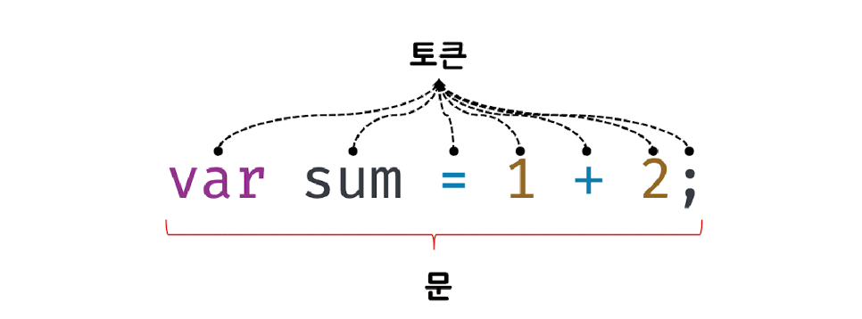
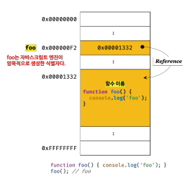

[TOC]


# 0. 개요

* 웹 브라우저에서 동작하는 유일한 프로그래밍 언어
* 별도의 컴파일 작업 없이 JS Engine만 있으면 실행 가능한 interpreter Language
* 명령형(imperative), 함수형(functional), 프로토타입 기반(prototype-based) 객체지향 프로그래밍을 지원하는 **멀티 패러다임 프로그래밍 언어**
* 강력한 OOP 능력을 지님
  * 클래스 기반 OO 보다 효율적이며 강력한 Prototype based OOP


## 0-1. ECMA 

* ECMA
  * Ecma 인터내셔널을 지칭
  * 정보와 통신 시스템을 위한 국제적 표준화 기구
  * ECMA-262, C#, C++, Drat, JSON 등 여러 시스템을 위한 표준을 담당
* ECMA-262 : 자바스크립트를 개발한 Netscape가 제시한 개선된 기술규격을 바탕으로 ECMA가 새롭게 제정한 표준
* ECMAScript
  * ECMA-262 기술 규격에 따라 정의하고 있는 표준화된 스크립트 프로그래밍 언어
  * Javascript를 표준화 하기 위해 만들어 짐
  * Javascript는 ECMAScript와의 호환을 목표로 함
* ES6 : ECMAScript(=ES) 의 6번째 개정안
* Javascript : ECMAScript의 표준 사양을 가장 잘 구현한 프로그래밍 언어


# 1. 변수

## 1-1. 변수 선언

* var, let, const 키워드 사용

```javascript
var score;
```


**식별자**(Identifier)

* 변수, 함수, 클래스 등을 구별해서 식별할 수 있는 고유한 이름
* **값이 아니라 메모리 주소를 기억함**
* 즉, 식별자란 메모리상에 존재하는 어떤 값을 식별할 수 있는 이름을 지칭


## 1-2. 실행 컨텍스트(execution context)

* 실행할 코드에 제공할 환경 정보들을 모아놓은 객체
  * 환경정보 : 모든 식별자(변수명, 함수명...)

* 변수이름을 비롯한 모든 식별자가 저장되는 공간
* JS engine이 여러가지 작업을 진행하는 공간
  * 실행환경 제공
  * 소스코드 평가
  * 실행결과 관리
  * 식별자와 스코프 관리


## 1-3. 호이스팅(hoisting)

* 코드상에서 식별자의 선언보다 상단에 접근이 이루어저도, JS Engine에 의한 **사전 평가과정**에 의해 식별자 접근에 지장이 없는 JS 고유의 특징

  * var, let, const, function, function*, class 등의 키워드를 쓰는 모든 식별자가 해당됨

  * 사전 평가과정내에서 변수선언 및 함수정의 등 모든 선언문을 소스코드에서 찾아내 먼저 실행

* 평가과정이 끝나면 선언문을 제외한 소스코드를 한 줄씩 순차적으로 실행


> 변수 선언은 runtime이 아닌 그 이전단계에서 미리 실행됨


자바스크립트의 고유 특징인 호이스팅 덕분에 아래 코드는 이상 없이 사용 가능하다

```javascript
console.log(score);
var score;
```


하지만 **초기화**는 runtime 시점에서 이루어진다

```javascript
console.log(x);	// undefined
var x = 'hello';
console.log(x);	// hello
```


**요약**

변수 선언 : 평가 과정

변수 초기화 : runtime


## 1-4. 값의 할당

- 변수에 값을 할당할 때는 새로운 메모리 공간을 확보하고 그곳에 할당값을 저장한다.
- 즉, 이전에 할당되었던 값은 유지된다.


가령 아래 코드를 보면

```javascript
console.log(score);	// undefined
var score = 80;
console.log(score);	// 80
score = 90;
console.log(score);	// 90
```


값을 매번 재할당 할 때마다 변수는 새로운 메모리 영역을 가리킨다.

(원시 값의 불변성과 연관됨)

불필요한 값들은 **가비지 콜렉터**에 의해 자동 해제된다.


# 2. 표현식과 문

**용어**

* 값(value) : 식(표현식; expression)이 평가(evaluate)되어 생성된 결과를 지칭
* 평가 : 식을 **해석**해서 값을 **생성**하거나 **참조**하는 것

```javascript
// 10 + 20 은 평가되어 숫자 값 30을 생성한다. 그리고 변수에 할당한다.
var sum = 10 + 20;	// 30
```

* 리터럴(literal)
  * 사람이 이해할 수 있는 문자(아라비아 숫자, 알파벳, 한글...) 또는 약속된 기호를 사용해 값을 생성하는 표기법(notation)

```javascript
// 숫자 리터럴 3
3
```

위 코드에서 3은 단순한 아라비아 숫자가 아니라 숫자 리터럴이다.

사람이 이해할 수 있는 아라비아 숫자를 사용해 숫자 리터럴 3을 코드에 기술하면 자바스크립트 엔진은 이를 평가해 숫자 값 3을 생성한다.

> 리터럴은 JS Engine에 의해 평가되어 값을 생성한다

리터럴로 생성 가능한 값의 종류( data type)은 아래와 같음

| 리터럴             | 예시                              | 비고                    |
| ------------------ | --------------------------------- | ----------------------- |
| 정수 리터럴        | 100                               |                         |
| 부동소수점 리터럴  | 10.5                              |                         |
| 2진수 리터럴       | 0b01000001                        | 0b로 시작               |
| 8진수 리터럴       | 0o101                             | ES6에서 도입. 0o로 시작 |
| 16진수 리터럴      | 0x41                              | ES6에서 도입. 0x로 시작 |
| 문자열 리터럴      | 'Hello' "Hello"                   |                         |
| 불리언 리터럴      | true false                        |                         |
| null 리터럴        | null                              |                         |
| undefined 리터럴   | undefined                         |                         |
| 객체 리터럴        | { name: 'Lee', address: 'Seoul' } |                         |
| 배열 리터럴        | [ 1, 2, 3 ]                       |                         |
| 함수 리터럴        | function() {}                     |                         |
| 정규 표현식 리터럴 | /[A-Z]+/g                         |                         |


## 2-1. 표현식(expression)

* 값(value)으로 평가될 수 있는 문(statement)
* 표현식이 평가되면 새로운 값을 생성하거나 기존 값을 참조 함
* 리터럴도 표현식에 포함 됨

```javascript
// 100은 리터럴임
// 리터럴 100은 JS engine에 의해 평가되어 값을 생성하므로 그 자체로 표현식임
var score = 100;
```


```javascript
// 50 + 50 은 리터럴과 연산자로 이뤄짐
// 50 + 50 은 평가되어 숫자 값 100을 생성하므로 표현식임
var score = 50 + 50;
```


```javascript
// 변수 식별자를 참조하면 변수 값으로 평가 됨
// 식별자 참조는 값을 생성하지는 않지만 값으로 평가되므로 표현식임
score;
```


> 표현식은 리터럴, 식별자(변수, 함수 이름 등), 연산자, 함수 호출 등의 조합으로 이뤄질 수 있음
>
> 표현식 : 값으로 평가 될 수 있음, 변수에 의해 주솟값이 참조 될 수 있음


```javascript
//리터럴 표현식
10
'Hello'

//식별자 표현식(선언이 이미 존재한다고 가정)
sum
person.name
arr[1]

//연산자 표현식
10 + 20
sum = 10
sum !== 10

//함수/메서드 호출 표현식(선언이 이미 존재한다고 가정)
square()
person.getName()
```


## 2-2. 문(statement)

- 프로그램을 구성하는 기본단위이자 최소 실행 단위
  - 프로그램 : 문의 집합으로 이루어진 것
  - 프로그래밍 : 문을 작성하고 순서에 맞게 나열하는 것
- 문은 여러 토큰(token)으로 구성 됨
  - 토큰 : 문법적 의미를 가지며, 문법저긍로 더이상 나눌 수 없는 코드의 기본 요소



* 명령문 이라고도 불린다.
  * 즉, 컴퓨터에 내리는 명령 단위
* 선언문, 할당문, 반복문 등이 존재

```javascript
//변수 선언문
var x;

//할당문
x = 5;

//함수 선언문
function foo() {}

//조건문
if (x > 1) { console.log(x); }

//반복문
for (var i = 0 ; i < 2; i++) { console.log(i); }
```


**세미콜론**

- 문의 종료를 나타냄
- 중괄호로 묶인 코드블록 {...} 뒤에는 세미콜론 안붙임
  - if, for 문 등
  - 이런 코드 블록은 자체 종결성(self closing)을 지님


**표현식인 문과 표현식이 아닌 문**

- 표현식인 문 : 값으로 평가되어 변수에 할당 가능
- 표현식이 아닌 문 : 값으로 평가될 수 없으므로 변수에 할당하면 에러 발생

```javascript
//변수 선언문은 표현식이 아닌 문이다.
var x;

//할당문은 그 자체가 표현식이지만 완전한 문이기도 하다. 즉, 할당문은 표현식인 문이다.
x = 100;

//표현식이 아닌 문은 값처럼 사용할 수 없다.
var foo = var x;	//SyntaxError : Unexpected token var

//표현식인 문은 값처럼 사용할 수 있다.
var foo = x = 100;
console.log(foo);	//100
```


# 3. 데이터 타입(Data Type)

- 값의 종류를 지칭
- JS의 모든 값은 데이터타입을 가짐
- JS(ES6)는 7개 타입을 제공
  - 원시타입(primitive type)과 객체 타입(object/reference type) 으로 분류


**구분**

- 원시 타입
  - 숫자 타입
  - 문자열 타입
  - 불리언 타입
  - undefined 타입 : var 키워드로 선언된 변수에 암묵적으로 할당되는 값
  - null 타입 : 값이 없다는 것을 의도적으로 명시할 때 사용하는 값
  - symbol 타입 : ES6에서 추가된 7번째 타입
- 객체 타입 : 객체, 함수, 배열 등


**숫자 타입**

- C나 자바와 달리 정수와 실수의 구분이 없음
- 64비트 부동소수점 형식을 따름

```javascript
var binary = 0b01000001;
var octal = 0o101;
var hex = 0x41;

console.log(binary); 	//65
console.log(octal);		//65
console.log(hex);		//65
console.log(binary === octal);	//true
console.log(octal === hex);		//true

//숫자 타입은 모두 실수로 취급한다.
console.log(1 === 1.0);	// true
console.log(4 / 2);		// 2
console.log(3 / 2);		// 1.5

//세가지 특별한 값
console.log(10 / 0);	// Infinity
console.log(10 / -0);	// -Infinity
console.log(1 * 'String');	//NaN (not-a-number; 산술 연산 불가)
```


**문자열 타입**

```javascript
var string;
string = '문자열';
string = "문자열";
string = `문자열`;

string = '작은따옴표로 감싼 문자열 내의 "큰따옴표"는   문자열로 인식된다.';
string = "큰따옴표로   감싼 문자열 내의 '작은따옴표'는 문자열로 인식된다.";
```

* JS의 문자열은 원시타입이며 변경 불가능한 값(immutable value) 임
  * 즉, 생성된 이후 수정 불가
* **문자열과 불변성**에서 자세히 다룰 예정


### 템플릿 리터럴

- 멀티라인 문자열(multi-line string), 표현식 삽입(expression interpolation), 태그드 템플릿(tagged template) 등 편리한 문자열 처리기법을 제공한다.

- 런타임에 일반 문자열로 변환되어 처리됨
- 백틱(`)을 사용해 표현

```javascript
var template = `Template literal`;
console.log(template);
```


```javascript
// 1. 멀티라인 문자열
var str = 
`Hello
World`;

console.log(str);

var template = 
`
<ul>
    <li><a href="#">Home</a></li>
</ul>
`


// 2. 표현식 삽입
var first = 'Ung-mo';
var last = 'Lee';

// ES5 : 문자열 연결
console.log(`My name is ${first} ${last}.`);	// My name is Ung-mo Lee.
console.log(`1 + 2 = ${1+2}`);	//1 + 2 = 3
${}로 표현식을 감싸서 문자열 내에 삽입할 수 있다.
표현식의 평가 결과가 문자열이 아니더라도 문자열로 타입이 강제로 변환되어 삽입된다.
console.log('1 + 2 = ${1 + 2}');	// 1 + 2 = ${1 + 2}
```


**undefined 타입**

- undefined 타입의 값은 undefined가 유일
- var 키워드로 선언한 변수는 암묵적으로 undefined로 초기화 됨
- 할당후 초기화 되지 않은 변수를 참조하면 undefined가 반환 됨

```javascript
var joo;
console.log(foo);	// undefined
```


**null 타입**

- 변수에 값이 없음을 의도적으로 명시할때 사용한다.
  - 개발자가 의도적으로 값을 할당하지 않았음을 명시하고 싶다면 undefined가 아닌 null을 할당해야한다.
- null을 할당한다는것은 이전에 있던 값에 대한 참조를 명시적으로 제거하는 것을 의미한다.
  - JS Engine은 누구도 참조하지 않는 메모리 공간에 대해 가비지 콜렉션을 수행할 것이다. (undefined 와의 차이)


**Symbol 타입**

- ES6에서 추가된 7번째 타입
- 변경 불가능한 원시 타입의 값
- 다른 값과 중복되지 않는 유일무이한 값
- 주로 이름이 충돟랑 위험이 없는 객체의 유일한 프로퍼티 키를 만들기 위해 사용
- 생성법 : Symbol 함수를 호출
  - 심벌 이외의 원시 값은 리터럴을 통해 생성한다.
- 생성된 Symbol 값은 외부에 노출되지 않으며, 절대 중복되지 않은 유일무이한 값이다.
  - unique한 특성 때문에 property key 접근자로 주로 쓰임


```javascript
// 심벌 값 생성
var key = Symbol('key');
console.log(typeof key);	//symbol

// 객체 생성
var obj = {};

// 이름이 충돌할 위험이 없는 유일무이한 값인 심벌을 프로퍼티 키로 사용한다.
obj[key] = 'value';
console.log(obj[key]);
```

- Symbol에 대해서는 추후 보다 자세히 다룬다.


**object 타입**

- JS의 데이터타입은 크게 `원시타입`과 `객체타입`으로 나뉜다.
  - 이는 추후 보다 자세히 다룬다.
- JS는 객체 기반의 언어이며, JS를 이루는 거의 모든것이 객체라 볼 수 있다.
- 지금까지 살펴본 6가지 타입 이외의 값은 모두 Object 타입이다.


**데이터 타입의 필요성**

1. 값을 저장하거나 읽을때 확보해야할 메모리 공간의 크기를 결정하기 위해

2. 메모리에서 읽어들인 2진수를 어떻게 해석할지 알기 위해

 

**동적 타이핑**

- 자바스크립트의 변수는 선언이 아닌 할당에 의해 타입이 결정(타입 추론; type inference)된다.
- 재할당에 의해 변수의 타입이 언제든지 동적으로 변할 수 있다.
- 이런 특징을 동적 타이핑이라 한다.

| 정적 타입 언어                                    | 동적 타입 언어                               |
| ------------------------------------------------- | -------------------------------------------- |
| C, C++, Java, Kotlin, Go, Haskell, Rust, Scala... | JavaScript, Python, PHP, Ruby, Lisp, Perl... |

 


**typeof 연산자**

- 변수의 데이터 타입을 알 수있는 함수

```javascript
typeof ''				// string
typeof 1				// number
typeof NaN			// number
typeof true			// boolean
typeof undefined		// undefined
typeof Symbol()			// symbol
typeof null				// object
typeof []				// object
typeof {}				// object
typeof new Date()		// object
typeof /test/gi			// object
typeof function () {}		// function
```


# 4. 객체

* 정의 : JS를 구성하는 모든 것
* 원시값을 제외한 나머지 값(함수, 배열, 정규표현식 등)은 모두 객체 임
  * 원시타입 : 하나의 값만 나타냄, 변경 불가
  * 객체타입 : 다양한 타입의 값을 하나의 단위로 구성한 복합적인 자료구조, 변경 가능
* **프로퍼티의 집합**


## 4-0. **프로퍼티**

```javascript
var person = {
    name: 'Lee',
    age: 20
};
```

* 용어
  * 프로퍼티 - name: 'Lee' 와 age: 20 각각의 문장들
  * 프로퍼티 키 : 빈 문자열을 포함한 모든 문자열 또는 심벌 값
    * 심벌값도 문자열로 사용
    * name과 age
  * 프로퍼티 값 : Javascript에서 사용 가능한 모든 값
    * 'Lee'와 20


**프로퍼티 키**

```javascript
// 식별자 네이밍 규칙을 따르지 않을 경우 따옴표로 둘러싸야함
var persen = {
    firstName = 'Ung-Mo',	// 식별자 네이밍 규칙을 준수
    'last-Name' = 'Lee';	// 식별자 네이밍 규칙을 준수 X
};

console.log(person);	// {firstName: "Ung-mo", last0name: "Lee"}
```

```javascript
// 문자열 또는 문자열로 평가할 수 있는 표현식을 사용해 프로퍼티 키를 동적으로 생성할 수도 있다. 이 경우 프로퍼티키로 사용할 표현식을 대괄호[..]로 묶어야 한다.
var obj = {};
var key = 'hello';

// ES5: 프로퍼티 키 동적 생성
obj[key] = 'world';
// ES6 : 계산된 프로퍼티 이름
// var obj = { [key]: 'world'};

console.log(obj);	// {hello: "world"}
```

- 빈 문자열을 포함하는 모든 문자열 또는 심벌 값
  - 식별자 네이밍 규칙을 미준수 할 경우 따옴표 사용

- 역할 : 프로퍼티 값에 접근 가능한 식별자
- 프로퍼티키에 문자열이나 심벌값 이외의 값을 넣으면 암묵적 타입 변환을 통해 문자열이 된다.
- var나 function 같은 예약어를 키로 쓸 수 있고 에러도 없지만 권장하지 않는다.


**프로퍼티 값**

* JS에서 사용하는 모든 값은 프로퍼티 값이 될 수있음
* 프로퍼티 값이 함수이면 메서드(method)라 부름
  * JS에서 함수는 객체이므로 값 취급이 가능


```javascript
var counter = {
   num: 0,
   increase: function() {
      this.num++;
   }
};
```

- 객체는 `프로퍼티`와 `메서드`로 구성된 집합임
- 객체의 집합으로 프로그램을 표현하려는 프로그래밍 패러다임을 객체지향 프로그래밍이라 함


다소 복잡하지만 아래와 같은 방법으로도 사용 가능

```javascript
var person = {
    age:4,
    height:170
};

person = {age: 17, height: 175};
person['key1'] = {age:21, height : 170};
person['key2'] = {age:30, height : 180};

//console.log(person.height);
console.log(person.age, person.height);
console.log(person['key1'].age, person['key1'].height);
console.log(person['key2'].age, person['key2'].height);

// output
// 17 175
// 21 170
// 30 180
```


**프로퍼티 접근**

두가지 방법이 존재

1. 마침표 프로퍼티 접근 연산자(.)를 사용하는 **마침표 표기법(dot notation)**
2. 대괄호 프로퍼티 접근 연산자([...])를 사용하는 **대괄호 표기법(bracket notation)**
   - 대괄호 표기법의 경우 프로퍼티 키는 반드시 **따옴표로 감싼 문자열**이어야 한다.
   - 따옴표로 감싸지 않으면 자바스크립트 **엔진은 식별자(변수...)로 해석**한다.
   - 프로퍼티 키가 식별자 네이밍을 준수하지 않는다면 대괄호 프로퍼티 접근 연산자를 사용해야한다.


```javascript
var person = {
    name: 'Lee'
};
 
// 마침표 표기법에 의한 프로퍼티 접근
console.log(person.name);
 
// 대괄호 표기법에 의한 프로퍼티 접근
console.log(person['name']);
```

대괄호 표기법에서 프로퍼티 키를 따옴표로 감싸지 않으면 아래 코드 처럼 reference error가 발생

```javascript
var person = {
    name: 'Lee'    
};
 
console.log(person[name]);
```


만약 아래처럼 "name"이라는 문자열 데이터를 저장하고 있는 변수 name이 존재한다면 어떻게 될까?

```javascript
name = "name"
 
var person = {
    name: 'Lee'    
};
 
console.log(person[name]);  
```

따옴표가 없으므로 식별자인 변수 name을 참조하여 해석한다


### Node.js와 웹 브라우저의 평가 순서 차이

```javascript
var person = {
    'last-name': 'Lee',
    1: 10
};
 
person.'last-name';     // SyntaxError: Unexpected string
person.last-name;    // 브라우저 환경 : NaN
                        // Node.js 환경 : Reference Error
 
person[last-name];      // ReferenceError
person['last-name']     // Lee
 
// 프로퍼티키가 숫자로 이뤄진 문자열인 경우 따옴표를 생략할 수 있다.
 
person.1;               // SyntaxError
person.'1';             // SyntaxError
person[1];              // 10 : person[1] -> person['1']
person['1'];            // 10
```


위 코드의 person['last-name']; 결과는 브라우저와 node.js에 따라 달라짐

(name 변수의 존재 여부 차이 때문)


**자바스크립트 엔진**

자바스크립트 엔진은 먼저 person.last를 평가한다.

person객체에는 프로퍼티키가 last인 프로퍼티가 없으므로 person.last를 undefined로 평가한다.

여기까지는 node.js와 브라우저가 공통적으로 행하는 작업이다.

 

**Node.js**

Node.js 환경에서는 name이라는 식별자 선언이 없으므로 reference error가 발생한다.

 

**브라우저**

브라우저 환경에서는 **name이라는 전역변수가 창(windows)의 이름을 가진채 암묵적으로 존재**하며 기본값은 빈 문자열이다.

그러므로 person.last-name 은 undefined-''와 같으므로 NaN이 된다.


**프로퍼티 값 갱신**

이미 존재하는 프로퍼티에 값을 할당하면 프로퍼티 값이 갱신된다.

```javascript
var person = {
    name: 'Lee'
};
 
person.name = 'Kim';
 
console.log(person);
```


**프로퍼티 동적 생성**

존재하지 않는 프로퍼티에 값을 할당하면 프로퍼티가 동적으로 생성되어 추가되고 프로퍼티 값이 할당된다.

```javascript
var person = {
    name: 'Lee'
};
 
person.age = 20;
 
console.log(person);
```


**프로퍼티 삭제**

delete 연산자는 객체의 프로퍼티를 삭제한다.

delete 연산자의 피연산자는 프로퍼티 값에 접근할 수 있는 표현식이어야 한다.

존재하지 않는 프로퍼티를 삭제하면 아무런 에러없이 무시된다.


```javascript
var person = {
    name: 'Lee'
};
 
console.log(person) // { name: 'Lee' }
 
person.age = 20;
console.log(person) // { name: 'Lee', age: 20 }
 
delete person.age;
console.log(person) // { name: 'Lee' }
 
delete person.address;
console.log(person) // { name: 'Lee' }
```


## 4-1. 객체 생성 방법

- 클래스 기반 OOP 언어
  - new 연산자로 생성자를 호출하여 인스턴스를 생성
- 프로토타입 기반 OOP 언어
  - 객체 리터럴
  - Object 생성자 함수
  - 생성자 함수
  - Object.create 메서드
  - 클래스(ES6)


### 객체 리터럴(object literal)

- 객체를 생성하기 위한 표기법
  - 리터럴 : 값을 생성하는 표기법
  - 숫자 값이나 문자열을 만들듯이(리터럴) 간편하게 리터럴로 객체 생성 가능
  - 프로토타입 기반 객체지향 언어에서 객체를 생성하는 가장 일반적인 방법
  - 자바스크립트의 유연함과 강력함을 대표하는 객체 생성 방식

- 정의 방법 : 중괄호{...} 내에 0개 이상의 프로퍼티를 정의

```javascript
var person = {
    name: 'Lee',
    sayHello: function () {
    	console.log(`Hello! My name is ${this.name}.`);
    }
};

console.log(typeof person);	//object
console.log(person);			// {name: "Lee", sayHello: f}
```

 

- 중괄호내에 프로퍼티를 정의하지 않으면 빈 객체가 생성

```javascript
var empty = {};			// 빈 객체
console.log(typeof empty);		// object
```

 

> 객체 리터럴 외의 객체 생성 방식은 모두 함수를 사용해 객체를 생성 함
>


## 4-2. 축약 표현

- ES6에서 추가된 객체 리터럴 확장 기능에 대해 알아보자


### 프로퍼티 축약 표현

- 프로퍼티 값은 변수에 할당된 값, 즉 식별자 표현식 일 수도 있음
  - 프로퍼티 키에 변수 대입 = 프로퍼티 키에 변수이름 할당
  - 프로퍼티 값에 변수 대입 = 프로퍼티 값에 변수값 할당

```javascript
var x=1, y=2;

var obj = {
    x: x,
    y: y
};

console.log(obj);	// {x: 1, y: 2}
console.log(obj.x);		// 1
console.log(obj['x']);	// 1
```


- 프로퍼티 값으로 변수를 사용하면 변수이름을 프로퍼티 키로, 변수 값을 프로퍼티 값으로 인식하여 자동 생성 가능

```javascript
// ES6
let x = 1, y = 2;

// 프로퍼티 축약 표현
const obj = {x, y};

console.log(obj);	// {x: 1, y: 2}
```


### 계산된 프로퍼티 이름

- 정의 : 표현식을 사용해 동적 생성된 프로퍼티키
  - 문자열 또는 문자열로 타입 변환 할 수 있는 값이어야 함
- 프로퍼티 키로 사용할 표현식을 대괄호 ([....])로 묶어야 함


```javascript
const prefix = 'prop';
let i = 0;

// 객체 리터럴 내부에서 계산된 프로퍼티 이름으로 프로퍼티 키를 동적 생성
const obj = {
    [`${prefix}-${++i}`]:i,
    [`${prefix}-${++i}`]:i,
    [`${prefix}-${++i}`]:i
};

console.log(obj);	// {prop-1: 1, prop-2: 2, prop-3: 3}
```


### 메서드 축약 표현

```javascript
// ES6
const obj = {
	name: 'Lee',
    // 메서드 축약 표현
    sayHi(){
        console.log('Hi: ' + this.name);
    }  
};

obj.sayHi();	// Hi! Lee
```

> 메서드 축약표현으로 생성된 함수와 프로퍼티 값으로 생성된 함수는 질적으로 다르다.
>
> 전자는 proto 프로퍼티가 없지만, 후자에게는 있다.
>
> 이는 생성자로서의 사용 가능 여부에 영향을 준다


# 5. 원시 값(privitive value)

- 변경 불가능한 값 (불변성)
  - 데이터의 신뢰성을 보장
  - 변수가 아니라 값 자체에 대한 진술임
  - **상수와는 다름**
- 변수에 실제 값을 저장
- 다른 변수에 재 할당시 값에 의한 전달

* 원시 타입

  - 숫자 타입

  - 문자열 타입

  - 불리언 타입

  - undefined 타입 : var 키워드로 선언된 변수에 암묵적으로 할당되는 값

  - null 타입 : 값이 없다는 것을 의도적으로 명시할 때 사용하는 값

  - symbol 타입 : ES6에서 추가된 7번째 타입


## 5-1. 변경 불가능한 값

앞서 변수에 원시값을 재 할당하면 메모리에 있는 값은 유지되고, 변수는 새로운 메모리를 참조함을 이야기 한 적이 있다.


이는 원시값의 불변성과 깊은 연관이 있다. 원시값은 변경 불가능 하므로 그저 변수가 참조하던 메모리 공간의 주소를 변경할 뿐이다.


> 불변성을 갖는 원시 값이 할당된 변수는 재할당 이외에 변수 값을 변경할 수 있는 방법이 없다.
>
> 이는 상태 변경의 추적을 용이하게 만듬


## 5-2. 문자열과 불변성

- ECMAScript 사양에 문자열 타입(2바이트)와 숫자 타입(8바이트) 이외의 원시 타입은 크기를 명확히 규정하고 있지 않음
- 문자열은 원시타입 이지만 길이에 다라 필요한 메모리 공간의 크기가 결정됨
- 문자열은 유사 배열 객체이면서 **이터러블**이므로 배열과 유사하게 각 문자에 접근 가능
  - 접근은 가능하지만 수정은 불가
  - 원시 값을 객체처럼 사용하는 **래퍼 객체**와 연관됨

```javascript
var str = 'Hello';
str = 'world';	// Hello가 저장된 메모리는 그대로 두고, 새로운 주소에 world를 저장, str은 새로운 주소를 가리킴

console.log(str[0]);	// w

str[0] = 'S';	// 문자열은 원시값 이므로 변경 불가능, 에러가 발생하지 않음
console.log(str);	// world
```


## 5-3. 값에 의한 전달

```javascript
var score = 80;
var copy = score;

console.log(score);	// 80
console.log(copy);	// 80

score = 100;

console.log(score);	// 100
console.log(copy);	// 80
```

원시값 80이 그대로 복사되어 전달됨


사실 "값에 의한 전달" 이란 용어는 자바스크립트를 위한 용어가 아니며, ECMAScript 사양에도 등장하지 않는다.

위와 같은 작동 방식은 자바스크립트 엔진을 구현하는 제조사에 따라 차이가 있을 수 있음

> 엄격하게 표현하면 변수(식별자)에는 값이 아닌 메모리 주소가 저장됨


# 6. 객체

- 변경 가능한 값
- 메모리에 참조 값을 저장
- 다른 변수에 할당시 참조에 의한 전달

프로퍼티의 갯수가 정해지지 않았으므로, 확보해야할 메모리 공간의 크기를 사전에 정할 수 없음

원시값과 다른 방식으로 동작하도록 설계됨


**자바 스크립트의 객체 관리**

- 자바스크립트의 객체는 프로퍼티 키를 인덱스로 사용하는 해시 테이블 (hash table)방식으로 동작함


## 6-0. 클래스 기반 vs 프로토타입 기반 OOP

| 클래스 기반                                                  | 프로토타입 기반                                              |
| ------------------------------------------------------------ | ------------------------------------------------------------ |
| - 사전 정의된 클래스를 기반으로 객체(인스터스) 생성<br />- 객체 생성 이전에 이미 프로퍼티와 메서드가 정해짐 | - 클래스 없이 동적으로 프로퍼티와 메서드 추가/삭제 가능<br />- 편리하지만 고비용, 저효율<br />- 히든 클래스 방식을 도입하여  클래스 방식과 유사하게 동작 시켜 성능 개선 |


## 6-1. 변경 가능한 값

- 원시 값을 할당한 변수는 원시 값 자체를 값으로 갖는다.
  - 하지만 객체를 할당한 변수가 기억하는 메모리 주소를 통해 메모리 공간에 접근하면 참조 값에 접근할 수 있음
  - 참조 값 : 생성된 객체가 저장된 메모리 공간의 주소 그 자체
- 변경 가능한 값 : 프로퍼티의 동적 추가, 값의 갱신, 프로퍼티 삭제 가능

아래 그림처럼 객체를 할당한 변수에는 생성된 객체가 실제로 저장된 메모리 공간의 주소가 저장되어 있음


```javascript
var person = {
    name: 'Lee'
};

// 변수 person는 객체 {name: 'Lee'}를 참조한다
console.log(person);


ver x = 5;

// 변수 x는 값 5를 갖는다
console.log(X);
```


- 객체는 변경 가능한 값이다. 즉, 프로퍼티의 동적 추가,  값의 갱신, 프로퍼티 삭제가 가능함

```javascript
var person = {
    name: 'Lee'
};

// 프로퍼티 값 갱신
person.name='Kim';

// 프로퍼티 동적 생성
person.address = 'Seoul';

console.log(person);	// {name: "Kim", address: "Seoul"}
```


## 6-2. 참조에 의한 전달

```javascript
var person={
    name: 'Lee'
};

// 참조 값을 복사 (얕은 복사)
var copy = person;

// copy와 person은 동일한 객체를 참조 함
console.log(copy === person);	// true

// coyp와 person을 통해 객체를 변경
copy.name = 'Kim';
person.address = 'Seoul';

// person과 copy는 동일한 객체를 가리키므로, 한쪽에서만 객체를 변경해도 서로에게 영향을 줌
colsole.log(person);	// {name: "Kim", address: "Seoul"}
console.log(copy);		// {name: "Kim", address: "Seoul"}


```


변수 person과 copy는 모두 같은 주소를 저장하게됨

즉, 2개의 식별자가 하나의 객체를 공유


> 메모리에 저장된 데이터가 원시 값이냐 혹은 참조 값이냐에 따라 값에 의한 전달과 참조에 의한 전달이 구분됨
>
> 참조에 의한 전달은 그저 참조 값(메모리 주소)를 전달 할 뿐임


**퀴즈**

```javascript
var person1 = {
    name: 'Lee'
};

var person2 = {
    name: 'Lee'
};

console.log(person1 === person2);	// false
console.log(person1.name === person2.name);	// true
```

1. person1과 person2는 같은 구조의 객체를 참조하지만, 다른 메모리에 저장된 객체이므로 false (전혀 다른 참조값이 저장됨)
2. person1.name 과 person2.name은  값으로 평가 될 수 있는 표현식이다. 두 표현식 모두 원시 값 'Lee'로 평가되므로 true


**원시값과 객체**

| 원시 타입                                                    | 객체 타입                                                    |
| ------------------------------------------------------------ | ------------------------------------------------------------ |
| - 변경 불가능<br />- 메모리에 실제 값을 저장<br />- 다른 변수에 할당 시 값에 의한 전달 | - 변경 가능한 값<br />- 메모리에 참조 값을 저장<br />- 다른 변수에 할당 시 참조에 의한 전달 |


# 7. 함수

* 자바스크립트의 가장 중요한 핵심
* 연관 개념
  * 스코프, 실행 컨텍스트, 클로저, 생성자 함수에 의한 객체 생성, 메서드, this, 프로토타입, 모듈화 등


**기본 사용법**

```javascript
function add(x,y) {
    return x + y;
}

add(2,5);	// 7
```


## 7-1. 함수 리터럴

- 자바스크립트의 함수는 객체 타입의 값이다
- 객체를 객체 리터럴로 생성하듯이, 함수도 함수 리터럴로 생성 가능함


```javascript
var f = function add(x, y){
    return x + y;
};

console.log(f(1,2));	// 3
console.log(add(3,4));	// reference error (식별자 함수 이름은 함수 몸체 내에서만 참조 가능)
```


**함수와 일반 객체의 차이**

1. 일반객체는 호출 불가능하지만, 함수는 호출 가능함
2. 일반객체에는 없는 함수만의 고유한 프로퍼티가 존재


> 함수가 객체라는 사실은 다른 프로그래밍 언어와 구별되는 가장 중요한 특징임
>


## 7-2. 함수 정의

자바스크립트에서 함수를 정의하는 방법에는 4가지가 있다.

| 함수 정의 방식       | 예시                                                         |
| -------------------- | ------------------------------------------------------------ |
| 함수 선언문          |  |
| 함수 표현식          |  |
| Function 생성자 함수 |  |
| 화살표 함수(ES6)     |  |


* 함수 선언문은 표현식이 아닌 문이다.
  * 표현식이 아닌 문은 변수에 할당 불가
* 함수 선언문은 문(state) 이지만 함수 리터럴 처럼 변수에 할당 되는것 처럼 보임
* 이는 문맥에 따라 동일한 함수 리터럴을 2가지 방식으로 해석하는 경우가 있기 때문
  * 함수 선언문 : 표현식이 아닌 문으로 해석
  * 함수 리터럴 : 표현식인 문으로 해석

가령 { } 은 블록문일수도, 객체 리터럴일수도 있다. 즉 { } 은 중의적인 표현이며, 결국 문맥에 따라 해석 방법이 결정됨


> 기명 함수는
>
> 함수 리터럴을 단독으로 사용하면  함수 선언문으로 해석 하고
>
> 함수 리터럴이 값으로 평가되어야 하는 문맥(함수 리터럴을 변수에 할당 or 피연산자로 사용)에선 함수 리터럴 표현식으로 해석한다


**함수 선언문과 함수 리터럴  표현식의 차이**

```javascript
//1. 기명함수로 리터럴을 단독으로 사용 => 함수 선언문
function foo(){console.log('foo')};
foo(); // foo

//2. 함수 리터럴 값을 평가되는 문맥(피연산자로 사용) => 함수 리터럴 표현식으로 해석
(function bar(){console.log('bar')};);
bar(); // 참조 오류발생 (함수 리터럴 표현식의 함수 이름은 해당 함수의 몸체에서만 참조 가능)
```


자바스크립트 엔진은 함수 선언문을 해석해 함수 객체를 생성하고 함수 이름과 동일한 이름의 식별자를 만듬




지금까지 살펴본 함수 선언문을 의사코드로 쓰면 아래와 같다.

```javascript
//함수 선언문 
cosnt add = function add(x,y){//함수 객체를 참조하기 위해 함수이름과 같은 식별자 생성 후 함수 객체를 할당
  return x+y;
}
//함수 호출은 함수 이름이 아닌 함수 객체를 가리키는 식별자자라는 것의 주의!!
console.log(add(2, 5))// 7
```


> 함수는 함수 이름으로 호출하는것이 아니라 **함수 객체를 가리키는 식별자로 호출함**

자바스크립트 엔진은 **함수 선언문**을 **함수 표현식**으로 변환해 **함수 객체**를 생성한다고 생각할 수 있음


### 함수 표현식

- 자바스크립트의 함수는 값처럼 변수에 할당할 수도 있고 프로퍼티 값이 될 수도 있으며 배열의 요소가 될 수 있다.
- 이처럼 **값의 성질을 갖는 객체**를 '**일급객체**'라하는데 **자바스크립트의 함수가 바로 '일급 객체'**이다.
-  **일급객체**인 함수는 **함수 리터럴로 생성한 함수 객체를 변수에 할당**할 수 있는데 이러한 함수 정의 방식을 **함수 표현식**이라 부른다.


```javascript
//함수 이름이 있는 기명 함수 표현식
const add = function foo(x,y){
  return x+y;
}
// 함수 객체를 가리키는 식별자로 호출해야한다.
console.log(add(2, 5))// 7
//함수 이름이 없는 익명 함수 표현식
const add = function (x, y){
  return x+y;
}
//함수 호출
console.log(add(2, 5))// 7
```


### 함수 생성 시점과 함수 호이스팅

- 함수 선언문 - 표현식이 아닌 문, 호이스팅의 영향을 받아 어디서든 호출 가능
- 함수 표현식 - 표현식인 문, 호이스팅에 영향을 받지 않아, 런타임 중 함수 코드에 도달해야 생성되고 호출 됨


## 생성자 함수

- 정의 : 객체를 생성하는 함수
- 빌트인 함수인 Function 생성자 함수에 매개변수 목록과 **함수 몸체를 문자열로 전달하면서 new연산자(없어도 가능)와 함께 호출**하면 함수객체를 생성해서 반환한다.

```javascript
//생성자 함수
const add = new Function('x', 'y', 'return x + y');
//함수 호출
console.log(add(2, 5))// 7
```


- **Function 생성자 함수로 생성하는 함수**는 **클로저를 생성하지 않는 등 함수 선언문이나 표현식으로 생성한 함수와 다르게 동작**한다.

```javascript
//함수 선언문 시 클로저
const add1 =(function (){
  const a = 10;
  return function (x, y){
    return x + y;
  };
}());
console.log(add1(1,3)) // 13

//생성자 함수시 클로저
const add2 =(function (){
  const a = 10;
  return new Function('x', 'y', 'return x+y');
}());
console.log(add2(1,3)) // 변수 a참조 오류?
```


## 화살표 함수

- unction 키워드 대신 화살표를 사용해 더 간략한 방법으로 함수를 선언

```javascript
//화살표 함수
const add = (x, y) => x + y;

//함수 호출
console.log(add(2, 5))// 7
```


### 콜백 함수

- 함수의 매개변수로 다른 함수를 전달받아 호출 가능
  - 콜백 함수 : 함수의 매개변수를 통해 다른 함수의 내부로 전달되는 함수
    - logAll, logOdds
  - 고차 함수 : 매개변수를 통해 함수의 외부에서 콜백 함수를 전달 받은 함수
    - repeat

```javascript
// 외부에서 전달받은 함수 f를 n만큼 반복 호출하는 함수
function repeat(n, f){ // 변경 되는 함수를 f로 추상화하여 외부에서 전달받는다.
   for(var i = 0; i < n; i++) {
   	f(i); // i를 전달하면서 함수 f를 호출
  }
}

const logAll = function(i){ // 모든 0부터 n직전까지 출력하는 logAll 함수
    console.log(i)
};

repeat(5, logAll)// 반복 호출할 logAll 함수(콜백함수)를 인수로 전달한다.

const logOdds = function(i){ // 0부터 n직전까지 중 홀수만 출력하는 logOdds 함수
    if (i % 2) console.log(i);
};

repeat(5, logOdds)// 반복 호출할 logOdds 함수(콜백함수)를 인수로 전달한다.
```

- **콜백 함수**를 통해서 **함수를 합성** 하면 함수의 변하지 않는 공통 로직은 미리 정의해두고, 경우에 따라서 **변경되는 로직은 추상화해서 함수 외부에서 함수 내부로 전달**하여 위 코드의 단점을 해결할 수 있다.

- **중첩 함수**처럼 **콜백 함수** 역시 **고차함수에 전달되어 헬퍼함수의 역할**을 하지만 중첩 함수는 고정되어 교체하기 어렵지만 **콜백 함수**는 **외부에서 고차함수 내부로 주입할 수 있다.**
  -> 따라서 **고차함수는 콜백함수를 자신의 일부분으로 합성하여 교체가 보다 유연하다.**


**콜백함수가 고차함수 내부에서만 호출**

- 콜백함수를 익명함수 리터럴로 정의하면서 곧바로 고차 함수에 전달하면 콜백 함수로서 전달된 함수 리터럴은 고차 함수가 호출 될 때마다 평가되어 함수 객체를 생성 함

```javascript
// 익명 함수 리터럴을 콜백함수로 고차 함수에 전달
function repeat(5, function(i){ // 익명 함수 리터럴은 repeat 함수를 호출 할 때마다 평가되어 함수 객체를 생성한다.
    if (i % 2) console.log(i);
});
```

```javascript
function repeat(i,F){
    for(j=0; j<i; j++){
        F(j);
    }
}

// 호출과 동시에 함수 선언
repeat(5, function(i){
    console.log(i *2);
});

/*
0
2
4
6
8
*/
```


- 함수 외부에서 콜백 함수를 익명 함수 리터럴로 정의한 후 함수 참조를 고차 함수에 전달하면 고차 함수가 호출 될 때마다 콜백 함수가 생성된다.

```javascript
//logOdds 함수는 단 한 번만 생성된다.
const logOdds = function(i){ 
    if (i % 2) console.log(i);
};

// 고차 함수에 함수 참조를 전달한다.
repeat(5, logOdds);
```


## 순수함수와 비 순수 함수

- **`순수 함수`**: 함수형 프로그래밍에서 어떤 외부 상태에 의존하지도 않고 변경하지 않는, 부수효과가 없는 함수이다.
  - 언제나 함수 호출의 결과가 같음
  - 오직 전달된 매개변수를 통해서만 결과가 달라짐
- **`비 순수 함수`** : 외부 상태에 의존하거나 함수의 외부 상태를 변경하는 부수효과가 있는 함수를 의마한다.
  - 상황에 따라 함수 호출 결과가 달라짐


```javascript
let count = 0;
// 순수 함수 increase는 동일한 인수가 전달되면 언제나 동일 한 값을 반환
function increase(n){
  return ++n;
}

// 순수 함수가 반환한 결과값을 변수에 재할당해서 상태를 변경
let newCount = increase(count);
console.log(count)
count = increase(count);
console.log(count)
let count2 = 0;

// 비순수 함수 increase에 의해 count2에 값이 변화한다.
function increase(){
  return ++count2; // 외부 상태를 직접 참조하여 외부 상태를 변경
}

// 비 순수 함수는 외부 상태 count를 변경하므로 상태 변화 추적이 어렵다
increase();
console.log(count2)
increase();
console.log(count2)
```


# 8. 스코프

정의 : 특정 변수들에 접근 가능한 유효 범위

JS engine이 식별자를 검색할때 사용하는 규칙


## 8-1. 스코프 체인

```javascript
var x = "global x";
var y = "global y";
 
function outer() {
    var z = "outer's local z";
    
    console.log(x);     // global x
    console.log(y);     // global y
    console.log(z);     // outer's local z
 
    function inner() {
        var x  = "inner's local x";
 
        console.log(x); // inner's local x
        console.log(y); // global y
        console.log(z); // outer's local z
    }
 
    inner();
}
 
outer();
 
console.log(x);         // global x
console.log(z);  
```


- 정의 : 스코프가 계층적인 구조로 연결되는 것
- 함수, if문, for 문등이 중복된 구조를 가질 경우 스코프도 중복되어 계층적인 구조를 지닌다.
- 변수를 참조할 때 JS engine은 스코프 체인을 통해 변수를 참조하는 코드의 스코프에서 시작하여 상위 스코프 방향으로 이동하며 선언된 변수를 검색 한다.


> 스코프 체인은 실행 컨텍스트의 렉시컬 환경을 단방향으로 연결(chaining) 한 것이다.


## 8-2. 렉시컬 스코프

프로그래밍 언어가 상위 스코프를 결정하는 방법은 크게 2가지로 나뉨

1. 동적 스코프(dynamic scope)
   - 함수를 어디서 **호출**했는지에 따라 함수의 상위 스코프를 결정
   - 함수가 호출되는 시점에 동적으로 상위 스코프를 결정
2. 렉시컬 스코프(lexical scope) / 정적 스코프(static scope)
   - 함수를 어디서 **정의**했는지에 따라 함수의 상위 스코프를 결정
   - 함수 정의가 평가되는 시점에 상위 스코프를 결정

**자바스크립트는 렉시컬 스코프를 따른다. **

즉, 함수가 호출된 위치는 상위 스코프 결정에 어떠한 영향도 주지 않는다.


```javascript
var x = 1;
 
function foo() {
    var x = 10;
    bar();
}
 
function bar() {
    console.log(x);
}
 
foo();  // 1
bar();  // 1
```


2개의 함수는 구조적으로 분명 분리되어 있지만, foo 내부에서 bar를 호출하는중이다

동적 스코프 구조의 프로그래밍 언어일 경우 스코프 체인의 형태는 아래와 같다


하지만 자바스크립트는 렉시컬 스코프를 따르므로 함수가 정의된 시점에 상위 스코프가 결정된다.


따라서 bar 함수 스코프에서 참조하는 변수 x의 값은 1이 됨


## 8-3. 전역변수

### 전역변수의 문제점

- 암묵적 결합 허용 : 코드 어디서든 참조 및 할당 가능
- 긴 생명 주기 : 생명주기가 길어서 메모리 리소스도 오랜 기간 소비 함
- 스코프 체인상의 종점에 존재 : 검색속도가 느림
- 네임 스페이스 오염 : 파일이 분리되어 있어도 하나의 전역 스코프를 공유하므로 다른 파일 내에서 같은 이름으로 명명된 전역 변수나 전역 함수가 같은 스코프내에 존재할 경우 예상치 못한 결과 발생 가능


### 전역변수의 사용을 억제 하는 법

#### 1. 즉시 실행 함수

모든 코드를 즉시 실행 함수로 감싸면 모든 변수는 즉시 실행 함수의 지역 변수가 됨

```javascript
(function () {
    var foo = 10;
    // ...
}());
 
console.log(foo); // ReferenceError
```


#### 2. 네임 스페이스 객체

- 전역에 네임스페이스 역할을 담당할 객체를 생성하고 전역 변수처럼 사용하고 싶은 변수를 프로퍼티로 추가하는 방법이다.

```javascript
var MYAPP = {}; // 전역 네임스페이스 객체
 
MYAPP.name = 'Lee';
 
MYAPP.person = {
    age: 20,
    address: 'Seoul'
}
 
console.log(MYAPP.name);            // Lee
console.log(MYAPP.person.age);      // 20
console.log(MYAPP.person.address);  // Seoul
```

- 장점 : 식별자 충돌을 방지

- 단점 : 네임스페이스 객체 자체가 전역 변수에 할당 되므로 그다지 유용하지 않다.


#### 3. 모듈 패턴

- 전역 변수의 억제와 캡슐화를 구현할 수 있다.
  - 캡슐화 : 모듈화 + 정보 은닉
- 자바스크립트는 public, private, protected 같은 접근 제한자를 제공하지 않으므로 아래의 방법을 사용한다.


```javascript
var Counter = (function(){
    // private
    var num = 0;
 
    // public
    return {
        increase() {
            return ++num;
        },
        decrease() {
            return --num;
        },
        getNum() {
            return num;
        }
    }
}());
 
console.log(Counter.num);           // undefined;
 
console.log(Counter.increase());    // 1
console.log(Counter.increase());    // 2
console.log(Counter.decrease());    // 1
console.log(Counter.getNum());      // 1
```


# 9. let, const 키워드와 블록 레벨 스코프

## 9-1. var 키워드로 선언한 변수의 문제점


**1. 변수 중복 선언 허용**

var 키워드로 선언된 변수는 같은 스코프 내에서 중복 선언이 허용 됨

```javascript
function foo(){
    var x = 1;
    var x = 2;
    console.log(x);
}

foo();
```


let이나 const 키워드로 선언된 변수는 중복 선언을 허용안함

```javascript
function foo(){
    let x = 1;
    let x = 2;
    console.log(x);     // SyntaxError: Identifier 'x' has already been declared
}

foo();
```


**2. 함수 레벨 스코프**

- var 키워드로 선언한 변수는 오로지 함수의 코드 블록만을 지역 스코프로 인정 함
- 함수 외부에서 var 키워드로 선언한 변수는 코드 블록 내에서 선언해도 모두 전역 변수가 됨

```javascript
var x = 1;

if (true){
    var x = 10;
}

console.log(x);	// 10
```


```javascript
var i = 10;

for(var i = 0; i < 5; i++){
    console.log(i);	// 0, 1, 2, 3, 4
}

console.log(i);	// 5
```


**3. 변수 호이스팅**

- var로 선언한 함수는 호이스팅에 의해 선언문 이전에 참조가 가능해진다. 
- 단, 초기화 이전 시점에서는 항상 undefined를 반환 함
- 에러는 남기지 않지만 가독성을 떨어 뜨리고 오류를 발생시킬 여지를 남김


## 9-2. let 키워드

var 키워드의 단점을 보완하기 위해 ES6에서 추가된 새로운 변수 선언 키워드


**1. 변수 중복 선언 금지**

```javascript
var foo = 123;
var foo = 456;

let bar = 123;
let bar = 456;	// SyntaxError
```


**2. 블록 레벨 스코프**

var 키워드 : 함수의 코드 블록만을 지역 스코프로 인정

let 키워드 : 모든 코드 블록(함수, if 문, for 문, while 문...) 을 지역 스코프로 인정하는 **블록 레벨 스코프**를 따름

```javascript
let foo = 1; // 전역 변수

{
    let foo = 2;
    let bar = 3;
}

console.log(foo);	// 1
console.log(bar);	// ReferenceError
```


**3. 변수 호이스팅**

let 키워드로 선언된 변수는 변수 호이스팅이 발생하지 않음

var : 선언 단계와 초기화 단계가 한번에 진행됨

let : 선언 단계와 초기화 단계가 분리됨


**4. 전역 객체와 let**

var 전역변수, 전역 함수, 암묵적 전역 : 전역 객체 window의 프로퍼티가 됨

```javascript
// 브라우저에서 실행

// 전역 변수
var x = 1;

// 암묵적 전역
y = 2;

// 전역 함수
function foo() {}

console.log(window.x);	// 1
console.log(x);	// 1

console.log(window.y);	// 2
console.log(y);	// 2

console.log(window.foo);	// function foo() {}
console.log(foo);	// function foo() {}
```


let 전역 변수 : 전역 객체의 프로퍼티가 아님 (window 객체로 접근 불가)

let 전역 변수는 보이지 않는 개념적인 블록내에 존재하게 됨

```javascript
// 브라우저에서 실행

let x = 1;

console.log(window.x);	// undefined
console.log(x);	// 1
```


## 9-3. const 키워드

상수 선언에 쓰임 - 선언과 동시에 초기화 해야함

let키워드와 대부분 동일한 성질을 지님


**const 키워드와 객체**

const 키워드로 선언된 변수에 할당돈 변수 값은 변경 불가능 하다. (변수에 저장된 메모리 주소를 수정해야 하므로)

하지만 const 키워드로 선언된 변수에 객체를 할당한 경우 값을 변경 할 수 있음 (객체가 바뀌는거지, 변수에 저장된 메모리가 바뀌진 않으므로)

```javascript
const person = {
    name: 'Lee'
};

person.name = 'Kim';

console.log(person);
```


# 10. 프로퍼티와 어트리뷰트

## 10-1. 내부 슬롯(internal slot)과 내부 메서드(internal method)

- 정의 : JS Engine의 구현 알고리즘을 설명하기 위해 ECMAScript 사양에서 사용하는 의사 프로퍼티(pseudo property)와 의사 메서드(pseudo method)다.
- ECMAScript 사양에 등장하는 이중 대괄호[[...]]로 감싼 이름들이 internal slot과 internal method 이다.

[262.ecma-international.org/#sec-object-internal-methods-and-internal-slots](https://262.ecma-international.org/#sec-object-internal-methods-and-internal-slots)

 

- internal slot과 internal method는 JS engine의 내부 로직이므로, javascript는 이들에 대해 직접적으로 접근하거나 호출할 방법을 제공하지 않는다.
  - 단, 일부 internal slot과 internal method에 한하여 간접적으로 접근할 수 있는 수단을 제공한다.
  - ex) 모든 객체는 [[Prototype]] 이라는 internal slot을 가지며, [[Prototype]] internal slot은 \_\_proto\_\_를 통해 간접적으로 접근할 수 있다.

```javascript
const o = {};

o.[[Prototype]]	// Uncaught SyntaxError: Unexpected token '['

o.__proto__	// Object.prototype
```


## 10.2 프로퍼티 어트리뷰트와 프로퍼티 디스크립터 객체

- JS 엔진은 프로퍼티를 생성할 때 프로퍼티의 상태를 나타내는 프로퍼티 어트리뷰트를 기본값으로 자동 정의 한다
- 프로퍼티 상태 : 프로퍼티의 값(value), 값의 갱신 가능 여부(writable), 열거 가능 여부(enumerable), 재정의 가능 여부(configurable) 등 프로퍼티가 지니는 정보들
- 프로퍼티 어트리뷰트 : 프로퍼티의 상태를 나타내는 수단
  - ex) [[Value]], [[Writable]], [[Enumerable]], [[Configurable]] etc...
  - 직접 접근은 불가능 하지만, Object.getOwnPropertyDescriptor 메서드를 사용하여 간접적으로 확인 가능
    - 이 함수는 **프로퍼티 디스크립터(Property Descriptor) 객체**를 반환한다.
    - 존재하지 않는 프로퍼티나 상속받은 프로퍼티에 대한 프로퍼티 디스크립터를 요구하면 undefined가 반환된다.
- 프로퍼티 디스크립터 객체 : 프로퍼티 어트리뷰트에 대한 정보를 제공하는 객체


**Object.getOwnPropertyDescriptor 메서드**

https://developer.mozilla.org/ko/docs/Web/JavaScript/Reference/Global_Objects/Object/getOwnPropertyDescriptor

- 객체가 지닌 `하나의 프로퍼티`에 대한 디스크립트 객체를 얻음
- 기능
  - 프로퍼티 어트리뷰트 정보를 제공하는 `프로퍼티 디스크립터 객체`를 반환함
  - `존재하지 않는 프로퍼티`나 `상속받은 프로퍼티에 대한 프로퍼티 디스크립터`를 요구하면 undefined를 반환

- 매개변수

  1. 객체의 참조

  2. 프로퍼티 키 (문자열)


```javascript
const person = {
    name: 'Lee'
};
 
// 프로퍼티 어트리뷰트 정보를 제공하는 프로퍼티 디스크립터 객체를 반환
console.log(Object.getOwnPropertyDescriptor(person, 'name'));
// { value: 'Lee', writable: true, enumerable: true, configurable: true }
```


**Object.getOwnPropertyDescriptors 메서드**

- 객체에 포함된 `모든 프로퍼티`의 프로퍼티 어트리뷰트를 제공하는 프로퍼티 디스크립터 객체들을 반환

```javascript
const person = {
    name: 'Lee'
};

// 프로퍼티 동적 생성
person.age = 20;
 
// 모든 프로퍼티의 프로퍼티 어트리뷰트 정보를 제공하는 프로퍼티 디스크립터 객체들을 반환
console.log(Object.getOwnPropertyDescriptors(person));
/*
{
  name: { value: 'Lee', writable: true, enumerable: true, configurable: true },
  age: { value: 20, writable: true, enumerable: true, configurable: true }
}
*/
```


## 10.3 데이터 프로퍼티와 접근자 프로퍼티

- 프로퍼티는 2종류로 구분된다.
  - 데이터 프로퍼티(data property)
    - 키와 값으로 구성된 일반적인 프로퍼티
    - 지금까지 살펴본 모든 프로퍼티 (필드, 메서드...)가 이에 해당한다.
  - 접근자 프로퍼티(accessor property)
    - 자체적으로는 값을 가지 않고 다른 데이터 프로퍼티의 값을 읽거나 저장할 때 호출되는 접근자 함수(accesor function)로 구성된 프로퍼티다.


### 데이터 프로퍼티(data property)

- 아래와 같은 프로퍼티 어트리뷰트를 지님

  (아래 프로퍼티 어트리뷰트는 JS engine이 프로퍼티를 생성할 때 기본값으로 자동 정의된다)

| 프로퍼티 어트리뷰트 | 프로퍼티 디스크립터 객체의 프로퍼티 | 설명                                                         |
| ------------------- | ----------------------------------- | ------------------------------------------------------------ |
| [[Value]]           | value                               | - 프로퍼티 키를 통해 프로퍼티 값에 접근하면 반환되는 값 <br />- 프로퍼티 키를 통해 프로퍼티 값을 변경하면 [[Value]]에 값을 재할당한다. <br />이때 프로퍼티가 없으면 프로퍼티를 동적 생성하고 생성된 프로퍼티의 [[Value]]에 값을 저장한다. |
| [[Writable]]        | writable                            | - 프로퍼티 값의 변경 가능 여부를 나타내며 불리언 값을 갖는다. <br />- [[Writable]]의 값이 false인 경우 해당 프로퍼티의 [[Value]]의 값을 변경할 수 없는 읽기 전용 프로퍼티가 된다. |
| [[Enumerable]]      | enumerable                          | - 프로퍼티의 열거 가능 여부를 나타내며 불리언 값을 갖는다. <br />- [[Enumerable]]의 값이 false인 경우 해당 프로퍼티는 for ... in 문이나 Object.keys 메서드 등으로 열거할 수 없다. |
| [[Configurable]]    | configurable                        | - 프로퍼티의 재정의 가능 여부를 나타내며 불리언 값을 갖는다.<br /> - [[Configurable]]의 값이 false인 경우 해당 프로퍼티의 삭제, 프로퍼티 어트리뷰트 값의 변경이 금지된다. <br /> 단, [[Writable]]이 true인 경우 [[Value]]의 변경과 [[Writable]]을 false로 변경하는 것은 허용된다. |


```javascript
const person = {
    name: 'Lee'
};

console.log(Object.getOwnPropertyDescriptor(person, 'name'));
// {value: 'Lee', writable: true, enumerable: true, configurable: true}
```

위 코드를 보면 [[Value]]는 프로퍼티의 값으로 초기화 되며, [[Writable]]과 [[Enumarable]], [[Configurable]] 의 값이 모두 자동으로 초기화 되는것을 볼 수 있다.


이는 프로퍼티를 동적으로 추가해도 마찬가지이다.

```javascript
const person={
    name: 'Lee'
};

person.age = 20;

console.log(Object.getOwnPropertyDescriptors(person));
/*
{
    age: {value: 20, writable: true, enumerable: true, configurable: true}
    name: {value: 'Lee', writable: true, enumerable: true, configurable: true}
    [[Prototype]]: Object
}
*/
```


### 접근자 프로퍼티(Accessor Property)

- `자체적으로 값을 갖지 않고`, 다른 데이터 프로퍼티의 값을 읽거나 저장할때 사용하는 `접근자 함수(accessor function)`으로 구성된 프로퍼티임
- 접근자 프로퍼티는 다음과 같은 프로퍼티 어트리뷰트를 지닌다.

| 프로퍼티 어트리뷰트 | 프로퍼티 디스크립터 객체의 프로퍼티 | 설명                                                         |
| ------------------- | ----------------------------------- | ------------------------------------------------------------ |
| [[Get]]             | get                                 | - 접근자 프로퍼티를 통해 데이터 프로퍼티의 값을 읽을 때 호출되는 접근자 함수다. <br />- 접근자 프로퍼티 키로 프로퍼티 값에 접근하면 프로퍼티 어트리뷰트 [[Get]]의 값, 즉 getter 함수가 호출되고 그 결과가 프로퍼티 값으로 반환된다. |
| [[Set]]             | set                                 | - 접근자 프로퍼티를 통해 데이터 프로퍼티의 값을 저장할 때 호출되는 접근자 함수다. <br />- 접근자 프로퍼티 키로 프로퍼티 값을 저장하면 프로퍼티 어트리뷰트 [[Set]]의 값, 즉 setter 함수가 호출되고 그 결과가 프로퍼티 값으로 저장된다. |
| [[Enumerable]]      | enumerable                          | 데이터 프로퍼티의 [[Enumerable]]과 같다.                     |
| [[Configurable]]    | configurable                        | 데이터 프로퍼티의 [[Configurable]]과 같다.                   |


```javascript
const person = {
    // data property
    firstName : 'Ungmo',
    lastName : 'Lee',
 
    // fullName은 접근자 함수로 구성된 접근자 프로퍼티다.
    // getter 함수
    get fullName() {
        return `${this.firstName} ${this.lastName}`;
    },
 
    // setter 함수
    set fullName(name) {
        // 배열 디스트럭처링 할당
        [this.firstName, this.lastName] = name.split(' ');
    }
};
 
//데이터 프로퍼티를 통한 프로퍼티 값의 참조.
console.log(person.firstName + ' ' + person.lastName);
// Ungmo Lee
 
// 접근자 프로퍼티를 통한 프로퍼티 값의 저장
// 접근자 프로퍼티 fullName에 값을 저장하면 setter 함수가 호출된다.
person.fullName = 'Heegun Lee';
console.log(person);
// { firstName: 'Heegun', lastName: 'Lee', fullName: [Getter/Setter] }
 
// 접근자 프로퍼티를 통한 프로퍼티 값의 저장
// 접근자 프로퍼티 fullName에 값을 저장하면 getter 함수가 호출된다.
console.log(person.fullName);
// Heegun Lee
 
// firstName은 데이터 프로퍼티다.
// 데이터 프로퍼티는 [[Value]], [[Writable]], [[Enumerable]], [[Configurable]]
// 프로퍼티 어트리뷰트를 갖는다.
let descriptor = Object.getOwnPropertyDescriptor(person, 'firstName');
console.log(descriptor);
// { value: 'Heegun',  writable: true,  enumerable: true,  configurable: true }
 
// fullName은 접근자 프로퍼티다.
// 접근자 프로퍼티는 [[Get]], [[Set]], [[Enumerable]], [[Configurable]]
descriptor = Object.getOwnPropertyDescriptor(person, 'fullName');
console.log(descriptor);
// { get: [Function: get fullName],  set: [Function: set fullName],  enumerable: true,  configurable: true }
```

위 코드에서 person 객체의 데이터 프로퍼티와 접근자 프로퍼티를 구분해보자

- 데이터 프로퍼티 : firstName, lastName
- 접근자 프로퍼티 : get fullName(), set fullName(name)


**접근자 프로퍼티로 프로퍼티 값에 접근시 일어나는 일**

가령 person 객체의 fullName 함수로 프로퍼티 값에 접근시 일어나는 일을 상세히 알아보지

1. [[Get]] 내부 메서드가 호출
2. 찾고자 하는 프로퍼티 키가 유효한지 확인
   - 프로퍼티 키는 문자열 혹은 심벌이어야 함
   -  'fullName'은 문자열 이므로 유효함
3. 프로토타입 체인에서 프로퍼티를 검색한다
   - person 객체내의 fullName 프로퍼티를 검색
4. 검색된 fullName 프로퍼티가 `데이터 프로퍼티`인지 `접근자 프로퍼티`인지 확인
   - fullName은 접근자 프로퍼티임
5. 접근자 프로퍼티 fullName의 프로퍼티 어트리뷰트 [[Get]]의 값, 즉 getter 함수를 호출하여 그 결과를 반환한다

> 프로퍼티 fullName의 프로퍼티 어트리뷰트 [[Get]]의 값은 Object.getOwnPropeftyDescriptor 메서드가 반환하는 프로퍼티 디스크립터 객체의 get 프로퍼티 값과 같다.


데이터 프로퍼티(firstName)과 접근자 프로퍼티(full Name)의 내부 구조 차이를 눈여겨 보자


### 프로토타입(prototype)

- 어떤 객체의 상위(부모) 객체의 역할을 하는 객체
- 하위 객체에게 자신의 프로퍼티와 메서드를 상속


**프로토타입 체인**

정의 : 프로토타입이 단 방향 링크드 리스트 형태로 연결되어 있는 상속구조를 지칭

객체의 프로퍼티나 메서드에 접근할 때, 해당 객체에 접근하려는 프로퍼티나 메서드가 없으면 `프로토타입 체인`을 따라 프로토타입의 프로퍼티나 메스드를 차례로 검색한다.


### 접근자 프로퍼티와 데이터 프로퍼티를 구별하기

```javascript
// 일반 객체의 __proto__는 접근자 프로퍼티다.
console.log(Object.getOwnPropertyDescriptor(Object.prototype, '__proto__'));
// { get: [Function: get __proto__], set: [Function: set __proto__], enumerable: false, configurable: true }
 
// 함수 객체의 prototype은 데이터 프로퍼티다.
console.log(Object.getOwnPropertyDescriptor(function() {}, 'prototype'));
// { value: {}, writable: true, enumerable: false, configurable: false }
```


## 10-4. 프로퍼티 정의

- 새로운 프로퍼티를 추가하면서 프로퍼티 어트리뷰트를 명시적으로 정의
- 기존 프로퍼티의 프로퍼티 어트리뷰트를 재정의

ex) `프로퍼티 값(value)`, `프로퍼티 열거(enumarable) `, `프로퍼티 재정의(configurable)` 등 프로퍼티의 여러가지 상태들을 재정의

​	


**Object.defineProperty  메서드**

https://developer.mozilla.org/ko/docs/Web/JavaScript/Reference/Global_Objects/Object/defineProperty

- 프로퍼티의 어트리뷰트를 정의 할 수 있는 메서드
- 어트리뷰트가 없으면 프로퍼티를 새로 생성


활용 예

firstName, lastName, fullName 3개의 property key를 가지는 property attribute를 정이ㅡ

```javascript
const person = {};
 
// 데이터 프로퍼티 정의
// person 객체에서 firstName을 property key로 가지는 property attribute를 정의한다
Object.defineProperty(person, 'firstName', {
    value: 'Ungmo',
    writable : true,
    enumerable: true,
    configurable: true
});

// person 객체에서 lastName을 property key로 가지는 property attribute를 정의한다
// 미설정한 정보는 default로 채워짐
Object.defineProperty(person, 'lastName', {
    value: 'Lee'
});
 
let descriptor = Object.getOwnPropertyDescriptor(person, 'firstName');
console.log('firstName', descriptor);
/*
firstName {
  value: 'Ungmo',
  writable: true,
  enumerable: true,
  configurable: true
}
*/
 
// 디스크립터 객체의 프로퍼티를 누락시키면 undefined, false가 기본값이다.
descriptor = Object.getOwnPropertyDescriptor(person, 'lastName');
console.log('lastName', descriptor);
/* 
lastName {
  value: 'Lee',
  writable: false,
  enumerable: false,
  configurable: false
}
*/
 
// [[Enumerable]]의 값이 false인 경우
// 해당 프로퍼티는 for...in 문이나 Object.keys 등으로 열거할 수 없다.
// lastName 프로퍼티는 [[Enumerable]]의 값이 false 이므로 열거되지 않는다.
console.log(Object.keys(person));
// [ 'firstName' ]
 
// [[Writable]]의 값이 false인 경우
// lastName 프로퍼티는 [[Writable]]의 값이 false 이므로 값을 변경할 수 없다.
// 이때 값을 변경하면 에러는 발생하지 않고 무시된다.
person.lastName = 'Kim';
 
// [[Configurable]]의 값이 false 인경우 해당 프로퍼티를 삭제할 수 없다.
// lastName 프로퍼티는 [[Configurable]]의 값이 false 이므로 삭제할 수 없다.
// 이때 프로퍼티를 삭제하면 에러는 발생하지 않고 무시된다.
delete person.lastName;
 
// [[Configurable]]의 값이 false인 경우 해당 프로퍼티를 재정의 할 수 없다.
// Object.defineProperty(person, 'lastName', { enumerable: true });
// Uncaught TypeError: Cannot redefine property: lastName
descriptor = Object.getOwnPropertyDescriptor(person, 'lastName');
console.log('lastName', descriptor);
/*
lastName {
  value: 'Lee',
  writable: false,
  enumerable: false,
  configurable: false
}
*/
 
// 접근자 프로퍼티 정의
// person 객체에서 fullName을 property key로 가지는 property attribute를 정의한다
Object.defineProperty(person, 'fullName', {
    get() {
        return `${this.firstName} ${this,lastName}`
    },
    set(name) {
        [this.firstName, this.lastName] = name.split(' ');
    },
    enumerable: true,
    configurable: true
});
 
descriptor = Object.getOwnPropertyDescriptor(person, 'fullName');
console.log('fullName', descriptor);
/*
fullName {
  get: [Function: get],
  set: [Function: set],
  enumerable: true,
  configurable: true
}
*/
 
person.fullName = 'Heegun Lee';
console.log(person);
// { firstName: 'Heegun', fullName: [Getter/Setter] }
```


Object.defineProperty 메서드로 프로퍼티를 정의할 때 프로퍼티 디스크립터 객체의 프로퍼티를 일부 생략할 수 있다.

새략된 어트리뷰트는 다음과 같이 기본값이 적용된다.

| 프로퍼티 디스크립터 객체의 프로퍼티 | 대응하는 프로퍼티 어트리뷰트 | default value |
| ----------------------------------- | ---------------------------- | ------------- |
| value                               | [[Value]                     | undefined     |
| get                                 | [[Get]]                      | undefined     |
| set                                 | [[Set]]                      | undefined     |
| writable                            | [[Writable]]                 | false         |
| enumerable                          | [[Enumerable]]               | false         |
| configurable                        | [[Configurable]]             | false         |

Object.defineProperty 메서드는 한번에 하나의 프로퍼티만 정의할 수 있다.


**Object.defineProperties**

여러개의 프로퍼티를 한번에 정의할 수 있는 메서드

```javascript
const person = {};
 
Object.defineProperties(person, {
    // 데이터 프로퍼티 정의
    firstName : {
        value: 'Ungmo',
        writable: true,
        enumerable: true,
        configurable: true
    },
    lastName: {
        value: 'Lee',
        writable: true,
        enumerable: true,
        configrable: true
    },
    // 접근자 프로퍼티 정의
    fullName: {
        get() {
            return `${this.firstName} ${this.lastName}`;
        },
 
        set(name) {
            [this.firstName, this.lastName] = name.split(' ');
        },
        enumerable: true,
        configurable: true
    }
});
 
person.fullName = 'Heegun Kim';
console.log(person);
//  { firstName: 'Heegun', lastName: 'Lee', fullName: [Getter/Setter] }
```


## 10-5. 객체 변경 방지

- 객체는 변경 가능한 값 이므로 재할당 없이 직접 변경 가능하다
  - 프로퍼티의 추가,삭제, 값 갱신 및 프로퍼티 어트리뷰트의 재정의 가능
- JS는 객체의 변경을 방지하는 다양한 메서드를 제공한다.
  - 메서드에 따라 변경을 금지하는 강도가 다름

| 구분           | 메서드                   | 프로퍼티 추가 | 프로퍼티 삭제 | 프로퍼티 값 읽기 | 프로퍼티 값 쓰기 | 프로퍼티 어트리뷰트 재정의 |
| -------------- | ------------------------ | ------------- | ------------- | ---------------- | ---------------- | -------------------------- |
| 객체 확장 금지 | Object.preventExtensions | X             | O             | O                | O                | O                          |
| 객체 밀봉      | Object.seal              | X             | X             | O                | O                | X                          |
| 객체 동결      | Object.freeze            | X             | X             | O                | X                | X                          |


### 객체 확장 금지(prevent extension)

- 정의 : 프로퍼티 추가 금지
  - 동적추가와 Object.defineProperty 메서드로 추가 2가지 방법이 모두 금지된다.


**사용 예**

- Object.preventExtensions 메서드로 객체의 확장을 금지한다.
- Object.isExtensible 메서드로 객체의 확장 가능 여부를 확인할 수 있다.

```javascript
const person = { name: 'Lee' };
 
// person 객체는 확장이 금지된 객체가 아니다.
console.log(Object.isExtensible(person));   // true
 
// person 객체의 확장을 금지하여 프로퍼티 추가를 금지한다.
Object.preventExtensions(person);
 
// person 객체는 확장이 금지된 객체다.
console.log(Object.isExtensible(person));   // false
 
// 프로퍼티 추가가 금지된다.
person.age = 20;    // ignore, strict mode 에서는 에러
console.log(person); 
// { name: 'Lee' }
 
// 프로퍼티 추가는 금지되지만 삭제는 가능하다.
delete person.name;
console.log(person);
// {}
 
Object.defineProperty(person, 'age', {value: 20});
// TypeError

```


### 객체 밀봉(seal)

- 정의 : 프로퍼티 추가 및 삭제와 프로퍼티 어트리뷰트 재정의 금지
- 밀봉된 객체는 읽기와 쓰기만 가능하다.
- Object.seal 메서드로 밀봉할 수 있다.
- Object.isSealed 메서드로 밀봉 여부를 확인할 수 있다.

```javascript
const person = { name: 'Lee' };
 
// person 객체는 밀봉(seal)된 객체가 아니다.
console.log(Object.isSealed(person));   // false
 
// person 객체를 밀봉(seal)하여 프로퍼티 추가, 삭제, 재정의를 금지한다.
Object.seal(person);
 
// person 객체는 밀봉(seal)된 객체다.
console.log(Object.isSealed(person));   // true
 
// 밀봉(seal)된 객체는 configurable이 false다.
console.log(Object.getOwnPropertyDescriptors(person));
/*
{
  name: {
    value: 'Lee',
    writable: true,
    enumerable: true,
    configurable: false
  }
}
*/
 
// 프로퍼티의 추가 및 삭제가 금지된다.
// 아래 코드는 무시되며, strict mode 에서는 에러 발생
person.age = 20;
delete person.name;
 
person.name = "Kim";
console.log(person);
// { name: 'Kim' }
 
Object.defineProperty(person, 'name', { configurable: true });
// TypeError
```


### 객체 동결(freeze)

- 정의 : 프로퍼티 추가 및 삭제와 어트리뷰트 재정의 금지, 프로퍼티 값 갱신 금지
  - 즉, `동결된 객체는 읽기만 가능하다.`
- Object.freeze 메서드로 객체를 동결 시킬 수 있다.
- Object.isFrozen 메서드로 동결 여부를 확인할 수 있다.

```javascript
const person = { name: 'Lee' };
 
// person 객체는 동결된 객체가 아니다.
console.log(Object.isFrozen(person));   // false
 
// person 객체를 동결한다.
Object.freeze(person);
 
// person 객체는 동결된 객체다.
console.log(Object.isFrozen(person));   // true
 
// 동결(freeze)된 객체는 writable과 configurable이 false이다.
console.log(Object.getOwnPropertyDescriptors(person));
/*
{
  name: {
    value: 'Lee',
    writable: false,
    enumerable: true,
    configurable: false
  }
}
*/
 
// 프로퍼티 추가, 삭제, 값 갱신이 금지된다.
person.age = 20;
delete person.name;
person.name = 'Kim'
console.log(person);
// { name: 'Lee' }
 
Object.defineProperty(person, 'name', {configurable: true});
// TypeError
```


### 불변 객체

앞서 살펴본 여러가지 변경 방지 메서드는 `얕은 변경 방지(shallow only)` 로 직속 프로퍼티의 변경만 방지되고 `중첩 객체까지는 영향을 주지 못한다.`

가령, Object freeze 메서드로 객체를 동결하여도 중첩 객체 가지 동결할 수는 없다.

```javascript
const person = {
    name: 'Lee',
    address: { city: 'Seoul' }	// 중첩 객체
};
 
// 얕은 객체 동결
Object.freeze(person);
 
// 직속 프로퍼티만 동결한다.
console.log(Object.isFrozen(person));           // true
 
// 중첩 객체까지 동결하지 못한다.
console.log(Object.isFrozen(person.address));   // false
 
person.address.city = 'Busan';
console.log(person);
// { name: 'Lee', address: { city: 'Busan' } }
```


- 모든 프로퍼티에 대해 재귀적으로 `Object.freeze` 메서드를 호출하여 중첩 객체에 대해서 까지 동결 할 수 있다.

```javascript
function deepFreeze(target) {
    // 1. undefined가 아니어야함 (target)
    // 2. 객체 여야함 (typeof target === 'object')
    // 3. frozen 상태가 아니어야함 (!Object.isFrozen(target))
    if (target && typeof target === 'object' && !Object.isFrozen(target)) {
        Object.freeze(target);
        /*
            모든 프로퍼티를 순회하며 재귀적으로 동결한다.
            Object.keys 메서드 : 객체 자신의 열거 가능한 프로퍼티 키를 배열로 반환한다.
            forEach 메서드 : 배열을 순회하며 배열의 각 요소에 대하여 콜백 함수를 실행한다.
        */
    }
    return target;
}

const person = {
    name: 'Lee',
    address: { city: 'Seoul' }
};
 
deepFreeze(person);
 
console.log(Object.isFrozen(person));           // true
// 중첩 객체도 동결된다.
console.log(Object.isFrozen(person.address));   // true
 
person.address.city = 'Busan';
console.log(person);    // { name: 'Lee', address: { city: 'Busan' } }
```


# 11. 생성자 함수에 의한 객체 생성

앞서 객체 리터럴을 이용하여 객체를 생성하는 방식을 살펴보았다.

```javascript
var person = {
    name: 'Lee',
    sayHello: function () {
    	console.log(`Hello! My name is ${this.name}.`);
    }
};

console.log(typeof person);	//object
console.log(person);			// {name: "Lee", sayHello: f}
```


이번장에서는 아래 내용을 살펴본다

1. 생성자 함수를 사용하여 객체를 생성하는 법
2. 객체리터럴 방식과 생성자 함수 방식의 장단점


## 11-1. Object 생성자 함수(constructor)

- 정의 : new 연선자와 함께 호출하여 객체(인스턴스)를 생성하는 함수
- Object 생성자 함수 및 String, Number, Boolean, Function, Array, Date, RegExp.Promise 등의 빌트인(built-in) 생성자 함수를 제공함


**코드 예**

Object 함수로 빈 객체를 생성한 후, 프로퍼티 또는 메서드를 추가하여 객체를 완성 하는 코드

```javascript
// 빈 객체의 생성
const person = new Object();

// 프로퍼티 추가
person.name = 'Lee';
person.sayHello = function() {
    console.log('Hi! My name is ' + this.name);
};

colsole.log(person);	// {name: "Lee", sayHello: f}
person.sayHello();
```


다양한 빌트인 생성자 함수를 사용하는 코드

```javascript
// String 생성자 함수에 의한 String 객체 생성
const strObj = new String('Lee');
console.log(typeof strObj); // object
console.log(strObj);        // String {"Lee"}

// Number 생성자 함수에 의한 Number 객체 생성
const numObj = new Number(123);
console.log(typeof numObj); // object
console.log(numObj);        // Number {123}

// Boolean 생성자 함수에 의한 Boolean 객체 생성
const boolObj= new Boolean(true);
console.log(typeof boolObj); // object
console.log(boolObj);        // Boolean {true}

// Function 생성자 함수에 의한 Function 객체(함수) 생성
const func = new Function('x', 'return x * x');
console.log(typeof func); // function
console.dir(func);        // ƒ anonymous(x)

// Array 생성자 함수에 의한 Array 객체(배열) 생성
const arr = new Array(1, 2, 3);
console.log(typeof arr); // object
console.log(arr);        // [1, 2, 3]

// RegExp 생성자 함수에 의한 RegExp 객체(정규 표현식) 생성
const regExp = new RegExp(/ab+c/i);
console.log(typeof regExp); // object
console.log(regExp);        // /ab+c/i

// Date 생성자 함수에 의한 Date 객체 생성
const date = new Date();
console.log(typeof date); // object
console.log(date);        // Mon May 04 2020 08:36:33 GMT+0900 (대한민국 표준시)
```


## 11-2. VS 객체 리터럴

### 객체 리터럴 방식의 단점

- 장점 : 코드 기술이 직관적이고 간편함
- 단점 : 동일한 프로퍼티를 갖는 객체를 여러개 생성해야 하더라도 매번 프로퍼티를 기술해야함

```javascript
const circle1 = {
  radius: 5,
  getDiameter() {
    return 2 * this.radius;
  }
};

console.log(circle1.getDiameter()); // 10

const circle2 = {
  radius: 10,
  getDiameter() {
    return 2 * this.radius;
  }
};

console.log(circle2.getDiameter()); // 20
```

객체는 `프로퍼티`를 통해 `상태(state)`를 표현하며 `메서드`를 통해 프로퍼티를 참조, 조작하는 `동작(behaviour)`을 표현한다

- 객체마다 프로퍼티 값이 다를 순 있지만, 메서드는 내용이 동일한 경우가 대분임

동일한 동작의 메서드를 지녔음에도, 별개의 코드로 작성되었으므로 코드 작성에 번거로움이 따라옴


### 생성자 함수 방식의 장점

- 프로퍼티 구조가 동일한 객체 여러개를 간편하게 생성 가능

```javascript
// 생성자 함수
function Circle(radius) {
  // 생성자 함수 내부의 this는 생성자 함수가 생성할 인스턴스를 가리킨다.
  this.radius = radius;
  this.getDiameter = function () {
    return 2 * this.radius;
  };
}

// 인스턴스의 생성
const circle1 = new Circle(5);  // 반지름이 5인 Circle 객체를 생성
const circle2 = new Circle(10); // 반지름이 10인 Circle 객체를 생성

console.log(circle1.getDiameter()); // 10
console.log(circle2.getDiameter()); // 20
```


생성자 함수에 반환하는 코드는 보이지 않는다.

그저  JS 엔진이 암묵적인 처리를 통해 인스턴스를 생성하고 반환한다.

> 만약 this가 아닌 다른 객체를 명시적으로 반환하면 this가 반환되지 못하고 return 문에 명시된 객체가 반환된다.
>
> 명시적으로 원시값을 반환하면 원시값 반환은 무시되고 암묵적으로 this가 반환된다.
>
> 따라서 생성자 함수 내부에서 return문은 생략하는것이 가독성에 좋다


JS는 생성자 함수에 특별한 형식을 정하지 않는다. `그저 new 연산자와 함께 호출하면 생성자 함수로 동작한다.`

만약 new 연산자 없이 함수를 호출하면 이는 일반함수로 동작한다.

(이때 일반 함수 내의 this는 실행 환경에 따라 달라지는 전역 객체(window, global)을 참조할것이다 자세한 사항은 별첨의 this 항목 참조)

```javascript
// new 연산자와 함께 호출하지 않으면 생성자 함수로 동작하지 않는다.
// 즉, 일반 함수로서 호출된다.
const circle3 = Circle(15);

// 일반 함수로서 호출된 Circle은 반환문이 없으므로 암묵적으로 undefined를 반환한다.
console.log(circle3); // undefined

// 일반 함수로서 호출된 Circle내의 this는 전역 객체를 가리킨다.
console.log(radius); // 15
```


###  생성자 함수의 인스턴스 생성 과정

1. 인스턴스 생성과 this 바인딩
   - 암묵적으로 빈객체를 생성 후, this에 바인딩 됨
     (정확히는 프로토타입에 의해 생성자 함수와 연결됨)
   - 바인딩 : 식별자와 값을 연결하는 과정 (변수 선언은 변수 이름 식별자와 확보된 메모리 공간의 주소를 바인딩 하는 것)
2. 인스턴스 초기화
3. 인스턴스 반환

```javascript
function Circle(radius) {
  // 1. 암묵적으로 인스턴스가 생성되고 this에 바인딩된다.

  // 2. this에 바인딩되어 있는 인스턴스를 초기화한다.
  this.radius = radius;
  this.getDiameter = function () {
    return 2 * this.radius;
  };

  // 3. 완성된 인스턴스가 바인딩된 this가 암묵적으로 반환된다
}

// 인스턴스 생성. Circle 생성자 함수는 암묵적으로 this를 반환한다.
const circle = new Circle(1);
console.log(circle); // Circle {radius: 1, getDiameter: ƒ}
```


### 내부 메서드 [[Call]]과 [[Construct]]

앞서 JS에서 함수를 정의하는 4가지 방법을 보았었다

| 함수 정의 방식       | 예시                                                         |
| -------------------- | ------------------------------------------------------------ |
| 함수 선언문          |  |
| 함수 표현식          |  |
| Function 생성자 함수 |  |
| 화살표 함수(ES6)     |  |

`함수 선언문` 또는 `함수 표현식`으로 정의한 함수는 `일반적인 함수` 및 `생성자 함수`로써 호출 가능하다.

함수는 객체이므로 일반 객체(ordinary object)와 동일하게 동작 가능함. 함수 객체는 일반 객체가 지니는 내부 슬롯과 내부 메서드를 모두 지니기 때문

```javascript
// 함수는 객체다.
function foo() {}

// 함수는 객체이므로 프로퍼티를 소유할 수 있다.
foo.prop = 10;

// 함수는 객체이므로 메서드를 소유할 수 있다.
foo.method = function () {
  console.log(this.prop);
};

foo.method(); // 10
```

함수는 객체이지만 일반 객체와 다르다. 일반객체는 호출 불가능 하지만, 함수는 호출 가능하다.

> 함수 객체는 일반 객체가 지니는 내부 슬롯과 내부 메서드는 물론, 함수로서 동작하기 위해 함수 객체만을 위한 [[Environment]], [[FormalParameters]] 등의 내부 슬롯과 [[Call]], [[Construct]] 같은 내부 메서드를 추가로 지님

함수가 일반 함수로서 호출되면 함수 객체의 내부 메서드 [[Call]] 이 호출되고 `new 연산자`와 함께 생성자 함수로서 호출되면 내부 메서드[[Construct]] 가 호출된다.

`일반함수와 생성자함수 중 무엇으로 호출되느냐에 따라 다른 내부메서드가 호출된다.`

- [[Call]] : 일반 함수로 호출 시
- [[Construct]] : 생성자 함수로서 호출 시

```javascript
function foo() {}

// 일반적인 함수로서 호출 : [[Call]]이 호출 됨
foo();

// 생성자 함수로서 호출 : [[Construct]]가 호출 됨
new foo();
```

- callable : 내부 메서드 [[Call]] 을 갖는 함수 객체

- constructor : 내부 메서드 [[Construct]] 를 갖는 함수 객체

  (일반함수 또는 생성자 함수로 호출 가능한 함수 객체)

- non-constructor : [[Construct]]를 갖지 않는 함수 객체

  (일반 함수로서만 호출 가능한 함수 객체)

함수 객체는 반드시 [[Call]] 을 가져야 하지만 [[Construct]] 포함 여부는 선택사항이다.

즉, 함수는 constructor 이거나 non-construtor 이다


### constructor와 non-constructor의 구분

자바스크립트 엔진은 함수 정의 방식에 따라 constructor와 non-constructor를 구분 한다.

- constructor : 함수 선언문, 함수 표현식, 클래스(클래스도 함수임)
- non-constructor : 메서드(`ES6 메서드 축약 표현`), 화살표 함수

> 객체의 프로퍼티에 값으로  할당된 함수는 일반 함수로 정의 된것으로 메서드로 인정되지 않는다.
>
> ES6의 메서드 축약 표현 만을 메서드로 인정한다.

```javascript
// 일반 함수 정의: 함수 선언문, 함수 표현식
function foo() {}
const bar = function () {};

// 프로퍼티 x의 값으로 할당된 것은 일반 함수로 정의된 함수다. 이는 메서드로 인정하지 않는다.
const baz = {
  x: function () {}
};

// 일반 함수로 정의된 함수만이 constructor이다.
new foo();   // -> foo {}
new bar();   // -> bar {}
new baz.x(); // -> x {}

// 화살표 함수 정의
const arrow = () => {};

new arrow(); // TypeError: arrow is not a constructor

// 메서드 정의: ES6의 메서드 축약 표현만을 메서드로 인정한다.
const obj = {
  x() {}
};

new obj.x(); // TypeError: obj.x is not a constructor
```


> constructor와 non-constructor 구분은 함수 정의 단계에서 결정된다.
>
> 하지만 constructor의 일반함수와 생성자함수 구분는 호출  단계(new 키워드 사용 여부)에서 결정된다


### new.target

- 생성자 함수가 new 연산자 없이 호출되는것을 방지하기 위해 사용되는 `파스켈 케이스 컨벤션`
- `this`와 유사하게 constructor인 모든 함수 내부에서 암묵적인 지역 변수와 함께 사용됨
  (`메타 프로퍼티` 라 불림)
- new 연산자와 함께 생성자 함수로서 호출되었는지 확인 가능


**사용법**

- new 연산자와 함께 호출 : 생성자 함수로써 호출되면 new.target은 함수 자신을 가리킴
- new 연산자 없이 호출 : 일반함수로써 호출되면 new.target은 undefined임

```javascript
// 생성자 함수
function Circle(radius) {
  // 이 함수가 new 연산자와 함께 호출되지 않았다면 new.target은 undefined다.
  if (!new.target) {
    // new 연산자와 함께 생성자 함수를 재귀 호출하여 생성된 인스턴스를 반환한다.
    return new Circle(radius);
  }

  this.radius = radius;
  this.getDiameter = function () {
    return 2 * this.radius;
  };
}

// new 연산자 없이 생성자 함수를 호출하여도 new.target을 통해 생성자 함수로서 호출된다.
const circle = Circle(5);
console.log(circle.getDiameter());
```

`일반 함수`로 호출되었다면 내부적으로 `생성자 함수`로 재호출시켜 객체를 생성하게끔 보완


대부분의 빌트인 생성자 함수(Object, String, Number, Boolean, Function, Array, Date, RegExp, Promise 등) 은 new 연산자와 함께 호출되었는지를 확인한 후 적절한 값을 반환한다.


가령, Object와 Function 생성자 함수는 new 연산자 없이 호출해도 new 연산자와 함께 호출했을 때와 동일하게 동작함

```javascript
let obj = new Object();
console.log(obj); // {}

obj = Object();
console.log(obj); // {}

let f = new Function('x', 'return x ** x');
console.log(f); // ƒ anonymous(x) { return x ** x }

f = Function('x', 'return x ** x');
console.log(f); // ƒ anonymous(x) { return x ** x }
```


하지만 String, Number, Boolean 생성자 함수는 new 연산자와 함께 호출하면 각 타입의 객체를 생성하여 반환하지만, new 연산자 없이 호출하면 그저 값을 반환한다. 이를 통해 데이터 타입을 변환하기도 한다 (명시적 타입 변환)

```javascript
var str = String(123);
console.log(str, typeof str); // 123 string

str = new String(123);
console.log(str, typeof str); // String {'123'} 'object'


var num = Number('123');
console.log(num, typeof num); // 123 'number'

num = new Number('123');
console.log(num, typeof num); // Number {123} 'object'


var bool = Boolean('true');
console.log(bool, typeof bool); // true 'boolean'

bool = new Boolean('true');
console.log(bool, typeof bool); // {true} 'object'
```


# 12. 함수와 일급 객체

## 12-1. 일급 객체

- 아래 조건을 만족하는 객체

  1. 무명의 리터럴로 생성 가능(즉, 런타임 중에 생성 가능)

  1. 변수나 자료구조(객체, 배열 등)에 저장 각능

  1. 함수의 매개변수에 전달 가능

  1. 함수의 반환값으로 사용 가능

- 일급 객체 예 : `함수`

> 함수는 일급객체 이므로 객체와 동일하게 사용 가능하다. 객체는 값이므로 함수는  값과 동일한 취급을 받는다. 따라서 함수는 값을 사용할 수 있는 곳(변수 할당문, 객체의 프로퍼티 값, 배열의 요소, 함수 호출의 인수, 함수 반환문) 이라면 어디서든지 리터럴로 정의 가능하며 런타임에 함수 객체로 평가된다.


**코드**

함수를 객체로써 사용하는 코드 예

```javascript
// 1. 함수는 무명의 리터럴로 생성할 수 있다.
// 2. 함수는 변수에 저장할 수 있다.
// 런타임(할당 단계)에 함수 리터럴이 평가되어 함수 객체가 생성되고 변수에 할당된다.
const increase = function (num) {
  return ++num;
};

const decrease = function (num) {
  return --num;
};

// 2. 함수는 객체에 저장할 수 있다.
const auxs = { increase, decrease };

// 3. 함수의 매개변수에게 전달할 수 있다.
// 4. 함수의 반환값으로 사용할 수 있다.
function makeCounter(aux) {
  let num = 0;

  return function () {
    num = aux(num);
    return num;
  };
}

// 3. 함수는 매개변수에게 함수를 전달할 수 있다.
const increaser = makeCounter(auxs.increase);
console.log(increaser()); // 1
console.log(increaser()); // 2

// 3. 함수는 매개변수에게 함수를 전달할 수 있다.
const decreaser = makeCounter(auxs.decrease);
console.log(decreaser()); // -1
console.log(decreaser()); // -2
```


JS의 함수는 함수의 매개변수에 전달할 수 있으며, 함수의 반환값으로도 사용 가능하다. 이는 함수형 프로그래밍을 가능케 하는 JS의 장점 중 하나이다.


함수는 객체이지만 일반 객체와 달리 `호출이 가능하다.` 그리고 일반 객체에는 없는 `함수 고유의 프로퍼티`도 있다.


## 12-2. 함수 객체의 프로퍼티

함수는 객체이므로 프로퍼티를 가질 수있다.


**코드**

`console.dir` 사용하여 함수 객체 내부를 확인

```javascript
function square(number) {
  return number * number;
}

console.dir(square);
```


square 함수의 모든 프로퍼티의 프로퍼티 어트리뷰트를 확인해보자

```javascript
function square(number) {
  return number * number;
}

console.log(Object.getOwnPropertyDescriptors(square));
/*
{
  length: {value: 1, writable: false, enumerable: false, configurable: true},
  name: {value: "square", writable: false, enumerable: false, configurable: true},
  arguments: {value: null, writable: false, enumerable: false, configurable: false},
  caller: {value: null, writable: false, enumerable: false, configurable: false},
  prototype: {value: {...}, writable: true, enumerable: false, configurable: false}
}
*/

// __proto__는 square 함수의 프로퍼티가 아니다.
console.log(Object.getOwnPropertyDescriptor(square, '__proto__')); // undefined

// __proto__는 Object.prototype 객체의 접근자 프로퍼티다.
// square 함수는 Object.prototype 객체로부터 __proto__ 접근자 프로퍼티를 상속받는다.
console.log(Object.getOwnPropertyDescriptor(Object.prototype, '__proto__'));
// {get: ƒ, set: ƒ, enumerable: false, configurable: true}
```


- arguments, caller, length, name, prototype 프로퍼티는 모두 일반 객체에는 없는 함수 객체 고유의 데이터 프로퍼티이다.


\_\_proto__ 는 접근자 프로퍼티이며, 함수 객체 고유의 프로퍼티가 아니라 Object.prototype 객체의 프로퍼티를 상속받은것이다. 즉, 이는 모든 객체가 사용 가능한 접근자 프로퍼티임


함수 객체의 프로퍼티에 대해 하나씩 살펴보자


### arguments 프로퍼티

- arguments 객체
- 함수 호출시 전달된 인수(argument)의 정보를 담고 있음
- 순회 가능한(iterable) 유사 배열 객체
- 함수 내부에서 `지역 변수`처럼 사용 됨
  - 함수 외부에서 참조 불가


JS는 함수의 매개변수와 인수의 갯수가 일치하는지 확인하지 않는다.

그러므로 매개변수를 잘못 입력해도 호출시에는 에러가 발생하지 않는다.


```javascript
function multiply(x, y) {
  console.log(arguments);
  return x * y;
}

console.log(multiply());        // NaN
console.log(multiply(1));       // NaN
console.log(multiply(1, 2));    // 2
console.log(multiply(1, 2, 3)); // 2
```


선언된 매개변수 갯수보다 적게 인수를 전달하면  (multipliy(), multiply(1)) 인수가 전달되지 않은 매개변수는 undefined로 초기화된 상태를 유지한다

인수 갯수가 초과할 경우, 초과된 인수는 무시된다. (암묵적으로 arguments 객체의 프로퍼티로 보관됨)


arguments 객체를 통해 전달된 인수의 갯수를 확인할 수 있다.
(가변 인자 함수 구현에 용이)

```javascript
function sum() {
  let res = 0;

  // arguments 객체는 length 프로퍼티가 있는 유사 배열 객체이므로 for 문으로 순회할 수 있다.
  for (let i = 0; i < arguments.length; i++) {
    res += arguments[i];
  }

  return res;
}

console.log(sum());        // 0
console.log(sum(1, 2));    // 3
console.log(sum(1, 2, 3)); // 6
```


arguments 객체는 배열 형태로 인자 정보를 담고 있지만 실제 `배열`이 아닌 `유사 배열 객체(array-like object)` 이다.

배열 객체 : length 프로퍼티를 가진 객체로, for 문으로 순회 가능한 객체를 지칭

실제 배열이 아니므로 배열 메서드 사용시 에러가 발생함

따라서 배열 메서드를 쓰기 위해선 `Function.prototype.call` , `Function.prototype.apply` 를 사용해 `간접 호출`해야 함


```javascript
function sum() {
  // arguments 객체를 배열로 변환
  const array = Array.prototype.slice.call(arguments);
  return array.reduce(function (pre, cur) {
    return pre + cur;
  }, 0);
}

console.log(sum(1, 2));          // 3
console.log(sum(1, 2, 3, 4, 5)); // 15
```


번거로움을 해결하기 위해 ES6 에서는 Rest 파라미터를 도입했다.

```javascript
// ES6 Rest parameter
function sum(...args) {
  return args.reduce((pre, cur) => pre + cur, 0);
}

console.log(sum(1, 2));          // 3
console.log(sum(1, 2, 3, 4, 5)); // 15
```


ES6 Rest 파라미터의 도입으로 arguments 객체의 중요성이 이전같지 않지만, ES6만 사용하지 않을 수 있으므로 알아둘 필요가 있음.


**arguments 객체의 Symbol(Symbol.iterator) 프로퍼티**

arguments 객체의 Symbol(Symbol.iterator) 프로퍼티는 arguments 객체를 순회 가능한 자료구조인 이터러블(iterable) 로 만들기 위한 프로퍼티다. Symbol.iterator를 프로퍼티 키로 사용한 메서드를 구현하는 것에 의해 `이터러블`이 된다.

```javascript
function multiply(x, y) {
  // 이터레이터
  const iterator = arguments[Symbol.iterator]();

  // 이터레이터의 next 메서드를 호출하여 이터러블 객체 arguments를 순회
  console.log(iterator.next()); // {value: 1, done: false}
  console.log(iterator.next()); // {value: 2, done: false}
  console.log(iterator.next()); // {value: 3, done: false}
  console.log(iterator.next()); // {value: undefined, done: true}

  return x * y;
}

multiply(1, 2, 3);
```


### caller 프로퍼티

- ECMAScript 사양에 포함되지 않은 비표준 프로퍼티
  (이후 표준화될 예정도 없음)
- 함수 자신을 호출한 함수를 가리킴

```javascript
function foo(func){
    return func();
}

function bar(){
    return 'caller : ' + bar.caller;
}

//브라우저에서 실행 결과 (Node.js 에서는 모듈에 의해 결과가 달라짐)
console.log(foo(bar)); // caller : function foo(func) {...}
console.log(bar());    // caller : null
```


 

### length 프로퍼티

- 함수 정의 시 선언한 매개변수의 갯수를 가리킴

```javascript
function foo() {}
console.log(foo.length); // 0

function bar(x) {
  return x;
}
console.log(bar.length); // 1

function baz(x, y) {
  return x * y;
}
console.log(baz.length); // 2
```

arguments 객체의 length 프로퍼티 : 전달된 인자(argument) 갯수

함수 객체의 length 프로퍼티 : 정의된 매개변수(parameter) 갯수


### name 프로퍼티

- 함수 이름을 나타내는 프로퍼티
- ES5와 ES6의 동작이 다름


앞서 `함수 선언문`에 대해 살펴 보았듯이 함수 이름과 함수 객체를 가리키는 식별자는 의미가 다르다.

함수를 호출할때는 함수 이름이 아닌 함수 객체를 가리키는 식별자로 호출한다.

```javascript
// 기명 함수 표현식
var namedFunc = function foo() {};
console.log(namedFunc.name); // foo

// 익명 함수 표현식
var anonymousFunc = function() {};
// ES5: name 프로퍼티는 빈 문자열을 값으로 갖는다.
// ES6: name 프로퍼티는 함수 객체를 가리키는 변수 이름을 값으로 갖는다.
console.log(anonymousFunc.name); // anonymousFunc

// 함수 선언문(Function declaration)
function bar() {}
console.log(bar.name); // bar
```


###  \_\_proto\_\_ 접근자 프로퍼티

모든 객체는 [[Prototype]] 이라는 내부 슬롯을 가진다

이는 OOP의 상속을 구현하는 프로토타입 객체를 가리킨다.

프로토타입 객체에 대해서는 추후 살펴본다

\_\_proto\_\_ 프로퍼티는 [[Prototype]] 내부슬롯이 가리키는 `프로토타입 객체`에 접근하기 위해 쓰이는 `접근자 프로퍼티`이다.


```javascript
const obj = { a: 1 };

// 객체 리터럴 방식으로 생성한 객체의 프로토타입 객체는 Object.prototype이다.
console.log(obj.__proto__ === Object.prototype); // true

// 객체 리터럴 방식으로 생성한 객체는 프로토타입 객체인 Object.prototype의 프로퍼티를 상속받는다.
// hasOwnProperty 메서드는 Object.prototype의 메서드다. (객체 고유의 프로퍼티 인지, 상속받은 프로퍼티키 인지 확인)
console.log(obj.hasOwnProperty('a'));         // true
console.log(obj.hasOwnProperty('__proto__')); // false
```


### prototype 프로퍼티

- 생성자 함수로 호출할 수 있는 함수 객체, 즉 constructor 만이 소유하는 프로퍼티
- non-constructor 에는 prototype 프로퍼티가 없다 (undefined).
- 생성자 함수로써 호출될때, 생성자 함수가 생성할 인스턴스의 프로토타입 객체(부모 객체)를 가리킴

```javascript
// 함수 객체는 prototype 프로퍼티를 소유한다.
(function () {}).hasOwnProperty('prototype'); // -> true


// 일반 객체는 prototype 프로퍼티를 소유하지 않는다.
({}).hasOwnProperty('prototype'); // -> false

const obj = {
    age: 17,
    print_age: function(){
        console.log(this.age);
    }
}

obj.hasOwnProperty('prototype');	// -> false
obj.print_age.hasOwnProperty('prototype');	// -> true (함수가 프로퍼티의 값이므로 메서드 취급 X)

const method = {
  x() {}
};
method.hasOwnProperty('prototype');	// -> false (ES6 축약표현으로 생성된 메서드)
```


# 12. 프로토타입

- 자바스크립트는 아래의 특성을 지닌 `멀티 패러다임 프로그래밍 언어`이다.
  - 명령형(imperative)
  - 함수형(functional)
  - 프로토타입 기반(prototype-based)
  - 객체지향 프로그래밍(OOP)
- JS는 OOP 언어이며, 원시 타입(primitive type)을 제외한 `모든것(함수, 배열, 정규 표현식 등...)이 객체`이다.


**JS의 클래스**

- ES6에서 제공된 인스턴스 생성 기법
- 기존 JS의 프로토타입 기반 OO 모델을 폐지한것은 아님
- 실상은 함수이다.
- 기존 프로토타입 기반의 인스턴스 생성 방식과 정확히 동일하게 동작하지는 않음


## 12-1. 객체지향 프로그래밍(Object Oriented Programming)

- 정의 : 프로그래밍 패러다임의 일종
- OOP : 프로그램을 여러개의 독립적인 단위(object)의 집합으로 표현하는 프래그래밍 패러다임
  - 명령형 프로그래밍(imperative prigramming) : 프로그램을 명령어 또는 함수의 목록으로 보는 절차지향적 관점으로 보는 전통적인 프로그래밍 패러다임
- 속성(attribute/property) : 각 객체가 지니는 고유의 특징이나 성질, 이를 통해 오브젝트간의 구분이 가능함
- 추상화(abstraction) : 다양한 속성 중 프로그램에 필요한 속성만을 간추려 내어 표현하는 것
- 객체(object) : 속성을 통해 여러개의 값을 하나의 단위로 구성한 복합적인 자료구조


가령 "이름"과 "주소" 라는 속성을 지니는 person 이라는 객체를 JS로 표현하면 아래와 같다.

```javascript
const person={
	name: 'Lee',
    address: 'Seoul'
};

console.log(person);	// {name: "Lee", address: "Seoul"}
```


원이라는 개념을 객체로 만들면 아래와 같다.

```javascript
const circle = {
  radius: 5, // 반지름

  // 원의 지름: 2r
  getDiameter() {
    return 2 * this.radius;
  },

  // 원의 둘레: 2πr
  getPerimeter() {
    return 2 * Math.PI * this.radius;
  },

  // 원의 넓이: πrr
  getArea() {
    return Math.PI * this.radius ** 2;
  }
};

console.log(circle);
// {radius: 5, getDiameter: ƒ, getPerimeter: ƒ, getArea: ƒ}

console.log(circle.getDiameter());  // 10
console.log(circle.getPerimeter()); // 31.41592653589793
console.log(circle.getArea());      // 78.53981633974483
```


## 12-2. 상속과 프로토타입

- 상속(inheritance) : OOP의 핵심 기능, 어떤 object의 프로퍼티 또는 메서드를 다른 객체가 상속받아 그대로 사용할 수 있는 능력
  - 코드 재사용성을 통한 개발 비용 절감
- JS는 프로토타입을 기반으로 상속을 구현한다.


아래는 프로토타입 OOP를 준수하지 않은 객체 생성코드이다.

```javascript
// 생성자 함수
function Circle(radius) {
  this.radius = radius;
  this.getArea = function () {
    // Math.PI는 원주율을 나타내는 상수다.
    return Math.PI * this.radius ** 2;
  };
}

// 반지름이 1인 인스턴스 생성
const circle1 = new Circle(1);
// 반지름이 2인 인스턴스 생성
const circle2 = new Circle(2);

// Circle 생성자 함수는 인스턴스를 생성할 때마다 동일한 동작을 하는
// getArea 메서드를 중복 생성하고 모든 인스턴스가 중복 소유한다.
// getArea 메서드는 하나만 생성하여 모든 인스턴스가 공유해서 사용하는 것이 바람직하다.
console.log(circle1.getArea === circle2.getArea); // false

console.log(circle1.getArea()); // 3.141592653589793
console.log(circle2.getArea()); // 12.566370614359172
```

인스턴스 마다 다른 값을 지녀야할 radius 프로퍼티와 다리 getArea 메서드는 모든 인스턴스가 똑같은 함수를 사용해도 된다.

하지만 위 방식으로 인스턴스를 만들면 circle1과 circle2는 각자 다른 함수를 지니게 된다.

`즉, 동일한 내용의 메서드가 중복생성된다.`


이는 메모리를 불필요하게 낭비하며 성능에 악영향을 준다


JS의 프로토타입 기반 상속을 통해 불필요한 중복을 제거해보자

```javascript
// 생성자 함수
function Circle(radius) {
  this.radius = radius;
}

// Circle 생성자 함수가 생성한 모든 인스턴스가 getArea 메서드를
// 공유해서 사용할 수 있도록 프로토타입에 추가한다.
// 프로토타입은 Circle 생성자 함수의 prototype 프로퍼티에 바인딩되어 있다.
Circle.prototype.getArea = function () {
  return Math.PI * this.radius ** 2;
};

// 인스턴스 생성
const circle1 = new Circle(1);
const circle2 = new Circle(2);

// Circle 생성자 함수가 생성한 모든 인스턴스는 부모 객체의 역할을 하는
// 프로토타입 Circle.prototype으로부터 getArea 메서드를 상속받는다.
// 즉, Circle 생성자 함수가 생성하는 모든 인스턴스는 하나의 getArea 메서드를 공유한다.
console.log(circle1.getArea === circle2.getArea); // true

console.log(circle1.getArea()); // 3.141592653589793
console.log(circle2.getArea()); // 12.566370614359172
```


Circle 생성자 함수가 생성한 모든 인스턴스는 자신의 프로토타입 객체인 Circle.prototype의 모든 프로퍼티와 메서드를 상속받는다.

getArea 메서드는 단 하나만 생성되어 프로토타입인 Circle.prototype의 메서드로 할당된다.

따라서 Circle 생성자 함수가 생성하는 모든 인스턴스는 getArea 메서드를 상속받아 사용할 수 있으며, 자신의 상태를 나타내는 radius 프로퍼티만 개별적으로 소유한다.


## 12-3. 프로토타입 객체

- 어떤 객체의 상위(부모) 객체의 역할을 하는 객체
- 다른 객체에 공유 프로퍼티(메서드 포함)을 제공한다.
- 프로토타입을 상속받은 하위(자식) 객체는 상위 객체의 프로퍼티를 자신의 프로퍼티처럼 자유롭게 사용 가능하다


**[[Prototype]]**

- 모든 객체는 [[Prototype]] 이라는 내부 슬롯을 가지며, 이 내부 슬롯의 값은 프로토타입의 참조다.
  - [[Prototype]]의 값이 null인 객체는 프로토타입이 없다.
- [[Prototype]]에 저장되는 프로토타입은 객체 생성 방식에 의해 결정됨
  - `객체 리터럴`에 의해 생성시 : Object.prototype
  - `생성자 함수`에 의해 생성 시 : 생성자 함수의 prototype 프로퍼티에 바인딩 된 객체


> 모든 객체는 하나의 프로토타입을 가진다.
>
> 객체의 프로토타입은 자신을 만든 생성자 함수의 prototype이며, 모든 프로토타입은 생성자 함수와 연결되어 있다.


### \_\_proto\_\_ 접근자 프로퍼티

모든 객체는 \_\_proto\_\_ 접근자 프로퍼티를 통해 자신의 프로토타입, 즉 [[Prototype]] 내부 슬롯에 간접 접근이 가능하다.

```javascript
const person = { name: 'Lee' };
```


**\_\_proto\_\_ 는 접근자 프로퍼티다**

내부 슬롯은 프로퍼티가 아니다.

따라서 자바스크립트는 원칙적으로 내부 슬롯과 내부 메서드에 직접적을 ㅗ접근하거나 호출할 방법을 제공하지 않는다.

단, 일부 내부 슬롯과 내부 메서드에 한해 간접적으로 접근할 수 있는 수단을 제공하기는 한다.

대표적으로 `[[Prototype]]` 내부 슬롯에 접근하기 위한 `__proto__` 접근자 프로퍼티가 있다.

```javascript
const obj = {};
const parent = {x: 1};

// getter 함수인 get __proto__가 호출되어 obj 객체의 프로토타입을 가져옴
obj.__proto__;

// setter 함수인 set __proto__가 호출되어 obj 객체의 프로토타입을 교체
obj.__proto__ = parent;

console.log(obj.x); // 1
```


**\_\_proto\_\_ 접근자 프로퍼티는 상속을 통해 사용된다**

- `__proto__` 접근자 프로퍼티는 객체가 직접 소유하는 프로퍼티가 아닌 `Object.prototype`의 프로퍼티이다.

- 모든 객체는 상속을 통해 `Object.prototype.__proto__`접근자 프로퍼티의 사용이 가능하다.

```javascript
const person = { name: 'Lee' };

// person 객체는 __proto__ 프로퍼티를 소유하지 않는다.
console.log(person.hasOwnProperty('__proto__')); // false

// __proto__ 프로퍼티는 모든 객체의 프로토타입 객체인 Object.prototype의 접근자 프로퍼티다.
console.log(Object.getOwnPropertyDescriptor(Object.prototype, '__proto__'));
// {get: ƒ, set: ƒ, enumerable: false, configurable: true}

// 모든 객체는 Object.prototype의 접근자 프로퍼티 __proto__를 상속받아 사용할 수 있다.
console.log({}.__proto__ === Object.prototype); // true
```


**Object.prototype**

- 모든 객체는 프로토타입의 계층구조인 프로토타입 체인에 묶여있다.
- JS 엔진은 객체의 프로퍼티에 접근하려고 할 때 해당 객체에 접근하려는 프로퍼티가 없다면 `__proto__` 접근자 프로퍼티가 가리키는 참조를 따라 자신의 부모 역할을 하는 프로토타입의 프로퍼티를 순차적으로 검색한다.
- 프로토타입 체인의 종점, 즉 `프로토타입 체인`의 최상위 객체는 `Object.prototype` 이며, 이 객체의 프로퍼티와 메서드는 모든 객체에 상속된다.


**`__proto__` 접근자 프로퍼티를 통해 프로토타입에 접근하는 이유**

- 상호 참조에 의해 프로토타입 체인이 꼬이는것을 방지하기 위해

서로가 자신의 프로토타입이 되는 비정상 코드

```javascript
const parent = {};
const child = {};

// child의 프로토타입을 parent로 설정
child.__proto__ = parent;
// parent의 프로토타입을 child로 설정
parent.__proto__ = child; // TypeError: Cyclic __proto__ value
```

비정상적인 프로토타입 설정을 감지하면 `__proto__` 접근자 프로퍼티는 에러를 발생시킨다.


> 프로토타입 체인은 단방향 링크드 리스트로 구현되어야 한다.


**코드내 \_\_proto\_\_ 접근자 프로퍼티의 직접 사용은 권장되지 않는다**

- 모든 객체가 `__proto__` 접근자 프로퍼티를 사용할 수 있는것은 아니다.
- 직접 상속을 통해 `Object.prototype` 을 상속받지 않는 객체의 생성도 가능하다

즉, `__proto__`프로퍼티의 사용이 불가능한 경우가 존재함

```javascript
// obj는 프로토타입 체인의 종점이다. 따라서 Object.__proto__를 상속받을 수 없다.
const obj = Object.create(null);

// obj는 Object.__proto__를 상속받을 수 없다.
console.log(obj.__proto__); // undefined

// 따라서 Object.getPrototypeOf 메서드를 사용하는 편이 좋다.
console.log(Object.getPrototypeOf(obj)); // null
```


따라서, `__proto__` 접근자 프로퍼티 대신 `Object.getPrototypeOf` 메서드와 `Object.setPrototypeOf` 메서드의 사용이 권장된다.

```javascript
const obj = {};
const parent = { x: 1 };

// obj 객체의 프로토타입을 취득
Object.getPrototypeOf(obj); // obj.__proto__;
// obj 객체의 프로토타입을 교체
Object.setPrototypeOf(obj, parent); // obj.__proto__ = parent;

console.log(obj.x); // 1
```

위 2개 함수는 `get Object.prototype._proto__` 와 `set Object.prototype.__proto__`의 처리 내용과 정확히 일치한다.


### 함수 객체의 prototype 프로퍼티

함수 객체만이 소유하는 `prototype 프로퍼티`는 생성자 함수가 생성할 인스턴스의 프로토타입을 가리킨다

```javascript
// 함수 객체는 prototype 프로퍼티를 소유한다.
(function () {}).hasOwnProperty('prototype'); // -> true

// 일반 객체는 prototype 프로퍼티를 소유하지 않는다.
({}).hasOwnProperty('prototype'); // -> false
```


non-constructor인 화살표 함수 혹은 ES6 메서드 축약 표현으로 정의한 메서드는 `prototype 프로퍼티`를 소유하지 않으며, 프로토타입도 생성하지 않는다.

```javascript
// 화살표 함수는 non-constructor다.
const Person = name => {
  this.name = name;
};

// non-constructor는 prototype 프로퍼티를 소유하지 않는다.
console.log(Person.hasOwnProperty('prototype')); // false

// non-constructor는 프로토타입을 생성하지 않는다.
console.log(Person.prototype); // undefined

// ES6의 메서드 축약 표현으로 정의한 메서드는 non-constructor다.
const obj = {
  foo() {}
};

// non-constructor는 prototype 프로퍼티를 소유하지 않는다.
console.log(obj.foo.hasOwnProperty('prototype')); // false

// non-constructor는 프로토타입을 생성하지 않는다.
console.log(obj.foo.prototype); // undefined
```

일반함수(함수선언문, 함수표현식)은 constructor 함수이므로 prototype 프로퍼티를 소유하지만 `객체를 생성하는 로직이 없을 경우 아무런 의미가 없다.`


**\_\_proto\_\_ 접근자 프로퍼티와 prototype 프로퍼티**

모든 객체가 가지고 있는(엄밀히 말하면 Object.prototype 으로부터 상속받은) `__proto__` 접근자 프로퍼티와 함수 객체만이 가지는 `prototype` 프로퍼티는 결국 동일한 프로토타입을 가리킨다.

하지만 이들 프로퍼티를 사용하는 주체가 다르다.

| 구분                          | 소유             | 값                | 사용 주체   | 사용 목적                                                    |
| ----------------------------- | ---------------- | ----------------- | ----------- | ------------------------------------------------------------ |
| \_\_proto\_\_ 접근자 프로퍼티 | 모든 객체        | 프로토타입의 참조 | 모든 객체   | 객체가 자신의 프로토타입에 접근 또는 교체하기 위해 사용      |
| prototype 프로퍼티            | constructor 함수 | 프로토타입의 참조 | 생성자 함수 | 생성자 함수가 자신이 생성할 객체(인스턴스)의 프로토타입을 할당하기 위해 사용 |


아래 코드로 `객체의 __proto__ 프로퍼티`와 `해당 객체를 생성한 생성자 함수의 prototype 프로퍼티`는 같은 프로토타입을 가리킴을 알 수 있다.

```javascript
// 생성자 함수
function Person(name) {
  this.name = name;
}

const me = new Person('Lee');

// 결국 Person.prototype과 me.__proto__는 결국 동일한 프로토타입을 가리킨다.
console.log(Person.prototype === me.__proto__);  // true
```


### 프로토타입의 constructor 프로퍼티와 생성자 함수

모든 프로토타입은 `constructor` 프로퍼티를 갖는다.

이 `constructor` 프로퍼티는 prototype 프로퍼티로 자신을 참조중인 생성자 함수를 가리킨다.

`이 연결은 생성자 함수가 생성될때, 즉 함수 객체가 생성될때 이뤄진다.`

```javascript
// 생성자 함수
function Person(name) {
  this.name = name;
}

const me = new Person('Lee');

// me 객체의 생성자 함수는 Person이다.
console.log(me.constructor === Person);  // true
```


me의 `__proto__`는 Person.prototype 이다.

그러므로 me에는  constructor프로퍼티가 없지만 Person.prototype의 constructor를 상속받아 접근 가능하다.


> 얼핏보면 관계가 복잡하다. 객체를 생성하는 함수가 있지만 그 객체의 프로토타입은 생성자 함수의 프로토 타입이다.
>
> 하지만 프로토타입의 constructor는 생성자 함수를 가리키므로, 이를 통해 객체는 자신을 생성한 함수가 무엇인지 알 수 있다.
>
> 이 관계에 대해 반드시 이해해야한다.


아래와 같이 constructor의 활용이 가능하다

```javascript
function Person(name) {
  this.name = name;
}

const me = new Person('Lee');

const you = new me.constructor('Kim');

console.log(me);	// Lee
console.log(you);	// Kim
```


## 12-4. 리터럴 표기법에 의해 생성된 객체의 생성자 함수와 프로토타입

앞에서 보았듯이 생성자 함수에 의해 생성된 인스턴스는 프로토타입의 constructor 프로퍼티에 의해 자신을 만든 생성자 함수와 연결된다.

```javascript
// obj 객체를 생성한 생성자 함수는 Object다.
const obj = new Object();
console.log(obj.constructor === Object); // true

// add 함수 객체를 생성한 생성자 함수는 Function이다.
const add = new Function('a', 'b', 'return a + b');
console.log(add.constructor === Function); // true

// 생성자 함수
function Person(name) {
  this.name = name;
}

// me 객체를 생성한 생성자 함수는 Person이다.
const me = new Person('Lee');
console.log(me.constructor === Person); // true
```


하지만 명시적인 new 연산자 없이 생성자 함수를 호출하여 인스턴스를 생성하는 객체 생성 방법도 있다.
(ex : 리터럴 표기법)

```javascript
// 객체 리터럴
const obj = {};

// 함수 리터럴
const add = function (a, b) { return a + b; };

// 배열 리터럴
const arr = [1, 2, 3];

// 정규표현식 리터럴
const regexp = /is/ig;
```

리터럴 표기법으로 생성된 객체도 프로토타입은 존재한다. 하지만 `constructor가 가리키는 생성자 함수가 객체를 생성했던 함수와 같은것인지는 단정할 수 없다.`


가령 아래 코드를 보자

```javascript
// obj 객체는 Object 생성자 함수로 생성한 객체가 아니라 객체 리터럴로 생성했다.
const obj = {};

// 하지만 obj 객체의 생성자 함수는 Object 생성자 함수다.
console.log(obj.constructor === Object); // true
```

객체 리터럴에 의해 생성된 객체인 obj의 constructor 프로퍼티는 Object 생성자 함수를 가리키고 있다.

그렇다면 객체 리터럴에 의해 생성된 객체는 Object 생성자 함수로 생성되는것인가?

ECMAScript 사양을 보자


2번 항목에서 Object 생성자 함수에 인수를 전달하지 않거나 undefined 또는 null을 인수로 전달하면서 호출하면 내부적으로 추상 연산을 호출하여 Object.prototype을 프로토타입으로 갖는 빈 객체를 생성한다.


**추상연산 (abstract operation)** : ECMAScript 사양에서 내부 동작의 구현 알고리즘을 표현한 의사코드


아래와 같이 Object 생성자 함수로 객체를 생성하되, 인수를 다양하게 넣은후  결과를 확인해보자

```javascript
// 2. Object 생성자 함수에 의한 객체 생성
// Object 생성자 함수는 new 연산자와 함께 호출하지 않아도 new 연산자와 함께 호출한 것과 동일하게 동작한다.
// 인수가 전달되지 않았을 때 추상 연산 OrdinaryObjectCreate를 호출하여 빈 객체를 생성한다.
let obj = new Object();
console.log(obj); // {}

// 1. new.target이 undefined나 Object가 아닌 경우
// 인스턴스 -> Foo.prototype -> Object.prototype 순으로 프로토타입 체인이 생성된다.
class Foo extends Object {}
new Foo(); // Foo {}

// 3. 인수가 전달된 경우에는 인수를 객체로 변환한다.
// Number 객체 생성
obj = new Object(123);
console.log(obj); // Number {123}
console.log(obj === Number);	// true

// String  객체 생성
obj = new Object('123');
console.log(obj); // String {"123"}
console.log(obj === String);	// true
```

인수가 전달될 경우 해당 인수에 맞는 객체로 변환된것을 볼 수 있다.


이처럼 Object 생성자 함수 호출과 객체 리터럴의 평가는 추상 연산 OrdinaryObjectCreate를 호출하여 빈 객체를 생성하는 점에서 동일하나 세부 내용은 다르다.
따라서 객체 리터럴에 의해 생성된 객체는 Object 생성자 함수가 생성한 객체가 아니다.


함수 객체의 경우 차이가 더 명확하다.

아래 코드를 보자

함수 선언문과 함수 표현식을 평가하여 생성된 함수 객체가 있다. 이 함수 객체는 Function 생성자 함수로 생성되지 않았다. 하지만 constructor 프로퍼티를 통해 확인해보면 foo 함수의 생성자 함수는 Function 생성자 함수다.

```javascript
// foo 함수는 Function 생성자 함수로 생성한 함수 객체가 아니라 함수 선언문으로 생성했다.
function foo() {}

// 하지만 constructor 프로퍼티를 통해 확인해보면 함수 foo의 생성자 함수는 Function 생성자 함수다.
console.log(foo.constructor === Function); // true
```

리터럴 표기법에 의해 생성된 객체도 상속을 위해 프로토타입이 필요하다. 따라서 리터럴 표기법에 의해 생성된 객체도 가상적인 생성자 함수를 가진다.

프로토타입은 생성자 함수와 더불어 생성되며 prototype, constructor 프로퍼티에 의해 상호 연결되어 있기 때문이다.

> 프로토타입과 생성자 함수는 단독으로 존재할 수 없고 언제나 쌍(pair)으로 존재한다.


리터럴 표기법(객체 리터럴, 함수 리터럴, 배열 리터럴, 정규 표현식 리터럴 등)에 의해 생성된 객체는 생성자 함수에 의해 생성된 객체는 아니다.

하지만 큰 틀에서 생각해보면 리터럴 표기법으로 생성한 객체도 생성자 함수로 생성한 객체와 본질적인 면에서 큰 차이는 없다.

`객체는 프로토타입을 가저야한다. 이는 리터럴 표기법으로 생성된 객체도 마찬가지이다. 그리고 프로토타입이 있으면 생성자 함수도 있어야한다.`

따라서 프로토타입의 constructor 프로퍼티를 통해 연결되어 있는 생성자 함수를 리터럴 표기법으로 생성한 객체를 생성자 함수로 생각해도 큰 무리는 없다

| 리터럴 표기법      | 생성자 함수 | 프로토 타입        |
| ------------------ | ----------- | ------------------ |
| 객체 리터럴        | Object      | Object.prototype   |
| 함수 리터럴        | Function    | Function.prototype |
| 배열 리터럴        | Array       | Array.prototype    |
| 정규 표현식 리터럴 | RegExp      | RegExp.prototype   |


## 12-5. 프로토타입의 생성 시점

`프로토타입은 생성자 함수가 생성되는 시점에 더불어 생성된다`

프로토타입과 생성자 함수는 언제나 쌍으로 존재해야하기 때문이다.

생성자 함수의 종류는 아래와 같다.

1. 사용자 정의 생성자 함수 (사용자가 직접 정의)
2. 빌트인 생성자 함수 (JS 기본 제공)

각 생성자 함수의 프로토타입 생성 시점에 대해 알아보자


### 사용자 정의 생성자 함수와 프로토타입 생성 시점

non-constructor 함수(화살표 함수, ES6 메서드 축약 표현) 이외의 Constructor 함수 (함수 선언문, 함수 표현식) 으로 정의한 함수 객체는 new 연산자와 함께 생성자 함수로서 호출할 수 있다.

> constructor는 함수 정의가 평가되어 함수 객체를 생성하는 시점에 프로토타입도 더불어 생성된다


```javascript
// 함수 정의(constructor)가 평가되어 함수 객체를 생성하는 시점에 프로토타입도 더불어 생성된다.
console.log(Person.prototype); // {constructor: ƒ}

// 생성자 함수
function Person(name) {
  this.name = name;
}
```


non-constructor는 프로토타입이 생성되지 않는다.

```javascript
// 화살표 함수는 non-constructor다.
const Person = name => {
  this.name = name;
};

// non-constructor는 프로토타입이 생성되지 않는다.
console.log(Person.prototype); // undefined
```


함수 선언문은 런타임 이전에 JS engine에 의해 먼저 평가되어 함수 객체가 된다.

함수선언문으로 정의된 생성자 함수의 프로토타입은 평가과정에서 생성된다


생성된 프로토타입은 오직 constructor 프로퍼티만을 갖는 객체이다.

그리고 프로토타입을 가지는데, 프로토타입도 객체이고 모든 객체는 프로토타입을 가지므로 프로토타입도 자신의 프로토타입을 갖는다. 생성된 프로토타입의 프로토타입은 Object.prototype 이다.


> 빌트인 생성자 함수가 아닌 사용자 정의 생성자 함수는 런타임이전의 평가과정에서 함수 객체가 생셩되는 시점에 프로토타입도 더불어 생성되며, 생성된 프로토타입의 프로토타입은 언제나 Object.prototype 이다.


### 빌트인 생성자 함수와 프로토타입 생성 시점

- 빌트인 생성자 함수도 일반 함수와 마찬가지로 빌트인 생성자 함수가 생성되는 시점에 프로토타입이 생성된다.
  (ex : Object, String, Number, Function, Array, RegExp, Date, Promise 등)
- 모든 빌트인 생성자 함수는 전역 객체가 생성되는 시점에 생성된다.
- 생성된 프로토타입은 빌트인 생성자 함수의 prototype 프로퍼티에 바인딩된다.

가령 Object 생성자 함수와 프로토타입은 아래와 같이 구성된다


**전역 객체(global object)**

전역 객체는 코드가 실행되기 전에 자바스크립트 엔진에 의해 생성된다. 
브라우저에서는 window, 서버 사이드 환경에서는 global 객체를 의미한다.
전역 객체는 표준 빌트인 객체들과 환경에 따른 호스트 객체, 
그리고 var 키워드로 선언한 전역 변수와 전역함수를 프로퍼티로 갖는다.


> 이처럼 객체가 생성되기 이전에 생성자 함수와 프로토타입은 이미 객체화 되어 존재하고, **이후 생성자 함수 또는 리터럴 표기법으로 객체를 생성하면 프로토타입은 생성된 객체의 [[Prototype]] 내부 슬롯에 할당된다.**
>
> 이로써 생성된 객체는 프로토타입을 상속받는다.


## 12-6. 객체 생성 방식과 프로토타입의 결정

객체 생성방법은 아래와 같다.

- 객체 리터럴
- Object 생성자 함수
- 생성자 함수
- Object.create 메서드
- 클래스(ES6)

각 방법의 세부적인 방식에 차이는 있으나 공통점은 추상 연산 OrdinaryObjectCreate 에 의해생성된다는 것이다.


**추상연산 OrdinaryObjectCreate 에 의한 객체 생성 방법** 

추상연산은 필수적으로 자신이 생성할 객체의 프로토타입을 인수로 전달받고, 자신이 생성할 객체에 추가할 프로퍼티 목록을 옵션으로 전달할 수 있다.

1. 빈 객체를 생성
2. 인수로 전달받은 프로퍼티 목록을 객체에 추가 (optional)
3. 인수로 전달받은 프로토타입을 자신이 생성한 객체의 [[Prototype]] 내부 슬롯에 할당한 다음 생성한 객체를 반환 (필수)

즉, 프로토타입은 추상연산에 전달된 인수에 의해 결정됨


### 객체 리터럴에 의해 생성된 객체의 프로토타입

JS 엔진은 객체 리터럴을 평가하여 객체를 생성할 때 추상연산 OrdinaryObjectCreate 를 호출한다.

이때 추상연산에 전달되는 프로토타입은 Object.prototype 이다.

즉, 객체 리터럴에 의해 생성되는 객체의 프로토타입은 Object.prototype 이다.

```javascript
const obj = { x: 1 };
```

위 객체 리터럴이 평각되면 추상연산에 의해 아래와 같은 연결이 형성된다.


obj는 자신의 프로토타입의 여러 프로퍼티를 사용 가능하다.

```javascript
const obj = { x: 1 };

// 객체 리터럴에 의해 생성된 obj 객체는 Object.prototype을 상속받는다.
console.log(obj.constructor === Object); // true
console.log(obj.hasOwnProperty('x'));    // true
```


### Object 생성자 함수에 의해 생성된 객체의 프로토타입

Object 생성자 함수를 인수 없이 호출하면 빈 객체가  생성된다. Object 생성자 함수를 호출하면 객체 리터럴과 마찬가지로 추상 연산 OrdinaryObjectCreate가 호출된다.

이때 추상연산에 의해 전달되는 프로토타입은 Object.prototype 이다.

즉, Object 생성자 함수에 의해 생성되는 객체의 프로토타입은 Object.prototype 이다.

```javascript
const obj = new Object();
obj.x = 1;
```


```javascript
const obj = new Object();
obj.x = 1;

// Object 생성자 함수에 의해 생성된 obj 객체는 Object.prototype을 상속받는다.
console.log(obj.constructor === Object); // true
console.log(obj.hasOwnProperty('x'));    // true
```


**객체 리터럴과 Object 생성자 함수**

두 방식의 차이는 프로퍼티를 추가하는 방법에 있다.

객체 리터럴 방식 : 객체 리터럴 내부에 프로퍼티를 추가 (객체 생성 과정에서 추상함수가 프로퍼티를 추가)

Object 생성자 함수 : 일단 빈 객체를 생성한 후 프로퍼티를 추가


### 사용자 정의 생성자 함수에 의해 생성된 객체의 프로토타입

사용자 정의 생성자 함수에 의해 인스턴스를 생성할때에도 추상연산 OrdinaryObjectCreate가 호출된다.

추상연산에 전달되는 프로토타입은 생성자 함수의 prototype 프로퍼티에 바인딩 된 객체이다.

즉, 생성자함수에 의해생성되는 객체의 프로토타입은 생성자 함수의 prototype 프로퍼티에 바인딩 되어 있는 객체이다.

```javascript
function Person(name) {
  this.name = name;
}

const me = new Person('Lee');
```


사용자 정의 생성자 함수 Person과 더불어 생성된 프로토타입 Person.prototype의 프로퍼티는 constructor 뿐이다.


프로토타입 Person.prototype에 프로퍼티를 추가하여 하위(자식) 객체가 상속받을 수 있도록 구현해보자.

프로토타입은 객체이다. 따라서 일반 객체처럼 프로퍼티의 추가/삭제가 가능하다.

그리고 이렇게 추가/삭제된 프로퍼티는 프로토타입 체인에 즉각 반영된다.

```javascript
function Person(name) {
  this.name = name;
}

// 프로토타입 메서드
Person.prototype.sayHello = function () {
  console.log(`Hi! My name is ${this.name}`);
};

const me = new Person('Lee');
const you = new Person('Kim');

me.sayHello();  // Hi! My name is Lee
you.sayHello(); // Hi! My name is Kim
```


## 12-7 프로토타입 체인

아래 코드를 보자

```javascript
function Person(name) {
  this.name = name;
}

// 프로토타입 메서드
Person.prototype.sayHello = function () {
  console.log(`Hi! My name is ${this.name}`);
};

const me = new Person('Lee');

// hasOwnProperty는 Object.prototype의 메서드다.
console.log(me.hasOwnProperty('name')); // true
```

Person 생성자 함수에 의해 생성된 me 객체는 Object.prototype의 메서드인 hasOwnProperty를 호출할 수 있다.

이것은 me객체가 Person.prototype 뿐만 아니라 Object.prototype도 상속받았다는 것을 의미한다.


me 객체의 프로토타입은 Person.prototype이다.

```javascript
Object.getPrototypeOf(me) === Person.prototype; // -> true
```


Person.prototype의 프로토타입은 Object.prototype이다.

``` javascript
Object.getPrototypeOf(Person.prototype) === Object.prototype; // -> true
```


그러므로 me 객체의 프로토타입의 프로토타입은 Object.prototype 이다.

```javascript
Object.getPrototypeOf(me.__proto__)===Object.prototype;	// true
```


> 프로토타입의 프로토타입은 언제나 Object.prototype이다.


> 자바스크립트는 객체의 프로퍼티(메서드 포함)에 접근하려고 할 때 해당 객체에 접근하려는 프로퍼티가 없다면 [[Prototype]] 내부 슬롯의 참조를 따라 자신의 부모 역할을 하는 프로토타입의 프로퍼티를 순차적으로 검색한다. 이를 **프로토타입 체인**이라 한다.
> 프로토타입 체인은 자바스크립트가 객체지향 프로그래밍의 상속을 구현하는 메커니즘이다.


프로토타입 체인의 최상위에 위치하는 객체는 언제나 Object.prototype 이다.(프로토타입 체인의 종점;end of prototype chain)

따라서 모든 객체는 Object.prototype을 상속받는다.

Object.prototype의 프로토타입 즉, [[Prototype]] 내부 슬롯의 값은 null 이다.


프로토타입 체인의 종점인 Object.prototype에서도 프로퍼티를 검색할 수 엇는 경우 undefined를 반환한다. (이때 에러가 발생하지는 않음)


```javascript
console.log(me.foo);	// undefined
```

> 프로토타입 체인은 상속과 프로퍼티 검색을 위한 메커니즘이라고도 할 수 있다.


프로퍼티가 아닌 `식별자`는 스코프 체인에서 검색한다.

> 스코프 체인은 식별자 검색을 위한 메커니즘이라고 할 수 있다.


```javascript
me.hasOwnProperty('name');
```

위 코드의 호출 메커니즘은 아래와 같다.

1. 스코프 체인을 통해 me 식별자를 검색
2. 프로토타입 체인을 통해 hasOwnProperty 프로퍼티를 검색

> 스코프체인과 프로토타입 체인은 서로 협력하여 식별자와 프로퍼티를 검색하는데 사용된다.


## 12-8. 오버라이딩과 프로퍼티 섀도잉

아래 예제를 보자

```javascript
const Person = (function () {
  // 생성자 함수
  function Person(name) {
    this.name = name;
  }

  // 프로토타입 메서드
  Person.prototype.sayHello = function () {
    console.log(`Hi! My name is ${this.name}`);
  };

  // 생성자 함수를 반환
  return Person;
}());

const me = new Person('Lee');

// 인스턴스 메서드
me.sayHello = function () {
  console.log(`Hey! My name is ${this.name}`);
};

// 인스턴스 메서드가 호출된다. 프로토타입 메서드는 인스턴스 메서드에 의해 가려진다.
me.sayHello(); // Hey! My name is Lee
```

생성자 함수로 객체(인스턴스)를 생성한 후, 인스턴스에 메서드를 추가했다.

이때, 인스턴스에 추가된 메서드와 프로토타입의 메서드의 프로퍼티 키가 같다

이를 그림으로 나타내면 아래와 같다.


- 용어
  - 프로토타입 프로퍼티 : 프로토타입이 소유한 프로퍼티
  - 인스턴스 프로퍼티 : 인스턴스가 소유한 프로퍼티

위 용어에서 프로퍼티에는 메서드도 포함된다.

위 관계도를 보면 프로토타입 메소드인 sayHello가 인스턴스 메서드인 sayHello에 의해 가려진다.

메서드를 호출하든, 삭제하든 항상 인스턴스 메서드에 먼저 접근된다.

위 같은 현상을 `프로퍼티 섀도잉(property shadowing)` 이라 한다.


**프로토타입 액세스**

객체를 통해 프로토 타입에 get 액세스는 허용되나 set 액세스는 허용되지 않는다.

```javascript
// 인스턴스 메서드를 삭제한다.
delete me.sayHello;
// 인스턴스에는 sayHello 메서드가 없으므로 프로토타입 메서드가 호출된다.
me.sayHello(); // Hi! My name is Lee

// 프로토타입 체인을 통해 프로토타입 메서드가 삭제되지 않는다.
delete me.sayHello;
// 프로토타입 메서드가 호출된다.
me.sayHello(); // Hi! My name is Lee
```

인스턴스 메서드의 삭제는 가능하지만, 프로토타입 인스턴스의 삭제는 이루어지지 않았다.

프로토타입 프로퍼티의 변경 또는 삭제는 하위 객체를 통해 프로토타입 체인을 통한 접근이 아닌, 프로토타입에 직접 접근해야한다.

```javascript
// 프로토타입 메서드 변경
Person.prototype.sayHello = function () {
  console.log(`Hey! My name is ${this.name}`);
};
me.sayHello(); // Hey! My name is Lee

// 프로토타입 메서드 삭제
delete Person.prototype.sayHello;
me.sayHello(); // TypeError: me.sayHello is not a function
```


## 12-9. 프로토 타입의 교체

프로토탑인은 임의의 다른 객체로 변경 가능하다.

즉, 부모 객체를 동적으로 변경할 수 있다.


**프로토타입에 접근하는 방법**

1. 생성자 함수의 prototype 프로퍼티
2. 인스턴스의 `__proto__` 접근자 프로퍼티
   (또는 Object.getPrototypeOf 메서드)


**교체 방법**

1. 생성자 함수
2. 인스턴스


### 생성자 함수에 의한 프로토타입의 교체

미래에 생성될 인스턴스의 프로토타입을 미리 교체

```javascript
const Person = (function () {
  function Person(name) {
    this.name = name;
  }

  // 1. 생성자 함수의 prototype 프로퍼티를 통해 프로토타입을 교체
  Person.prototype = {
    sayHello() {
      console.log(`Hi! My name is ${this.name}`);
    }
  };

  return Person;
}());

const me = new Person('Lee');
```

Person.prototype에 객체 리터럴을 할당했다. 이는 Person 생성자 함수가 생성할 객체의 프로토타입을 객체 리터럴로 교체한것이다.


프로토타입으로 교체한 객체 리터럴에는 constructor 프로퍼티가 없다.

`따라서 me 객체의 생성자 함수를 검색하면 Person이 아닌 Object가 나온다.`

```javascript
// 프로토타입을 교체하면 constructor 프로퍼티와 생성자 함수 간의 연결이 파괴된다.
console.log(me.constructor === Person); // false
// 프로토타입 체인을 따라 Object.prototype의 constructor 프로퍼티가 검색된다.
console.log(me.constructor === Object); // true
```


프로토타입을 교체하면 constructor 프로퍼티와 생성자함수간의 연결이 파괴된다.

이 연결을 되살리는 코드는 아래와 같다.

```javascript
const Person = (function () {
  function Person(name) {
    this.name = name;
  }

  // 생성자 함수의 prototype 프로퍼티를 통해 프로토타입을 교체
  Person.prototype = {
    // constructor 프로퍼티와 생성자 함수 간의 연결을 설정
    constructor: Person,
    sayHello() {
      console.log(`Hi! My name is ${this.name}`);
    }
  };

  return Person;
}());

const me = new Person('Lee');

// constructor 프로퍼티가 생성자 함수를 가리킨다.
console.log(me.constructor === Person); // true
console.log(me.constructor === Object); // false
```


### 인스턴스에 의한 프로토타입의 교체

이미 생성된 인스턴스의 프로토타입을 교체

\_\_proto\_\_ 접근자 프로퍼티(또는 Object.setPrototypeOf 메서드)를 통해 교체 가능하다.

```javascript
function Person(name) {
  this.name = name;
}

const me = new Person('Lee');

// 프로토타입으로 교체할 객체
const parent = {
  sayHello() {
    console.log(`Hi! My name is ${this.name}`);
  }
};

// 1.  me 객체의 프로토타입을 parent 객체로 교체한다.
Object.setPrototypeOf(me, parent);
// 위 코드는 아래의 코드와 동일하게 동작한다.
// me.__proto__ = parent;

me.sayHello(); // Hi! My name is Lee
```


1번 코드에서 me 객체의 프로토타입을 person에서  parent 객체로 교환하였다.

이를 그림으로 나타내면 아래와 같다.


프로토 타입으로 교체한 객체에는 constructor 프로퍼티가 없다.

따라서 me에서 constructor 프로퍼티를 검색하면 parent가아닌 Object.prototype의 프로퍼티를 찾게된다.

```javascript
// 프로토타입을 교체하면 constructor 프로퍼티와 생성자 함수 간의 연결이 파괴된다.
console.log(me.constructor === Person); // false
// 프로토타입 체인을 따라 Object.prototype의 constructor 프로퍼티가 검색된다.
console.log(me.constructor === Object); // true
```


아래 코드를 통해 Person 생성자 함수의 프로토타입이 Parent를 가리키도록 연결을 되살릴 수있다.

```javascript
function Person(name) {
  this.name = name;
}

const me = new Person('Lee');

// 프로토타입으로 교체할 객체
const parent = {
  // constructor 프로퍼티와 생성자 함수 간의 연결을 설정
  constructor: Person,
  sayHello() {
    console.log(`Hi! My name is ${this.name}`);
  }
};

// 생성자 함수의 prototype 프로퍼티와 프로토타입 간의 연결을 설정
Person.prototype = parent;

// me 객체의 프로토타입을 parent 객체로 교체한다.
Object.setPrototypeOf(me, parent);
// 위 코드는 아래의 코드와 동일하게 동작한다.
// me.__proto__ = parent;

me.sayHello(); // Hi! My name is Lee

// constructor 프로퍼티가 생성자 함수를 가리킨다.
console.log(me.constructor === Person); // true
console.log(me.constructor === Object); // false

// 생성자 함수의 prototype 프로퍼티가 교체된 프로토타입을 가리킨다.
console.log(Person.prototype === Object.getPrototypeOf(me)); // true
```

생성자함수는 Person 이지만 프로토타입은 Parent인 연결이 형성되었다.

이는 꽤나 번거로운 작업이다.


> 프로토타입은 직접 교체하지 않는것이 좋다


상속관계의 인위적인 설정은 **직접상속** 을 통해 하는것이 더 편리하고 안전하다.


# 별첨

## this

- 객체 자신의 프로퍼티나 메서드를 참조하기 위한 `자기 참조 변수(self-referencing variable)`
- this가 가리키는 값(this 바인딩)은 `함수 호출 방식`에 따라 동적으로 결정 됨
  - 함수 정의 방식이 아닌 호출 방식에 따라 결정됨

| 함수 호출 방식       | this가 가리키는 값(this 바인딩)        |
| -------------------- | -------------------------------------- |
| 일반 함수로서 호출   | 전역 객체 (window, global...)          |
| 메서드로서 호출      | 메서드를 호출한 객체(마침표 앞의 객체) |
| 생성자 함수로서 호출 | 생성자 함수가 생성할 인스턴스          |

```javascript
// 함수는 다양한 방식으로 호출될 수 있다.
function foo() {
  console.log(this);
}

// 일반적인 함수로서 호출
// 전역 객체는 브라우저 환경에서는 window, Node.js 환경에서는 global을 가리킨다.
foo(); // window

// 메서드로서 호출
const obj = { foo }; // ES6 프로퍼티 축약 표현
obj.foo(); // obj

// 생성자 함수로서 호출
const inst = new foo(); // inst
```


## 스코프 세이프 생성자 패턴

new.target은 ES6에서 새로 도입된 최신 문법으로, IE에서는 지원하지 않는다.

new.target을 쓸 수 없다면 스코프 세이프 생성자 패턴을 사용 가능하다.

```javascript
// Scope-Safe Constructor Pattern
function Circle(radius) {
  // 생성자 함수가 new 연산자와 함께 호출되면 함수의 선두에서 빈 객체를 생성하고
  // this에 바인딩한다. 이때 this와 Circle은 프로토타입에 의해 연결된다.

  // 이 함수가 new 연산자와 함께 호출되지 않았다면 이 시점의 this는 전역 객체 window를 가리킨다.
  // 즉, this와 Circle은 프로토타입에 의해 연결되지 않는다.
  if (!(this instanceof Circle)) {
    // new 연산자와 함께 호출하여 생성된 인스턴스를 반환한다.
    return new Circle(radius);
  }

  this.radius = radius;
  this.getDiameter = function () {
    return 2 * this.radius;
  };
}

// new 연산자 없이 생성자 함수를 호출하여도 생성자 함수로서 호출된다.
const circle = Circle(5);
console.log(circle.getDiameter()); // 10
```

생성자 함수에 의해 생성된 빈 객체는 프로토타입에 의해 생성자  함수와 연결되는데, 이를 이용해 new 연산자와 함께 호출되었는지 확인 가능하다.


