[TOC]


# 0. 개요


**HTML(HyperText Mark-up Language)**

- 정의 : 문서의 내용, 레이아웃, 폼 등 웹사이트의 **정적**인 모습을 기술하기 위한 마크업 언어

- 태그 :  HTML을 기술하기 위해 사용되는 명령어 집합
- 확장자 : html


**HTML5**

* HTML의 최신버전

* 스마트폰 웹 브라우저, 하이브리드 어플리케이션, 크롬 어플리케이션, 파이어폭스 어플리케이션 등 다양한 환경에서 HTML5를 사용하여 어플리케이션을 개발

* 기능

  * 플러그인을 기반으로 하는 응용 프로그램(어도비 플래시, 실버라이트 등)에 대한 필요성 최소화

  * 멀티 미디어 : 플러그인 없이 직접 영상과 음악 재생

  * 그래픽

    * 2차원 : SVG 태그(벡터 그래픽), 자바스크립트 캔버스(래스터 그래픽)
    * 3차원 : CSS3, 자바스크립트 WebGL

  * 통신 : 서버와 소켓으로 실시간 양방향 통신 가능 (이전에는 HTML 페이지가 서버에 요청을 하고 받아오는 단방향 통신 뿐이었음)

    * 웹 자체 기능만으로 실시간 채팅, 온라인 게임 플레이 가능

  * 장치 접근

    * 사용자의 장치에 접근해 정보와 기능을 사용 가능

      (ex : 스마트폰 배터리 잔량 확인, GPS, 진동벨 울리기 등)

    * LG는 WebOS SDK를 제공하여 TV에 들어가는 애플리케이션을 HTML5로 개발 지원

    * 표준이 완벽히 제정되면 SDK 없이 일반 웹 브라우저에서 장치에 직접 접근해 내장기능 사용 가능

  * 오프라인 및 저장소

    * 인터넷에 연결되지 않아도, 오프라인 저장소에 연결된 데이터를 사용하여 어플리케이션 동작 가능

    * 즉, 인터넷 연결 없이 웹페이지 사용 가능

      ex : 구글 크롬의 Gmail은 메일을 저장소에 별도로 저장해 읽을 수 있음

      인터넷 연결 없이 웹게임 플레이 가능

      웹을 벗어난 곳에서 작동 가능

    * WebOS 등 HTML5 어플리케이션을 중심으로 사용하는 OS 등장을 암시

  * HTML5 시멘틱 애그

    * HTML5에서 새로 추가된 태그
    * 시멘틱 웹의 구현에 사용됨
      * 시멘틱 웹 : 검색 엔진 같은 프로그램이 정보의 의미를 분석하고 자료를 검색 및 처리하여 제공하는 지능형 웹

  * CSS3 스타일 시트

    * HTML5는 CSS3 스타일 시트를 완벽하게 지원함
    * 3차원 변환 및 애니메이션 효과 적용 가능

  * 성능 및 통합

    * HTML5의 추가기능(멀티미디어, 그래픽, HTML5 시멘틱 태그, CSS3 스타일 시트, 자바스크립트...)으로 웹의 성능을 극대화 가능

      ex : 웹 워커를 사용하여 사용자의 화면이 멈추는 일 없이 연산 처리 가능

* 장점

  * 운영 체제에 비 종속적인, 웹에서 동작하는 프로그램 개발 가능


**개발환경 구성**

- 에디터 : 비주얼 스튜디오 코드

- Extension : Live Server

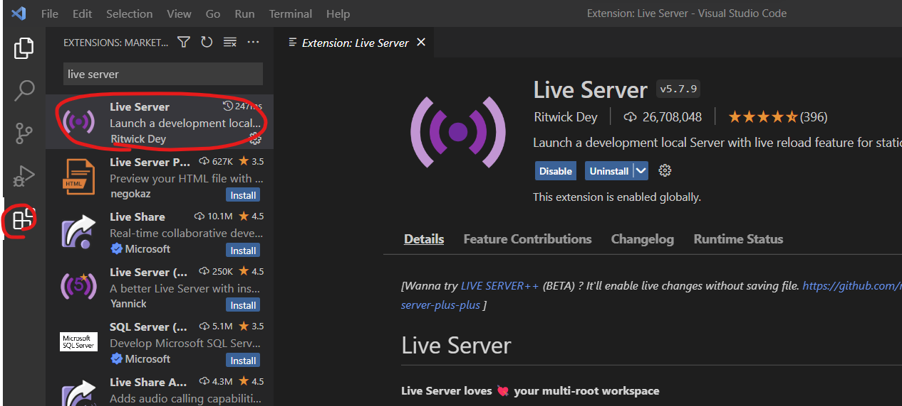


사용법

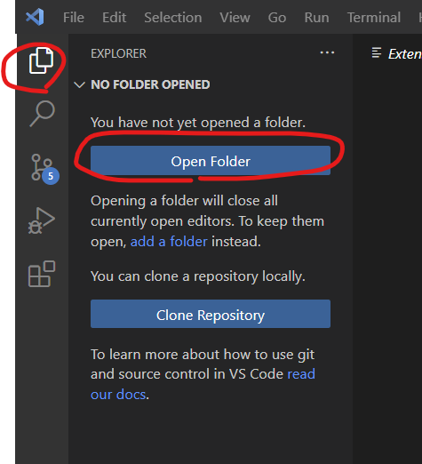

좌측상단의 Explorer 탭에서 에서 "Open Folder" 버튼을 클릭후, html문서가 있는 폴더를 선택


좌측에 있는 html 파일 우클릭 후, Open with Live Server 선택

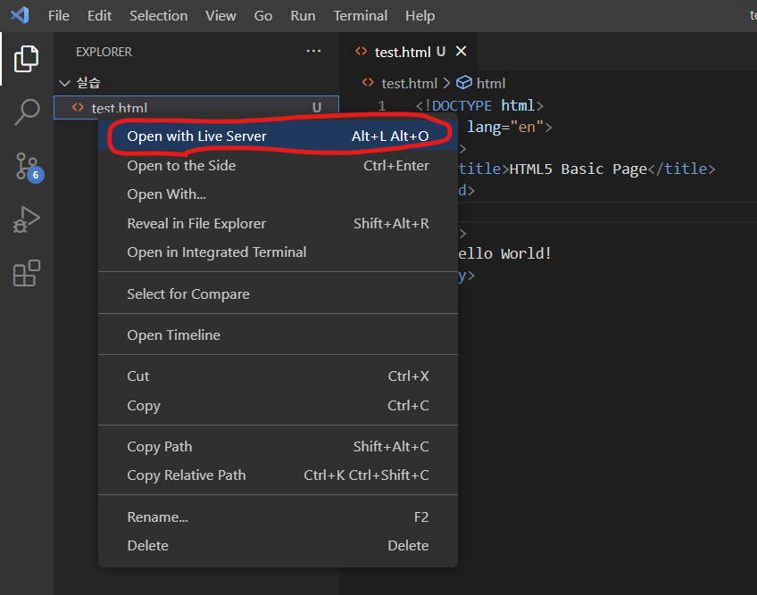


사용자의 입력에 맞추어 실시간으로 브라우저 내용이 변함

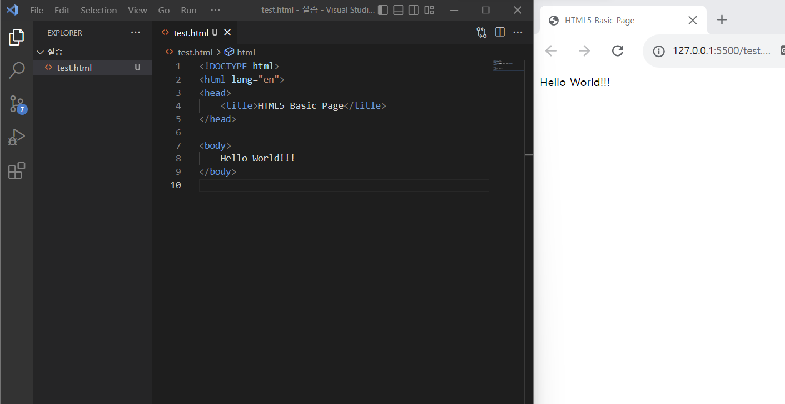


# 1. HTML5 기본

## 1-1. 기본 용어

HTML5은 아래의  3가지 요소를 중심으로 사용된다

* 태그(Tag) : HTML 페이지의 객체 생성에 사용됨
* 요소(Element) : Tag를 사용하여 만들어진 객체
* 속성(Attribute) : 태그에 부여되는 추가 정보

태그와 속성은 모두 W3C 재단에서 미리 정해놓았다.


가령 tag에 title 혹은 src 속성을 부여하여 요소를 만드는 코드는 아래와 같다

```html
<h1 title="header">Hello HTML5</h1>

```


## 1-2. HTML5 페이지 구조

모든 HTML5 페이지는 아래 코드에서 시작한다

```html
<!DOCTYPE html>
<html>
    <head>
        <!- 헤더 -->
    </head>
    <body>
        <!- 본문 -->        
    </body>
</html>
```

모든 HTML5 태그는 \<html\> 태그의 내부에 작성해야한다.


## 1-3. 주요 태그

모든 태그를 다 완벽히 숙지하긴 힘들다.

주로 쓰는것만 정리하고 나머지는 W3C 사이트를 참조한다


### 1-3-1. head Tag

head tag는 body tag에 비해 사용법이 까다롭다

| 태그 이름 | 설명                          |
| --------- | ----------------------------- |
| meta      | 웹 페이지에 추가 정보를 전달  |
| title     | 웹 페이지의 제목              |
| script    | 웹 페이지에 스크립트를 추가   |
| link      | 웹 페이지에 다른 파일을 추가  |
| style     | 웹 페이지에 스타일시트를 추가 |
| base      | 웹 페이지의 기본경로를 지정   |


### 1-3-2. body tag

\<body\> 태그 내부에서 사용되는 태그들에 대해 알아본다


#### **제목**

* 용도 : 제목의 입력에 사용됨

* 종류 : h1, h2, ..., h6 가 있으며 숫자가 작을수록 크다


#### **본문**

| 태그 이름 | 설명                                                         |
| --------- | ------------------------------------------------------------ |
| <p\>      | paragraph, 단락을 의미 , 본문 작성에 사용                    |
| \<br\>    | 개행                                                         |
| \<hr\>    | 수평 줄                                                      |
| \<a\>     | - 앵커<br />- href 속성으로 웹페이지 주소 등록 가능<br />   √ '#' 혹은 '#;' 로 설정하여 웹 표준을 지키면서 이동하지 않는 a 태그 생성 가능(빈 링크)<br />   √ id 속성을 부여하여 페이지내의 이동도 가능 |


#### **목록**

| 태그 이름 | 설명                  |
| --------- | --------------------- |
| \<ul\>    | 순서가 없는 목록 태그 |
| \<ol\>    | 순서가 있는 목록 태그 |
| \<li\>    | 목록 요소             |


```html
<!DOCTYPE html>
<html>
<head>
    <title>HTML TEXT Basic Page</title>
</head>
<body>
    <h1>ol tag</h1>
    <ol>
        <li>Facebook</li>
        <li>Tweeter</li>
        <li>Linked In</li>
    </ol>
    <h1>ul tag</h1>
    <ul>
        <li>Facebook</li>
        <li>Tweeter</li>
        <li>Linked In</li>
    </ul>
</body>
</html>
```

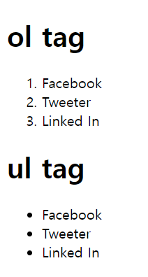


#### **이미지**

\<image\> 태그를 사용해 이미지 삽입 가능


**속성**

| 속성 이름 | 설명                                       |
| --------- | ------------------------------------------ |
| src       | 이미지 경로, 인터넷 주소 지정              |
| art       | 이미지 없을때 나오는 글자                  |
| width     | 이미지의 너비 (default : 이미지 자체 크기) |
| height    | 이미지의 높이 (default : 이미지 자체 크기) |


```html
<a></a>
```

이미지 크기는 알지만, 리소스가 아직 없을 경우 위 처럼 링크를 직접 입력하여 대체 삽입 가능


#### 사운드, 비디오 - audio, video

* 플러그인 없이 음악 및 영상을 재생할 수 있게 해주는 HTML5 태그

* 각각 audio, video 태그를 source 태그와 함께 사용하여 구현 가능


#### **입력 - form**

* 사용자에게 입력 받는 공간을 표시하는데 사용
* 서버와의 연동이 필요, 우선은 기본적인 사용법만 알아본다
* 연동 가능 태그 : input, select, textarea
* 사실 대부분의 입력 수단들은 디자인이 구 시대적이므로 자바스크립트로 직접 만들어 사용한다


생성 : form 태그를 사용

```html
<body>
    <form action="http://localhost/login.php">
    	<p>아이디 : <input type="text" name="id"></p>
   		<p>비밀번호 : <input type="password" name="pwd"></p>
  		<p>주소 : <input type="text" name="address"></p>
   		<input type="submit">
	</form>
</body>
```

브라우저로 열어보면 아래와 같다.


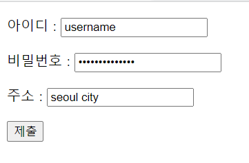

비밀번호는 타입을 password로 하여 보이지 않지만, password123!@# 으로 설정했다.

입력칸을 위 처럼 채운 후, 제출 버튼을 누르면 아래링크로 이동한다.

http://localhost/login.php?id=username&pwd=password123%21%40%23&address=seoul+city


form 태그의 각 속성은 아래와 같다

| 속성 이름 | 설명                           |
| --------- | ------------------------------ |
| action    | 입력 데이터의 전달 위치를 지정 |
| method    | 입력 데이터의 전달 방식을 선택 |

action은 여기서 다룰 내용이 아니므로 우선 제외

method는 GET과 POST로 나뉜다

* GET : 주소에 직접 데이터를 넣은 url을 생성하여 직접 접근한다(default)
  * 네이버나 구글등 검색엔진에서 검색 키워드를 입력하면 링크가 통째로 변하는것과 같은 원리
* POST : 주소 변경 X, 별도로 데이터를 보냄, 전송 데이터 크기 제한 없음


보다 자세한 정보는 웹서버 와의 연동이 필요하다


##### **문자열 입력 - input type="text"**

* 일반적으로 input 태그는 form 태그 내부에 있어야 하지만 Ajax 기술의 활성화로 안지켜지는 경우도 있다


```html
<body>
    <form action="http://localhost/login.php">
    	<p>아이디 : <input type="text" name="id"></p>
   		<p>비밀번호 : <input type="password" name="pwd"></p>
  		<p>주소 : <input type="text" name="address"></p>
   		<input type="submit">
	</form>
</body
```

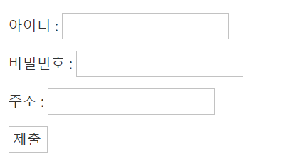


##### **선택 - select**

```html
<body>
    <form action="http://localhost/color.php">
        <h1>색상</h1>
        <select name="color">
            <option value="red">붉은색</option>
            <option value="black">검은색</option>
            <option value="blue">파란색</option>
        </select>
        <h1>색상2 (다중선택)</h1>
        <select name="color2" multiple>
            <option value="red">붉은색</option>
            <option value="black">검은색</option>
            <option value="blue">파란색</option>
        </select>
        <input type="submit">
    </form>
</body>
```

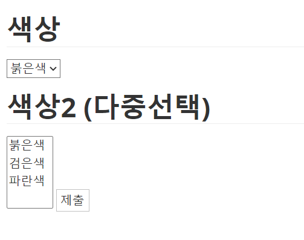


##### 버튼 - input type="button"

```html
<body>
    <form action="http://localhost/form.php">
        <input type="text">
        <input type="submit" value="전송">
        <input type="button" value="버튼" onclick="alert('hello world')">
        <input type="reset">
    </form>
</body>
```

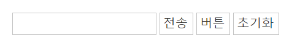


##### 데이터 전송 - hidden

```html
<body>
    <form action="http://localhost/hidden.php">
        <input type="text" name="id">
        <input type="hidden" name="hide" value="egoing">
        <input type="submit">
    </form>
</body>
```

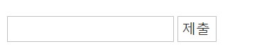

텍스트 입력란이 하나만 보인다.

하지만 텍스트를 입력하고 제출 버튼을 누르면 아래 url로 전송한다

http://localhost/hidden.php?id=sedfx&hide=egoing

hide=egoing 은 hidden 속성에 의해 숨겨진 값이다.


##### 컨트롤의 제목 - label

label 태그 : input 태그의 설명에 사용됨

```html
<body>
    <form action="">
        <p>
            <label for="id_txt">text : </label>
            <input id="id_txt" type="text" name="id" value="default value" />
        </p>

        <p>
            <label for="password">password : </label>
            <input id="password" type="password" name="pwd" value="default value" />
        </p>

        <p>
            <label> textarea :
                <textarea rows="2">default value</textarea>
            </label>
        </p>

        <p>
            <label>
                <input type="checkbox" name="color" value="red" /> 붉은색
            </label>
            <label for="color_blue">
                <input id="color_blue" type="checkbox" name="color" value="blue" /> 파란색
            </label>
        </p>
    </form>
</body>
```


label 태그를 클릭해도 input 태그가 활성화 되는것을 볼 수 있다.


#### 공간 분할(layout)

* 웹 페이지의 레이아웃을 나누는 태그
* 주요 태그 : div, span

| 태그 이름 | 설명                                  |
| --------- | ------------------------------------- |
| div       | block 형식(쌓아감)으로 공간을 분할    |
| span      | inline 형식(문장단위)으로 공간을 분할 |


아래코드를 보면 이해에 도움이 됨

```html
<!DOCTYPE HTML>
<html>
<head>
<meta charset="euc-kr">
<title>CSS 속성</title>
<style type="text/css">
	body {
		background-color: #e7e7e7;
	}
	#div1 {
		background-color: #F9F249;
		padding: 10px;
        border : 1px solid black;
	}
	#span1 {
		background-color: #36FFFF;
        border : 1px solid black;
	}
</style> 
</head>
<body>
	<div id="div1">
		Koreans are in general pessimistic about the socio-economic 
		circumstances surrounding them, a survey shows.
		Among different age groups, college students and job 
		seekers were most pessimistic, because of the tough 
		job market. The findings are based on market research firm 
		Macromillembrain's survey on five age groups each 
		with 200 people _ a total of 1,000. The groups included 
		college students and job seekers, office workers aged 20-39, 
		office workers in their 40s and office workers in their 50s.
	</div><br/>
	<span id="span1">
		Koreans are in general pessimistic about the socio-economic 
		circumstances surrounding them, a survey shows.
		Among different age groups, college students and job 
		seekers were most pessimistic, because of the tough 
		job market. The findings are based on market research firm 
		Macromillembrain's survey on five age groups each 
		with 200 people _ a total of 1,000. The groups included 
		college students and job seekers, office workers aged 20-39, 
		office workers in their 40s and office workers in their 50s.
	</span>
</body>
</html>
```

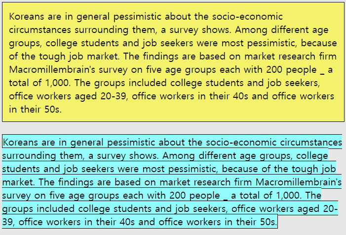

배경색과 border를 통해 레이아웃 구성 확인 가능

* div : 박스형태로 영역이 설정, 레이아웃 내에서 정렬

* span : 레이아웃 내에서 문장이 쓰여지듯이 줄단위로 영역 설정
  * **inline 속성을 지닌 태그는 보통 방법으로는 width와 height로 크기 지정이 불가능**


앞서 본문을 출력하기 위한 tag들은 대부분 block 형과 inline형 태그로 나뉜다

| block 형식 태그                                              | inline 형식 태그                                             |
| ------------------------------------------------------------ | ------------------------------------------------------------ |
| \<div\>,  \<h#\> , \<p\>, 목록 태그(ol, ul, li), \<table\> , \<form\> | \<span\>, \<a\>, \<input\>, 글자 형식( \<i\>, \<b\>, \<small\>, \<sub\> ... ) |


이미지와 멀티미디어 태그는 inline-block 형식을 지닌다.


#### Symentic 구조 tag

* HTML5태그의 가장 큰 변화
* HTML5를 시멘틱 웹 페이지 라고도 하는 이유
* 사용 목적 : 검색엔진등의 프로그램들이 html  코드를 보고 웹페이지의 구조를 효율적으로 알 수 있게끔 한다
* 기능적으론 모두 다 div와 같음

| 태그 이름 | 설명                                |
| --------- | ----------------------------------- |
| header    | 헤더를 의미                         |
| nav       | 내비게이션을 의미                   |
| aside     | 사이드에 위치하는 공간을 의미       |
| section   | 여러 중심 내용을 감싸는 공간을 의미 |
| article   | 글자가 많이 들어가는 부분을 의미    |
| footer    | 푸터를 의미                         |


가령 symentic tag를  활용한 웹페이지는 아래와 같다.

```html
<!DOCTYPE html>
<html>
<head>
    <title>HTML5 Basic</title>
</head>
<body>
    <header>
        <h1>HTML5 Header</h1>
    </header>
    <nav>
        <ul>
            <li><a href="#">Menu - 1</a></li>
            <li><a href="#">Menu - 2</a></li>
            <li><a href="#">Menu - 3</a></li>
        </ul>
    </nav>
    <section>
        <article>
            <h1>Lorem ipsum dolor sit amet</h1>
            <p>Lorem ipsum dolor sit amet, consectetur adipiscing elit.</p>
        </article>
        <article>
            <h1>Lorem ipsum dolor sit amet</h1>
            <p>Lorem ipsum dolor sit amet, consectetur adipiscing elit.</p>
        </article>
    </section>
    <footer>
        <address>서울특별시 강서구 내발산동</address>
    </footer>
</body>
</html>
```

시멘틱 태그의 기능은 div와 동일하므로, div만 써도 결과물엔 영향 없다.


